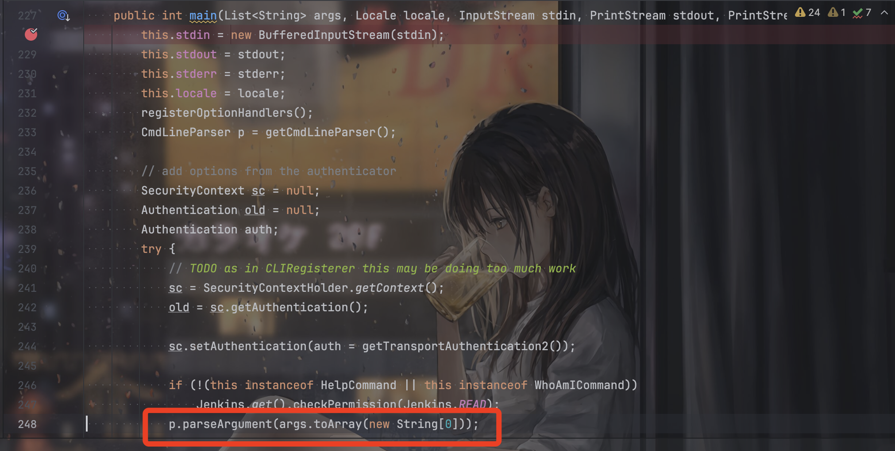
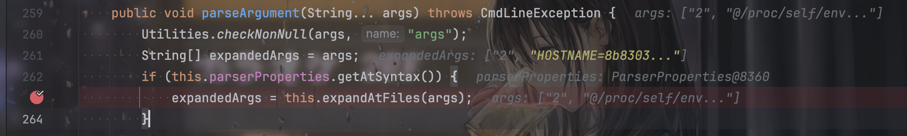
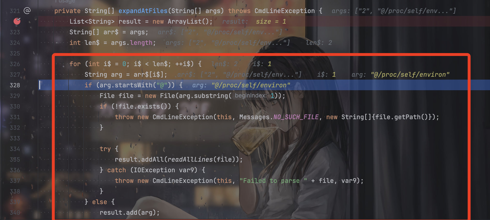
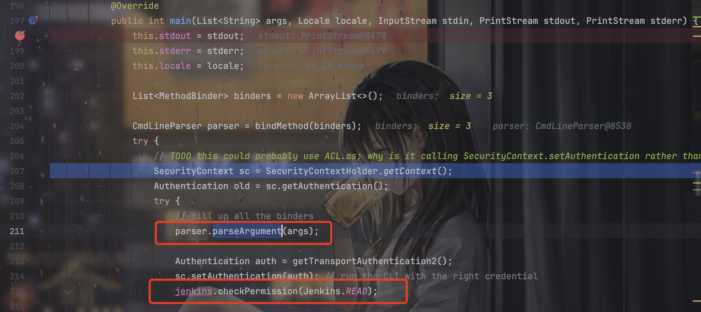
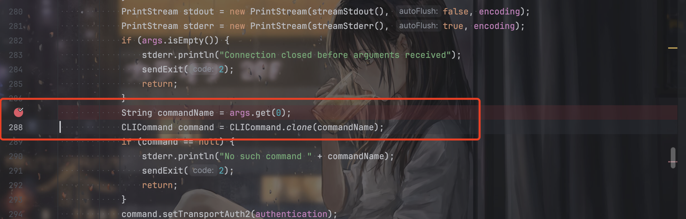

# CVE-2024-23897

## Summary

Jenkins 2.441及以前的版本存在利用Cli工具进行任意文件读取的漏洞：

```bash
java -jar jenkins-cli.jar -s http://localhost:8080/ -http connect-node 1 "@/etc/passwd"
```

其中`jenkins-cli.jar`从`Jenkins`服务端下载：http://localhost:8080/jnlpJars/jenkins-cli.jar

在利用上有两个限制。第一个限制是是否开启“匿名用户可读”选项，如果开启则可以利用`connect-node`和`reload-job`读取多行文件，如果不开启则可以利用`help`读取前两行，利用`keep-build`读取第三行，存在限制。

第二个限制是服务端字符集是否兼容读取二进制文件，如果不兼容的话则无法读取`/var/jenkins_home/secrets/org.springframework.security.web.authentication.rememberme.TokenBasedRememberMeServices.mac`，导致无法伪造remember-me。

## Analyze

Jenkins Cli的参数解析由Jenkins服务端负责，在`CLICommand.java`的main方法打断点：



其中下面的代码也进行了可读权限的验证。

```java
            if (!(this instanceof HelpCommand || this instanceof WhoAmICommand))
                Jenkins.get().checkPermission(Jenkins.READ);
```


在`expandAtFiles`处理



检测到`@`开头的参数就读取文件内容。其中这些处理都是args4j的处理，Jenkins在参数解析上使用args4j。



除了`help`和`who-am-i`命令，长亭提到的别的命令：

```
keep-build
restart
shutdown
safe-shutdown
disable-job
enable-job
```

原理需要跟进`CLIRegisterer.java`的`main`方法：



先解析的`args`再校验权限导致了绕过。

之所以不同的命令有不同的处理，则是因为`CLIAction.java`的`run`方法：



`CLICommand.clone(commandName);`根据`commandName`来`clone`相应的`CLICommand`，这里并不一定都是`CLICommand`，有的command似乎就是有自己单独的类，有的就是`CLICommand`，有的就是`CLIRegisterer`。

## Post Penetration

读取Credentials等，以及下面的文件：

- `/var/jenkins_home/users/*/config.xml` 保存所有用户的信息，包括密码、种子、Token等
- `/var/jenkins_home/secret.key` 保存Remember-Me Cookie中的一部分
- `/var/jenkins_home/secrets/master.key` 作为AES解密密钥
- `/var/jenkins_home/secrets/org.springframework.security.web.authentication.rememberme.TokenBasedRememberMeServices.mac` 作为计算hmac签名时的Key


`/var/jenkins_home/users/*/config.xml`中可以读取：

- 用户密码，使用JBCript哈希编码
- 用户Token，使用sha256哈希编码
- 用户种子，这个后面会用到

其中用户的密码要删去`#jbcrypte:`然后将开头的`$2a`替换为`$2y`就是正常的bcrypt哈希值，这个值只能硬跑破解。

Token无法使用，用户seed用于伪造`remember-me`，但是比较难以利用成功，就不写了。因为`/var/jenkins_home/secrets/org.springframework.security.web.authentication.rememberme.TokenBasedRememberMeServices.mac`是二进制文件，读取的时候会因为字符集的问题导致无法读取成功，必须要服务端支持读取二进制文件才可以。

## References

[Jenkins文件读取漏洞拾遗（CVE-2024-23897） | 离别歌](https://www.leavesongs.com/PENETRATION/jenkins-cve-2024-23897.html)

[【已复现】Jenkins 任意文件读取漏洞（CVE-2024-23897）](https://mp.weixin.qq.com/s/GSDwEg5fVHwEKatGpuxPog)