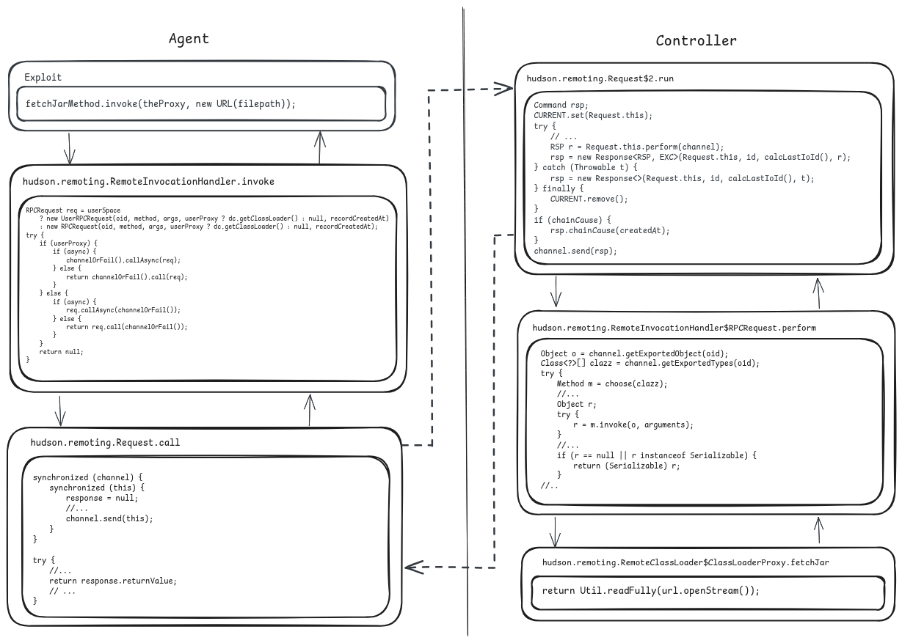
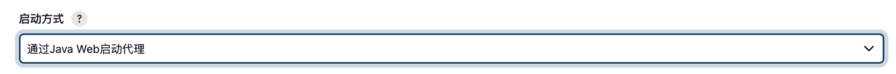
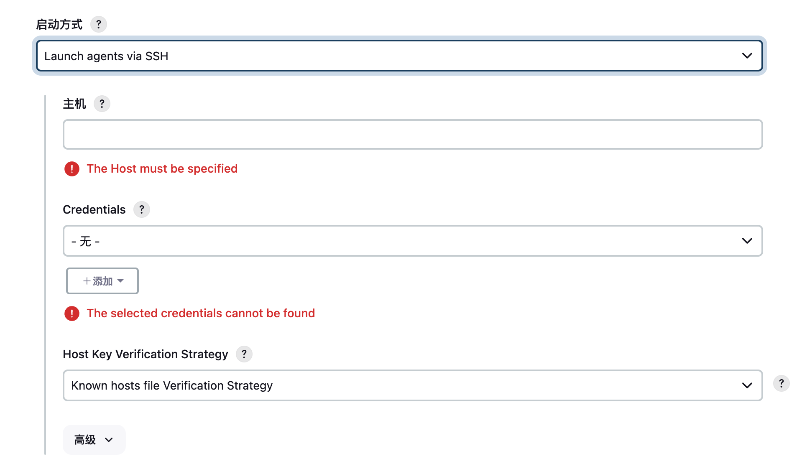

# CVE-2024-43044

## 漏洞分析

其实就是agent调用controller提供的`fetchJar`方法来实现任意文件读取：

连接方式有两种，一种是：

需要agent的name和secret

另外一种就是ssh：

然后读取配置文件伪造cookie，执行**Groovy**代码实现RCE。

但是CVE-2024-43044攻击的前提是**劫持一个 Jenkins 的agent**。

## References

[CVE-2024-43044分析](https://blog.convisoappsec.com/en/analysis-of-cve-2024-43044/)

[convisolabs/CVE-2024-43044-jenkins: Exploit for the vulnerability CVE-2024-43044 in Jenkins](https://github.com/convisolabs/CVE-2024-43044-jenkins)