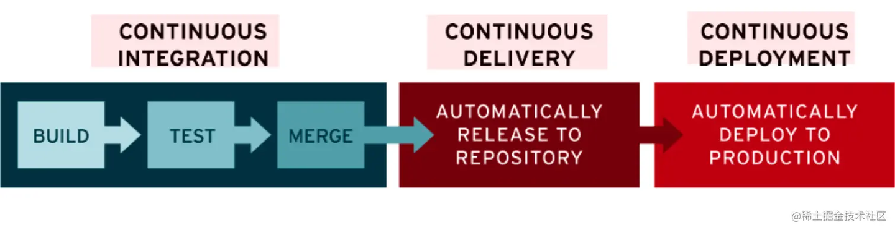

# CI/CD

CI/CD 是一种通过在应用开发阶段引入**自动化**来频繁向客户交付应用的方法。

CI/CD 的核心概念是**持续集成、持续交付和持续部署**。

## CI 持续集成（Continuous Integration）

持续集成（CI）可以帮助开发者更加方便地将代码更改合并到主分支。

一旦开发人员将改动的代码合并到主分支，系统就会通过自动构建应用，并运行不同级别的自动化测试（通常是单元测试和集成测试）来验证这些更改，确保这些更改没有对应用造成破坏。

如果自动化测试发现新代码和现有代码之间存在冲突，CI 可以更加轻松地快速修复这些错误。

## CD 持续交付（Continuous Delivery）

CI 在完成了构建、单元测试和集成测试这些自动化流程后，持续交付可以自动把已验证的代码发布到企业自己的存储库。

持续交付旨在建立一个可随时将开发环境的功能部署到生产环境的代码库。

在持续交付过程中，每个步骤都涉及到了测试自动化和代码发布自动化。

在流程结束时，运维团队可以快速、轻松地将应用部署到生产环境中。

持续交付通常是指开发人员对应用的更改会自动进行错误测试并上传到存储库（如 GitHub 或容器注册表），然后由运维团队将其部署到实时生产环境中。

## CD 持续部署（Continuous Deployment）

对于一个完整、成熟的 CI/CD 管道来说，最后的阶段是持续部署。

它是作为持续交付的延伸，持续部署可以自动将应用发布到生产环境。

实际上，持续部署意味着开发人员对应用的改动，在编写完成后的几分钟内就能及时生效（前提是它通过了自动化测试）。这更加便于运营团队持续接收和整合用户反馈。

总而言之，所有这些 CI/CD 的关联步骤，都极大地降低了应用的部署风险。

不过，由于还需要编写自动化测试以适应 CI/CD 管道中的各种测试和发布阶段，因此前期工作量还是很大的。

持续部署（另一种“CD”）指的是自动将开发人员的更改从存储库发布到生产环境，以供客户使用。

## 参考

https://zhuanlan.zhihu.com/p/363262875
