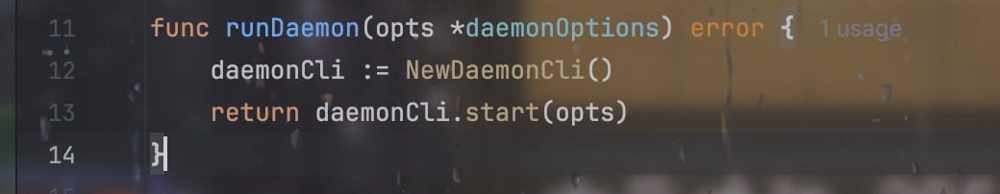

# Docker Source Code Analysis

## Docker组件构成

- https://github.com/docker/cli - 上图中的 Docker

- https://github.com/moby/moby - 即我们熟知的 Dockerd 守护进程，Docker服务

- https://github.com/containerd/containerd - 包含 Containerd 和 Containerd-shim

- https://github.com/opencontainers/runc

## Client

创建一个`DockerCli`对象，设置了输入输出和错误流。

然后创建一个顶层的Command：

具体docker解析命令行参数和后续处理用的是cobra库，中间一些具体细节不提了。

总的来说就是解析成一个command对象，最后执行`return cmd.Execute()`的时候，调用它的`RunE`：

以`docker ps -a`为例，最后调用`ContainerList()`，访问docker deamon。

## Daemon

Daemon主要关注初始化和路径这两部分，没有对代码细节看的特别详细。

在moby的`cmd/dockerd/docker.go`的`main`方法，重点是`newDaemonCommand`和`cmd.Execute()`。类似于Docker-cli的流程，调用`Execute`还是调用`cmd`的`RunE`方法：

分为`NewDaemonCli`和`start`两部分，`NewDaemonCli`创建一个`DaemonCli`结构体对象，该结构体包含配置信息，配置文件，参数信息，Daemon对象，authzMiddleware（认证插件）等等。

`start`则比较复杂，涉及到很多的配置相关信息，总的来说就是启动一个server，并且做了相关的事情。

server的相关路由可以在`api/server/router/container/container.go`中找到。仍然以`docker ps -a`为例，对应`router.NewGetRoute("/containers/json", r.getContainersJSON),`：

通过http参数配置好config，然后执行`s.backend.Containers(ctx, config)`，调用的是`daemon/list.go`的`Containers`，说明`s.backend`是`daemon *Daemon`。

具体则是从当前数据库中获得一个快照(view)，进行一定的filter后返回`containers`。

所以实际上针对docker daemon这这部分功能，看成一个web服务器即可。

实际上守护进程还有其他功能，但是这里只是了解一下大概的结构，就不继续看代码细节了。

## runc

TODO

## References

[11 组件组成：剖析 Docker 组件作用及其底层工作原理](https://learn.lianglianglee.com/%E4%B8%93%E6%A0%8F/%E7%94%B1%E6%B5%85%E5%85%A5%E6%B7%B1%E5%90%83%E9%80%8F%20Docker-%E5%AE%8C/11%20%20%E7%BB%84%E4%BB%B6%E7%BB%84%E6%88%90%EF%BC%9A%E5%89%96%E6%9E%90%20Docker%20%E7%BB%84%E4%BB%B6%E4%BD%9C%E7%94%A8%E5%8F%8A%E5%85%B6%E5%BA%95%E5%B1%82%E5%B7%A5%E4%BD%9C%E5%8E%9F%E7%90%86.md)

[（一）：Docker架构 · Docker源码分析 · 看云](https://www.kancloud.cn/infoq/docker-source-code-analysis/80525)

[Docker Architecture: Understanding How Docker Works With Examples](https://www.simplilearn.com/tutorials/docker-tutorial/docker-architecture)

[Docker (远程) Debug 调试环境搭建 | tari Blog](https://tari.moe/2022/goland-docker-debug)
