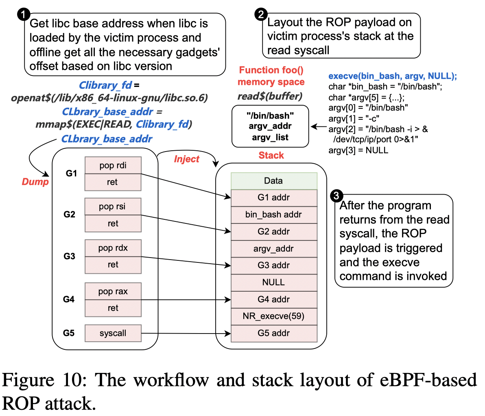
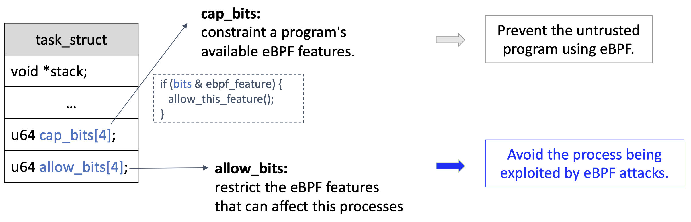

# Cross Container Attacks:The Bewildered eBPF on Clouds

## 基于libc的ROP攻击

由于 libc 是通过 mmap 系统调用映射到进程内存空间的，攻击者可以使用 eBPF 跟踪程序从 mmap 返回值中获取 libc 的基地址。一旦确定了基地址，攻击者就可以根据 libc 版本获取有用的 ROP gadget地址。有了这些gadget，攻击者就可以使用 bpf_probe_write_user helper，将 ROP 链放在常用系统调用（如 read）的返回地址上，从而操纵控制流并执行进程劫持。通过重复使用 libc 中的 ROP gadget，我们的攻击可以劫持任何进程。

## CapBits

CapBits 为进程的 task_struct 分配了两个bitmap字段。第一个字段（cap_bits）管理进程的可用 eBPF 程序类型、辅助函数和跟踪范围（如命名空间）。第二个字段是 allow_bits，用于指定其他 eBPF 程序的哪些 eBPF 功能（如跟踪）可以在该进程上运行。这些字段的每一位都表示启用（1）或禁用（0）某个功能。

