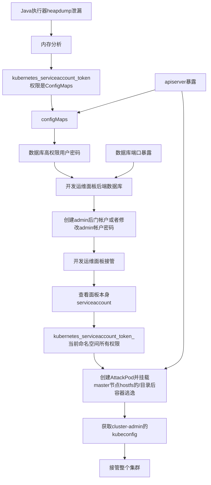

## Intro (Avalanche) - 千里之堤溃于蚁穴

很显然，安全性问题往往只取决于微小的瑕疵，这次文章当你完整阅读后你会发现你以为的常规操作，配置方法，或者很常见的代码实践，会导致如此大的安全性隐患。

### TL;DR - 摘要

1. Java mem dump 中云相关的凭据性泄漏 包括但不限于 alibaba Client AKSK, Mysql Client, Redis Client,Kubernetes \[API\] Client 等

2. 内存分析等杂项技巧在渗透测试中的应用

3. RBAC 宽松， 以及因此被滥用导致的信息泄漏与接管，包括但不限于可删减 pods 及其配置  外部数据库地址及其账密 云服务厂商 AKSK 凭据 高权限特殊权限 JWT 凭据等 

4. 脆弱的 DevOps 服务器或面板 例如 面板不安全的密码存储方式以及失败的鉴权，以及没有有效的命名空间隔离

5. 集群内部数据库对外开放，虽然这种行为通常来说不是什么严重的安全性问题，但是在一些信息泄漏的情况下，可以成为渗透至关重要的一部分。

### Attack Vectors - 攻击路径


#### Zh




## Detail - 技术细节

### EntryPoint - 入口 Heapdump

红队的进攻入口打点其实相当的重要。当然这里的入手点非常的简单啊。

由于对方使用了所谓的 api gateway 一类的东西，我们可以在某一个页面下访问到对方某个管理服务的 Spring actuator ，其中暴露了 heapdump 的接口，但是没有其他的 restart 一类可以直接导致 RCE 的接口。 因此我们很快就可以拿到这个服务的堆内存导出。

### Memory Analysis - 内存分析

我这里是直接使用的 [MAT](https://www.eclipse.org/mat/) ，这是 JVM 内存性能分析的一款有效工具。

在分析中，我着重观察了几个敏感的凭据位置，通过搜索诸如 Client 对象和 Config 字段的对象，以及一些环境变量，来尝试获取对应的配置文件内容，密钥等信息。

> kubernetes service account 凭据可能会存在于 TokenFileAuthentication 的对象中 在 okhttp 的每次请求中 使用 getToken() 方法来拿到凭据 
>
> [具体位置在 Kubernetes-Client/Java 项目中的这里](https://github.com/kubernetes-client/java/blob/b92b82e515d38982e4db9b8e6fa371d5db44490c/util/src/main/java/io/kubernetes/client/util/credentials/TokenFileAuthentication.java#L39)
>
> io/kubernetes/client/util/credentials/TokenFileAuthentication.java:71
>
> 因此我们可以得知在内存中存留的引用必然会在 heapdump 中暴露出这个对象的 Token。
>

这里我发现了三个凭据 和一些信息 总结如下


- 使用了 k8s 集群 并且为该 pod 配置了服务账号，我们可以获取到 token 和其中的命名空间

- 集群内使用的是 Mysql 数据库同时得到了数据库凭据

- 集群有集群内 Redis。Redis Client 泄漏了密码

- Java net URI IP 一些对象泄漏了一些内部的 IP 尤其是 api server 所在的位置

### Let's go Deep -  深入敌营

出于某种原因，我们可以直接的接触到对应的内网集群。虽然他在内网，但是内存中的一些内容的暴露以及 API gateway 处理不当在 http 响应中返回的 `Backend-IP` 头很轻松的可以让我知道具体的集群位置在哪里。

### RBAC Breaching - RBAC 违规

先进行简单的连接性测试，确认对方的 API 控制端口是否是可达的。6443 通常是 kubernetes API server 的端点，简单的 curl 6443 端口（当你不进行端口扫描时）一般情况我们应该的得到的返回的特征主要如下。

- 在 `-vvv` 的情况下证书通常带有 kubernetes k3s 等字段 (https 请求)

- 在没有其他错误的时候，显示401 错误的 JSON

  ```
  {
    "kind": "Status",
    "apiVersion": "v1",
    "metadata": {},
    "status": "Failure",
    "message": "Unauthorized",
    "reason": "Unauthorized",
    "code": 401
  }
  ```

  

既然我们已经拥有了服务账号的 token ，简单的将这个设置为环境变量 SAJWT 的值之后，创建一个 `kubectl` 的别名 `k`

```bash
export SAJWT="<ServiceAccountJWT>"
alias k='kubectl --token=${SAJWT} --server=https://<target-api-server-ip>:6443 --insecure-skip-tls-verify=true' 
```

这样，我们就得到了一个简易的和 api server 交互的 CLI Client.

第一件事，就是检查我们所具有的权限。在这一阶段，我们不需要采用枚举不同的资源来确定是否存在对应的访问权限。一来是可能对资源的权限涵盖不全，二来我们或许无法枚举到额外的资源，诸如 CDR。

`kubectl` 提供了一个非常好用的方法来帮助你得到权限。这里可以参考一下不错的文档。[Cloud-Hacktricks](https://cloud.hacktricks.xyz/pentesting-cloud/kubernetes-pentesting/kubernetes-enumeration)

```bash
k auth can-i --list=true < -n {namespace} [optional] >
```

在经过上面的操作后，我们可以得知这个泄漏 token 具有 configMap 的全部权限。

### ConfigMaps Leak more - 配置文件泄漏一切

**什么是 ConfigMap ？What's the ConfigMap?**

ConfigMap 通常是作为集群内配置进行统一管理的一种资源，常常会被用来存放数据库密码 连接信息，在使用时通常是在程序中使用 k8s SDK 进行获取，也可以通过挂载将内容挂载进入文件的挂载点。 key 就是文件名，value 为文件内容。当然也可能会存在一些 AKSK

在当前权限的 token 的 configmap dump 中，我发现在对应命名空间的 ConfigMap 中配置了数据库的 root 密码。这里泄漏了超多部分的内容，包括一部分外部数据库（主从同步）的账户密码等。

### Admin is me - 我才是管理员

现在所有的线索目前都指向了数据库。但是 3306 尝试失败了。所以简单的进行一波端口的扫描，发现开放了 33306 端口。33306 极有可能是那个程序员为了偷懒或者方便而进行反向代理的内部数据库的端口。如果这个猜想是成立的，那么我们可以通过之前获得的数据库凭据进行一手连接。

> 我承认我有赌的成分在里边，因为在扫描和扫描之前我就猜测对方程序员存在偷懒的可能，即故意通过配置静态的端口暴露对数据库端口进行暴露。而 k8s 默认是不会将任何 Pod 端口进行暴露的。
>
> 另外端口扫描确实是动静比较大，所以在可以不进扫描的时候，我会尽量避免这个行为。毕竟渗透讲究的是一个微操。
>

测试成功，这时候我们可以连接远程的数据库了，这时候我们是 root 权限的用户，拥有比先前内存转储中得到的凭据所有的权限都更全。

在多个数据库表中，我发现了一个存放有类似 kubernetes 面板的数据库，存放有类似 yaml 文件修改，执行 shell 类似字段的权限库，有类似权限绑定的绑定库，以及用户名密码的用户凭据库。

其中凭据表只有一行，也就是 admin 用户，经过 kali hash-identifier 工具的检查，大概确认是 sha256 后的密码，不过不确定是否加了盐。接着通过目录爆破和关键字搜索，我找到了面板的具体位置。

尝试爆破密码，但是跑完了整个 rockyou.txt 都没有跑出来这个密码，那多半不是什么弱密码了。于是另辟蹊径，在密码备份后，修改掉了 admin 的帐户密码，然后尝试创建一个 sha256 后用新密码进行登录，同时这一步也可以测试是否数据库密码进行了加盐。

最后我们成功的登录上了 admin 的帐户。 Dashboard 管理还是很全的，例如执行 shell 和管理 pod 之类的功能。

### Not the End - 还没结束

虽然我们已经通过这种方法拿下了部分集群的权限，只是一个 namespace 的全部权限但是没有整个集群的权限。因此我们还需要进一步的提升和巩固自己的权限。 而 dashboard 本身具有的管理功能通常是通过其中配置的 serviceaccount 的权限。所以思路其实非常清晰，直接通过 shell 交互，找到面板自己的 service account 凭据，滥用凭据创建 pod ，pod 中挂载 host 下的 / 目录并且将 pod 指向到集群的 master 节点，拿下 master 上的 kubeconfig 文件。

这一类技巧在 [hacktricks-cloud](https://cloud.hacktricks.xyz/pentesting-cloud/kubernetes-pentesting/kubernetes-enumeration#escaping-from-the-pod) 中有详细描述。而我优化了这一部分的攻击逻辑。 增加了 node selector 这种指定 pod 调度到某个节点的操作。顺手给提了一个 PR [hacktricks-cloud#7](https://github.com/carlospolop/hacktricks-cloud/pull/7/files)。(k8s 本身是随机选择合适的节点调度的，而 nodeSelector 可以保证调度到符合指定条件的节点，而我们所在的 k8s 集群，事后查看面板发现大约有七个节点。)

至于如何列出当前用户权限所有的凭据信息或者拿到 kubeconfig 文件，可以查看常见的文件点位，例如 `/etc/kubernetes/admin.conf` `/etc/kubernetes/controller-manager.conf` 以及 `/etc/rancher/k3s/k3s.yaml`  和 `~/.kube/xxxxx`这类的文件，或是使用命令类似 `kubectl config view --raw` 。这里 hacktricks 文档并没有写，下次有空了，再交个 PR。

### Everything End - 尾声

接下来我们就可以把最高权限的 admin 帐户或是系统类最高权限帐户，导入我们的 Lens k9s 一类的 kubernetes 管理工具，进行持久化和管理，享受他们给你带来的便利。你懂的，一切的管理工具都可以是黑客工具。全都可以炸完！（可莉脸）


## Conclusion - 总结

查看整个渗透测试的路径和思路，你会发现这里只有三个非常重要的独立于其他的初始条件，一个是 java 的内存泄漏，这是一切的开始，第二个是 kubernetes 控制 api 可以控制，第三个是主动暴露出来的数据库端口。然而，这些条件大部分在很多开发者写的代码和实际集群的配置中非常的常见，往往却是最容易被忽视的。

当然这一整个集群最为核心的问题在于 dashboard。dashboard 数据库的配置存放于 configmap 中，而 configmap 是可以直接被具有 configmap 权限的 service account 读取的，而 spring cloud app 通常会具有该权限。又由于错误地把 dashboard 部署在了生产 namespace，导致 dashboard configmap 混合在其他生产 configmap 中，从而使得攻击者可以完成一套从内存泄漏到 cluster-admin 接管的完整攻击链。多种缺陷综合在一起导致了这一次的严重的安全问题。


---

Take care of your cluster, and be well. 👆😎 

<iframe width="560" height="315" src="https://www.youtube.com/embed/FxJXn1dOwGA" title="YouTube video player" frameborder="0" allow="accelerometer; autoplay; clipboard-write; encrypted-media; gyroscope; picture-in-picture; web-share" allowfullscreen></iframe>

