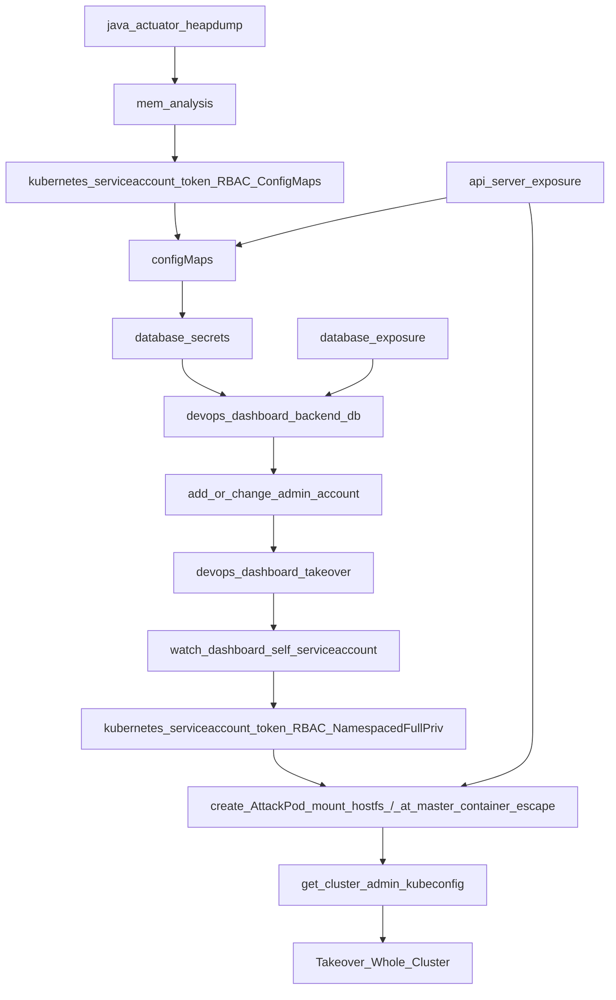

## Intro (Avalanche) - 千里之堤溃于蚁穴

Obviously, Some common security issue begins some little flaw. Finishing this blog, you will find that some usual operation, configuration, or programming practice will cause such hidden danger.

### TL;DR - 摘要

1. Java memory dumping with token leakage in the cloud (Spring cloud heap dump) e.g., Alibaba Client memory → Access Key Secret Key, MySQL Client → SQL account and password, Redis Client → password and get shell, Kubernetes API Client → Service account

2. Memory leakage is paired with memory analysis. There are real scenarios for some misc tricks in CTF.

3. Loose RBAC can causing information leaks and takeovers by abusing configured rules.Not limited to the ability to delete pods and their configurations, access external database addresses and their account credentials, cloud service provider AKSK credentials, high privilege JWT token for other service, etc.

4. Vulnerable DevOps service and dashboard. For example, incorrect dashboard password storage and authentication failure. Also the failure of namespace isolation.

5. Inner-Cluster Database Exposure. It's most important part in pentest with cred leakage although this action isn't always core  

### Attack Vectors - 攻击路径

#### En



## Detail - 技术细节

### EntryPoint - 入口 Heapdump

The entry point of red team action is really important. But there are very simple at here.

The target site is guarded by an API gateway. And We can reach a Spring Actuator endpoint at an administrator service, which exposes the heap dump interface without other RCE directly interface as restart. Then We can easily get  the heap memory dump.

### Memory Analysis - 内存分析

I'm using [MAT](https://www.eclipse.org/mat/) that is a powerful tool of JVM memory performance analysis.

Sensitive locations are inspected during my analysis. Searching the object with keywords like 'Client', 'Config' and some environment variables will show me the config file content and passwords information.

> Kubernetes service account credentials may exist in the object of TokenFileAuthentication, and the getToken() method is used in every request with okhttp to obtain credentials. The specific location can be found here in the [Kubernetes-Client/Java project](https://github.com/kubernetes-client/java/blob/b92b82e515d38982e4db9b8e6fa371d5db44490c/util/src/main/java/io/kubernetes/client/util/credentials/TokenFileAuthentication.java#L39), and at line 71 in TokenFileAuthentication.java. Therefore, we know that the token of this object will inevitably be exposed in the heapdump due to the reference remaining in memory.

I got 3 creds and some helpful tips as following.

- Target is Kubernetes Cluster and Configure this pod with service account. So we got the token and namespace.

- Mysql is in the Cluster. So we got the cred.

- Cluster contains Redis. And Redis Client leak password.

- Java net URI IP objects leak internal IPs, especially the apiserver location.

### Let's go Deep -  深入敌营

For some reason, We can directly access the internal clusters. Memory dump and HTTP Response Header `Backend-IP` (Caused by misconfiguration of API Gateway) are all pointed to the location of inner net cluster.

### RBAC Breaching - RBAC 违规

Without scanning ports, it's important to test connectivity by checking if the controller API endpoint is reachable. The API Server port in Kubernetes is typically open on port 6443. You can use the curl command to check connectivity on this port, and it should return a fingerprint as following.

-  When using `-vvv` flag, the certificate usually contains fields such as "kubernetes" or "k3s". (https request)

- When there are no other errors present, a JSON response with a 401 error is displayed.

  ```
  {
    "kind": "Status",
    "apiVersion": "v1",
    "metadata": {},
    "status": "Failure",
    "message": "Unauthorized",
    "reason": "Unauthorized",
    "code": 401
  }
  ```


Now we got token of service account. Setting the token value (JWT) as env variable SAJWT and then creating an alias `k` of `kubectl`.

```bash
export SAJWT="<ServiceAccountJWT>"
alias k='kubectl --token=${SAJWT} --server=https://<target-api-server-ip>:6443 --insecure-skip-tls-verify=true' 
```

So we create cli client which can interact with the remote api server.

Firstly, we need to check what role and what access control we met. At this step, we should not enumerate different resources manually to verify if we can access it. One is that the role of resources is more than what you can cover. Next is we can't get the external resources, e.g., CDR.

`kubectl` provide a command for you to get the access control conditions. Refer this cool document. [Cloud-Hacktricks](https://cloud.hacktricks.xyz/pentesting-cloud/kubernetes-pentesting/kubernetes-enumeration)

```bash
k auth can-i --list=true < -n {namespace} [optional] >
```

Now we can found the leaked token has configMap full access as response from above command.

### ConfigMaps Leak more - 配置文件泄漏一切

**什么是 ConfigMap ？What's the ConfigMap?**

ConfigMap is kind of resource that manages cluster configurations. It used to store database password and connection information. Program use it via k8s SDK and mount point that mounted as static file system into containers. Data is kv maps, key is filename and value is file content. Sometime AKSK is included in it.

I spent a long time on dumped configMap. Finally, I got the root password of the database in the cluster. There is leaking more data, which include the db password which used to back up from external database.

### Admin is me - 我才是管理员

All the clues so far point to the database. However, attempts to connect to port 3306 failed. So, a quick port scan was performed, and port 33306 was found to be open. It is highly likely that port 33306 is the internal database port for the reverse proxy that the programmer set up for convenience. If this assumption is correct, we can use the database credentials obtained earlier to establish a connection

> I admit there is an element of gambling involved because I speculated before scanning that the other programmer may have been lazy and deliberately exposed the database port by configuring a static port before scanning. By default, k8s does not expose any pod ports.
>
> Moreover, port scanning will create some noise in network traffic, so I try to avoid this behavior whenever possible. After all, penetration testing emphasizes fine-grained operations.

33306 test pass.Now we can access remote database. We are ROOT who has more privileges than memory dump one.

I found a db which is likely a backend of Kubernetes dashboard, stores privilege table that contain keywords like 'YAML edit', 'shell exec', stores role binding table, and credential table.

The credential table has 1 column, which is admin. After the Kali hash-identifier checking, the password is passhash after sha256. But I don't know whether it is salted. By the way, Directory brute force and keyword searching gave me the location of the dashboard. 

Attempt to passhash brute forcing is fail with full rockyou.txt.So the password was likely not a weak password. I tried another approach, backup current password, password for the 'admin' account updated to a new sha256 hash of new password. Then, I used new password to attempt a login, also testing whether the database password was salted.

Finally, we successfully logged in to the admin account. The Dashboard management has a wide range of functions, such as executing shell commands and managing pods.

### Not the End - 还没结束

Although we have gained some cluster permissions through this method, it is only full permissions for a single namespace and not the entire cluster. Therefore, we need to further escalate and consolidate our privileges. The management functions that the dashboard has are usually granted through the service account permissions configured within it. So the idea is clear - we can directly use shell interaction to find the dashboard's service account credentials, abuse the credentials to create a pod, mount the host's root directory within the pod, and then direct the pod to the master node of the cluster to obtain the kubeconfig file from the master node.

This kind of technique is described in detail in [hacktricks-cloud](https://cloud.hacktricks.xyz/pentesting-cloud/kubernetes-pentesting/kubernetes-enumeration#escaping-from-the-pod). However, I optimized the attack logic in this section by adding node selector operations, which allow pods to be scheduled to specific nodes. I also submitted a PR for this improvement [hacktricks-cloud#7](https://github.com/carlospolop/hacktricks-cloud/pull/7/files). (Kubernetes itself schedules to appropriate nodes randomly, while nodeSelector ensures that it schedules to nodes that meet specified criteria. After takeovering whole cluster, we found that there are approximately seven nodes in this Kubernetes cluster.)

To list all the credentials information for the current user's permissions or obtain the kubeconfig file, you can look for commonly used configuration files such as `/etc/kubernetes/admin.conf`, `/etc/kubernetes/controller-manager.conf`, `/etc/rancher/k3s/k3s.yaml`, and  `~/.kube/xxxxx`. Alternatively, you can use a command like `kubectl config view --raw`. This information is not currently included in the hacktricks documentation, but I can submit a PR for it when I have time.

### Everything End - 尾声

With the highest level of admin account or system-level privilege account, we can import them into our Kubernetes management tools like Lens or k9s for persistence and management, enjoying the convenience they bring us. You know, all management tools can be hacking tools. They can all be exploded! (Klee's face)


## Conclusion - 总结

If you look at the entire penetration testing path and approach, you will find that there are only three very important initial conditions that are independent of others. One is Java's memory leak, which is the beginning of everything; the second is that the Kubernetes control API can be accessed; and the third is the actively exposed database port. However, these conditions are very common in the code written by many developers and the actual cluster configuration, and they are often the easiest to be overlooked.

The core problem with the entire cluster lies in the dashboard. The configuration of the dashboard database is stored in a configmap, which can be directly read by a service account with configmap permissions, which is often owned by a spring cloud application. Due to the error of deploying the dashboard in the production namespace, the dashboard configmap is mixed with other production configmaps, allowing attackers to complete a complete attack chain from memory leaks to cluster-admin takeover. Multiple deficiencies combined to create this serious security problem.


---

Take care of your cluster, and be well. 👆😎 

<iframe width="560" height="315" src="https://www.youtube.com/embed/FxJXn1dOwGA" title="YouTube video player" frameborder="0" allow="accelerometer; autoplay; clipboard-write; encrypted-media; gyroscope; picture-in-picture; web-share" allowfullscreen></iframe>

