# Learning-eBPF-book-笔记


## 0x01 What Is eBPF, and Why Is It Important?

第一章主要介绍了一些概念作为入门。

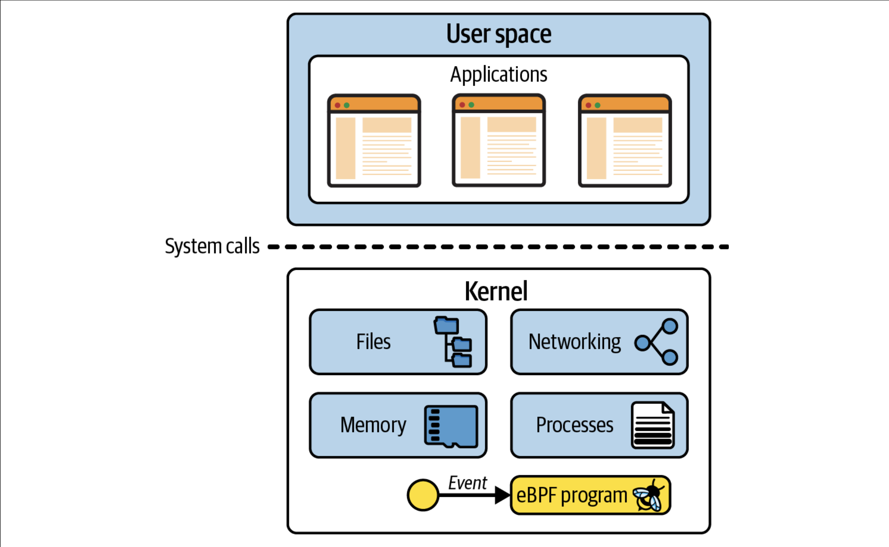

eBPF 是一项革命性的技术，起源于 Linux 内核，可以在操作系统的内核中运行沙盒程序。它被用来安全和有效地扩展内核的功能，而不需要改变内核的源代码或加载内核模块。eBPF 通过允许在操作系统内运行沙盒程序，应用程序开发人员可以在运行时，可编程地向操作系统动态添加额外的功能。然后，操作系统保证安全和执行效率，就像在即时编译（JIT）编译器和验证引擎的帮助下进行本地编译一样。eBPF 程序在内核版本之间是可移植的，并且可以自动更新，从而避免了工作负载中断和节点重启。


总的来说eBPF程序可以动态的加载到Kernel中，通过eBPF验证器来确保只有在安全的情况下才加载eBPF程序。它可以实现很多的功能，最初是过滤网络包，现在可以附件到各种事件中，实现各种各样的功能。


## 0x02 eBPF’s “Hello World“

第二章主要拿BCC框架举了几个"hello world"的例子。开发的话打算还是拿go来发现，因此就简单的看看文中的BCC框架的例子来了解一下eBPF以及一些常见的概念。

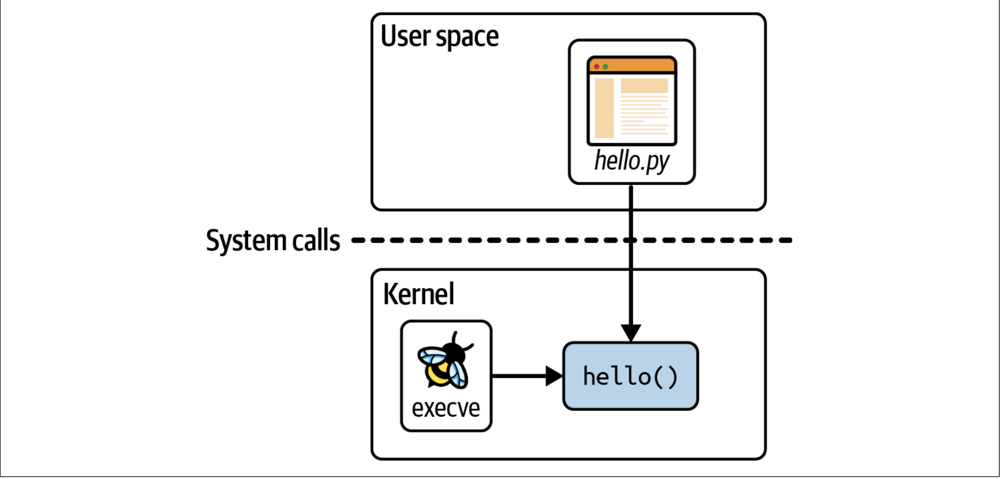

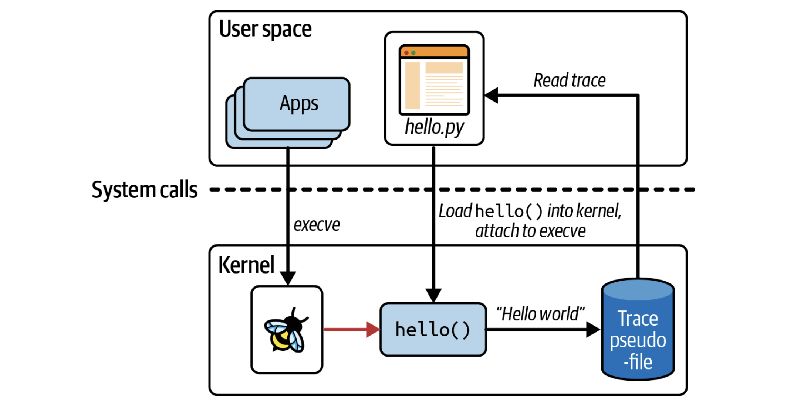


**eBPF Map：** Map是一种可以从eBPF程序和用户空间访问的数据结构，可以用于在多个eBPF程序中共享数据，或者在用户空间应用程序和内核中运行eBPF代码之间通信。

Map有很多种，一般来说都是键值存储。常见的有哈希表、perf buffer、ring buffer和eBPF程序的array。


下面是hash table的map：

```c
BPF_HASH(counter_table);

int hello(void *ctx) {
   u64 uid;
   u64 counter = 0;
   u64 *p;

   uid = bpf_get_current_uid_gid() & 0xFFFFFFFF;
   p = counter_table.lookup(&uid);
   if (p != 0) {
      counter = *p;
   }
   counter++;
   counter_table.update(&uid, &counter);
   return 0;
}
```

下面是perf buffer的map：

```c
BPF_PERF_OUTPUT(output); 
 
struct data_t {     
   int pid;
   int uid;
   char command[16];
   char message[12];
};
 
int hello(void *ctx) {
   struct data_t data = {}; 
   char message[12] = "Hello World";
 
   data.pid = bpf_get_current_pid_tgid() >> 32;
   data.uid = bpf_get_current_uid_gid() & 0xFFFFFFFF;
   
   bpf_get_current_comm(&data.command, sizeof(data.command));
   bpf_probe_read_kernel(&data.message, sizeof(data.message), message); 
 
   output.perf_submit(ctx, &data, sizeof(data)); 
 
   return 0;
}
```


**Ring Buffer的概念：** 视为逻辑上是环形的内存，有单独读和写指针，数据被写入到写指针所在的位置，长度信息包含在数据的头部。写完后写入指针移动到数据的末尾。读取操作从读指针所在的位置开始读取，从头部的长度信息来读取相应长度的数据，然后移动到数据的默认。读指针和写指针沿相同的方向移动。

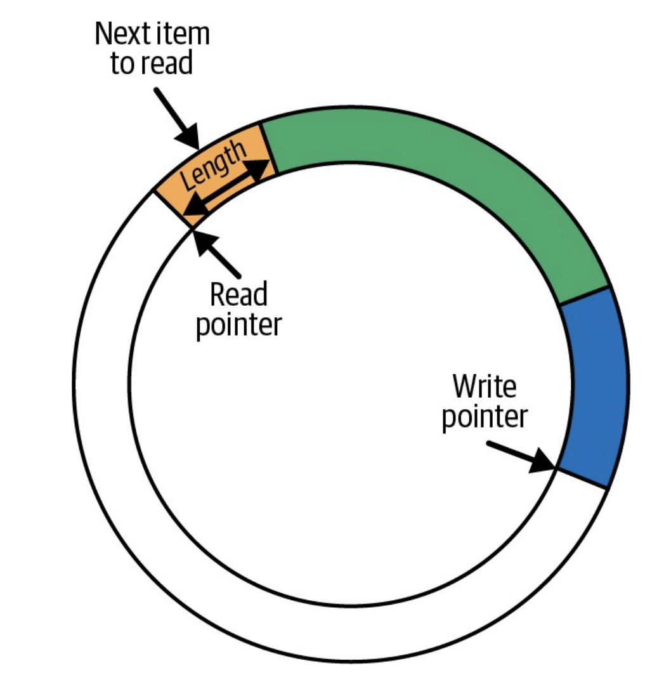


## 0x03 Anatomy of an eBPF Program

第三章主要举了两个c代码编写的eBPF程序的示例，来讲解了eBPF程序的一些细节。


eBPF虚拟机是采用eBPF字节码指定形式的程序，这些指定作用于虚拟的eBPF寄存器。eBPF寄存器使用10个通用寄存器，编号为0到9，寄存器10被用作堆栈指针且只能读取不能写入。


eBPF的指令的结构：

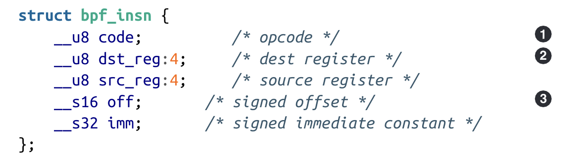

从上到下分别是opcode、目标寄存器、源寄存器、带符号的偏移、带符号的立即数。

eBPF程序加载到Kernel的时候，eBPF程序的字节码由一系列这样的bpf_insn结构表示，验证器会对此信息进行多次检查，以确保代码可以安全运行。


**map  semantics  can  be  repurposed  for  use  as  globalvariables**

## 0x04 The bpf() System Call

第四章主要介绍了`bpf() system call`。


```c
int bpf(int cmd, unionbpf_attr *attr, unsignedint size);
```

第一个参数是要执行的命令，第二个参数是相关的属性，第三个参数是attr中有多少字节的数据。返回值是文件描述符。

有不同的cmd可以用来操作eBPF程序和map：

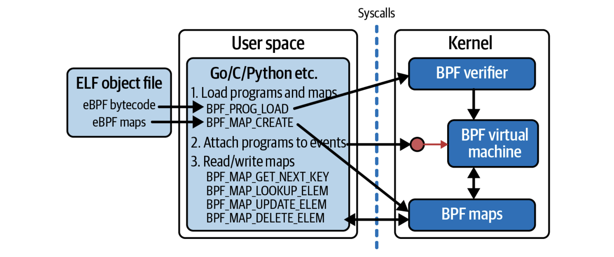

通过strace看到具体的`bpf()`

```bash
sudo strace -e bpf,perf_event_open,ioctl,ppoll ./hello-ring-buffer-config.py


#将BTF数据块加载进Kernel。BTF允许eBPF程序在不同的Kernel版本之间移植。
bpf(BPF_BTF_LOAD, {btf="\237\353\1\0\30\0\0\0\0\0\0\0P\5\0\0P\5\0\0\10\4\0\0\1\0\0\0\0\0\0\10"..., btf_log_buf=NULL, btf_size=2416, btf_log_size=0, btf_log_level=0}, 32) = 3


bpf(BPF_PROG_LOAD, {prog_type=BPF_PROG_TYPE_SOCKET_FILTER, insn_cnt=2, insns=0x7fff4bbeee50, license="GPL", log_level=0, log_size=0, log_buf=NULL, kern_version=KERNEL_VERSION(0, 0, 0), prog_flags=0, prog_name="libbpf_nametest"}, 64) = 4


#创建map。这里是创建perf buffer
bpf(BPF_MAP_CREATE, {map_type=BPF_MAP_TYPE_PERF_EVENT_ARRAY, key_size=4, value_size=4, max_entries=2, map_flags=0, inner_map_fd=0, map_name="output", map_ifindex=0, btf_fd=0, btf_key_type_id=0, btf_value_type_id=0}, 72) = 4
#下面是创建Ring Buffer
bpf(BPF_MAP_CREATE, {map_type=0x1b /* BPF_MAP_TYPE_??? */, key_size=0, value_size=0, max_entries=4096, map_flags=0, inner_map_fd=0, map_name="output", map_ifindex=0, btf_fd=0, btf_key_type_id=0, btf_value_type_id=0}, 72) = 4

#创建Hash Map
bpf(BPF_MAP_CREATE, {map_type=BPF_MAP_TYPE_HASH, key_size=4, value_size=12, max_entries=10240, map_flags=0, inner_map_fd=0, map_name="config", map_ifindex=0, btf_fd=3, btf_key_type_id=1, btf_value_type_id=4}, 72) = 5

#初始化Hash Map
bpf(BPF_MAP_UPDATE_ELEM, {map_fd=5, key=0x7f7c3407e810, value=0x7f7c33cd3310, flags=BPF_ANY}, 32) = 0


#将eBPF程序加载进Kernel
bpf(BPF_PROG_LOAD, {prog_type=BPF_PROG_TYPE_KPROBE, insn_cnt=41, insns=0x7f7c34991000, license="GPL", log_level=0, log_size=0, log_buf=NULL, kern_version=KERNEL_VERSION(5, 15, 122), prog_flags=0, prog_name="hello", prog_ifindex=0, expected_attach_type=BPF_CGROUP_INET_INGRESS, prog_btf_fd=3, func_info_rec_size=8, func_info=0x1d53090, func_info_cnt=1, line_info_rec_size=16, line_info=0x1c188d0, line_info_cnt=21, attach_btf_id=0, attach_prog_fd=0}, 144) = 6

#这个命令有点没理解懂。
#创建一个允许测量性能信息的文件描述符，返回值7表示kprobe的perf event的文件描述符。通过这个perf_event_open，将eBPF的文件描述符6写入了/sys/bus/event_source/devices/kprobe/type 
perf_event_open({type=0x6 /* PERF_TYPE_??? */, size=0x88 /* PERF_ATTR_SIZE_??? */, config=0, ...}, -1, 0, -1, PERF_FLAG_FD_CLOEXEC) = 7


```

下面的命令可以查看bfftool在读取map的时候进行的`bpf()`系统调用：

```bash
sudo strace -e bpf bpftool map dump name config
--- SIGCHLD {si_signo=SIGCHLD, si_code=CLD_EXITED, si_pid=24949, si_uid=0, si_status=0, si_utime=0, si_stime=0} ---
--- SIGCHLD {si_signo=SIGCHLD, si_code=CLD_EXITED, si_pid=24950, si_uid=0, si_status=0, si_utime=0, si_stime=0} ---
bpf(BPF_MAP_GET_NEXT_ID, {start_id=0, next_id=0, open_flags=0}, 128) = 0
bpf(BPF_MAP_GET_FD_BY_ID, {map_id=8, next_id=0, open_flags=0}, 128) = 3
bpf(BPF_OBJ_GET_INFO_BY_FD, {info={bpf_fd=3, info_len=80, info=0x7ffea93cce70}}, 128) = 0
bpf(BPF_MAP_GET_NEXT_ID, {start_id=8, next_id=0, open_flags=0}, 128) = 0
bpf(BPF_MAP_GET_FD_BY_ID, {map_id=34, next_id=0, open_flags=0}, 128) = 3
bpf(BPF_OBJ_GET_INFO_BY_FD, {info={bpf_fd=3, info_len=80, info=0x7ffea93cce70}}, 128) = 0
bpf(BPF_MAP_GET_NEXT_ID, {start_id=34, next_id=0, open_flags=0}, 128) = 0
bpf(BPF_MAP_GET_FD_BY_ID, {map_id=35, next_id=0, open_flags=0}, 128) = 3
bpf(BPF_OBJ_GET_INFO_BY_FD, {info={bpf_fd=3, info_len=80, info=0x7ffea93cce70}}, 128) = 0
bpf(BPF_MAP_GET_NEXT_ID, {start_id=35, next_id=0, open_flags=0}, 128) = -1 ENOENT (No such file or directory)
bpf(BPF_OBJ_GET_INFO_BY_FD, {info={bpf_fd=3, info_len=80, info=0x7ffea93cd000}}, 128) = 0
bpf(BPF_OBJ_GET_INFO_BY_FD, {info={bpf_fd=3, info_len=80, info=0x7ffea93ccfb0}}, 128) = 0
bpf(BPF_BTF_GET_FD_BY_ID, {btf_id=78}, 128) = 4
bpf(BPF_OBJ_GET_INFO_BY_FD, {info={bpf_fd=4, info_len=32, info=0x7ffea93cce60}}, 128) = 0
bpf(BPF_MAP_GET_NEXT_KEY, {map_fd=3, key=NULL, next_key=0x5648302d62e0}, 128) = 0
bpf(BPF_MAP_LOOKUP_ELEM, {map_fd=3, key=0x5648302d62e0, value=0x5648302d6300, flags=BPF_ANY}, 128) = 0
[{
        "key": 1000,
        "value": {
            "message": [72,105,32,117,115,101,114,32,53,48,49,33
            ]
        }
bpf(BPF_MAP_GET_NEXT_KEY, {map_fd=3, key=0x5648302d62e0, next_key=0x5648302d62e0}, 128) = 0
bpf(BPF_MAP_LOOKUP_ELEM, {map_fd=3, key=0x5648302d62e0, value=0x5648302d6300, flags=BPF_ANY}, 128) = 0
    },{
        "key": 0,
        "value": {
            "message": "Hey root!"
        }
bpf(BPF_MAP_GET_NEXT_KEY, {map_fd=3, key=0x5648302d62e0, next_key=0x5648302d62e0}, 128) = -1 ENOENT (No such file or directory)
    }
]
+++ exited with 0 +++
```

主要逻辑就是遍历所有的map，找到名为config的map就遍历map中的元素。

```bash
#获取指定值start_id之后的下一个map的id
bpf(BPF_MAP_GET_NEXT_ID, {start_id=0, next_id=0, open_flags=0}, 128) = 0
#返回指定Map ID的文件描述符
bpf(BPF_MAP_GET_FD_BY_ID, {map_id=8, next_id=0, open_flags=0}, 128) = 3
#检索文件描述符引用的对象
bpf(BPF_OBJ_GET_INFO_BY_FD, {info={bpf_fd=3, info_len=80, info=0x7ffea93cce70}}, 128) = 0
```

然后就是从找到的map中读取key和value：

```bash
#返回指定key之后的下一个有效key，第一次查用NULL
bpf(BPF_MAP_GET_NEXT_KEY, {map_fd=3, key=NULL, next_key=0x5648302d62e0}, 128) = 0
#读取指定key的值，写入value指定的内存地址中
bpf(BPF_MAP_LOOKUP_ELEM, {map_fd=3, key=0x5648302d62e0, value=0x5648302d6300, flags=BPF_ANY}, 128) = 0
```

## 0x05 CO-RE, BTF, and Libbpf

这一章主要就是介绍了BPF的CO-RE(Compile Once – Run Everywhere)，但是感觉这一章是目前遇到的最难理解的一章，因为像我一样的读者对Kernel等不是很了解的话，读这一章就会感觉很昏，它的每一小节的内容不不知道都是干什么的。 把这一章看完之后再去看一下这个文章[BPF 可移植性和 CO-RE（一次编译，到处运行）](https://cloud.tencent.com/developer/article/1802154)，里面的内容基本上这一章都有提到，可能会帮助理解，但是看完其实有些内容还是觉得很抽象不太懂，我觉得这也是入门一个新技术很正常的吧，如果都很懂了就说明这个技术很easy and low，不懂的地方以后对这个技术理解的很深了可能就懂了。


为了解决eBPF程序的跨内核可移植性问题，提出了CO-RE方法。

CO-RE方法由以下几部分组成：

- **BTF：**  BTF（BPF Type Format）是一种表示数据结构和函数签名布局的格式，它可以用于确定编译时和运行时使用的结构之间的差异。
- **Kernel headers：** Linux的内核headers包括描述其使用的数据结构等的头文件，这些头文件在不同的Linux之间可能是不同的。可以通过命令`bpftool btf dump file /sys/kernel/btf/vmlinux format c > vmlinux.h`生成一个与所有内核类型兼容的C头文件，它包含了BPF程序可能需要的所有的数据结构信息。
- **Compiler support：** Clang为了支持BPF程序的适配，支持了导出BTF重定位信息等。
- **Library support for data structure relocations：** 当BPF程序加载进内核的时候，CO-RE要求调整字节码，基于CO-RE重定位信息来调整编译时机器上的数据结构和运行时机器上的数据结构之间的差异。libbpf是包含这种重定位功能的原始C语言库。
- **BPF skeleton(optionally)：** skeleton可以从编译后的Object file中生成，例如`bpftool gen skeleton hello-buffer-config.bpf.o > hello-buffer-config.skel.h`，其中包含了很多用户空间的代码可以很方便去调用来管理BPF生命周期的函数。


下面是dump出来的BTF例子，具体字段的分析书中谈到了一些：

```bash
sudo bpftool btf dump id 80
[1] TYPEDEF 'u32' type_id=2
[2] TYPEDEF '__u32' type_id=3
[3] INT 'unsigned int' size=4 bits_offset=0 nr_bits=32 encoding=(none)
[4] STRUCT 'user_msg_t' size=12 vlen=1
	'message' type_id=6 bits_offset=0
[5] INT 'char' size=1 bits_offset=0 nr_bits=8 encoding=SIGNED
[6] ARRAY '(anon)' type_id=5 index_type_id=7 nr_elems=12
[7] INT '__ARRAY_SIZE_TYPE__' size=4 bits_offset=0 nr_bits=32 encoding=(none)
[8] STRUCT '____btf_map_config' size=16 vlen=2
	'key' type_id=1 bits_offset=0
	'value' type_id=4 bits_offset=32
[9] INT '(anon)' size=4 bits_offset=0 nr_bits=32 encoding=(none)
[10] PTR '(anon)' type_id=0
[11] FUNC_PROTO '(anon)' ret_type_id=12 vlen=1
	'ctx' type_id=10
[12] INT 'int' size=4 bits_offset=0 nr_bits=32 encoding=SIGNED
[13] FUNC 'hello' type_id=11 linkage=static
[14] INT '(anon)' size=4 bits_offset=0 nr_bits=32 encoding=(none)
[15] STRUCT 'config_table_t' size=152 vlen=20
	'key' type_id=1 bits_offset=0
	'leaf' type_id=4 bits_offset=32
	'lookup' type_id=16 bits_offset=128
	'lookup_or_init' type_id=20 bits_offset=192
	'lookup_or_try_init' type_id=20 bits_offset=256
	'update' type_id=22 bits_offset=320
	'insert' type_id=22 bits_offset=384
	'delete' type_id=24 bits_offset=448
	'call' type_id=26 bits_offset=512
	'increment' type_id=28 bits_offset=576
	'atomic_increment' type_id=28 bits_offset=640
	'get_stackid' type_id=30 bits_offset=704
	'sk_storage_get' type_id=35 bits_offset=768
	'sk_storage_delete' type_id=37 bits_offset=832
	'inode_storage_get' type_id=35 bits_offset=896
	'inode_storage_delete' type_id=37 bits_offset=960
	'task_storage_get' type_id=35 bits_offset=1024
	'task_storage_delete' type_id=37 bits_offset=1088
	'max_entries' type_id=1 bits_offset=1152
	'flags' type_id=12 bits_offset=1184
[16] PTR '(anon)' type_id=17
[17] FUNC_PROTO '(anon)' ret_type_id=18 vlen=1
	'(anon)' type_id=19
[18] PTR '(anon)' type_id=4
[19] PTR '(anon)' type_id=1
[20] PTR '(anon)' type_id=21
[21] FUNC_PROTO '(anon)' ret_type_id=18 vlen=2
	'(anon)' type_id=19
	'(anon)' type_id=18
[22] PTR '(anon)' type_id=23
[23] FUNC_PROTO '(anon)' ret_type_id=12 vlen=2
	'(anon)' type_id=19
	'(anon)' type_id=18
[24] PTR '(anon)' type_id=25
[25] FUNC_PROTO '(anon)' ret_type_id=12 vlen=1
	'(anon)' type_id=19
[26] PTR '(anon)' type_id=27
[27] FUNC_PROTO '(anon)' ret_type_id=0 vlen=2
	'(anon)' type_id=10
	'(anon)' type_id=12
[28] PTR '(anon)' type_id=29
[29] FUNC_PROTO '(anon)' ret_type_id=0 vlen=2
	'(anon)' type_id=1
	'(anon)' type_id=0
[30] PTR '(anon)' type_id=31
[31] FUNC_PROTO '(anon)' ret_type_id=12 vlen=2
	'(anon)' type_id=10
	'(anon)' type_id=32
[32] TYPEDEF 'u64' type_id=33
[33] TYPEDEF '__u64' type_id=34
[34] INT 'long long unsigned int' size=8 bits_offset=0 nr_bits=64 encoding=(none)
[35] PTR '(anon)' type_id=36
[36] FUNC_PROTO '(anon)' ret_type_id=10 vlen=3
	'(anon)' type_id=10
	'(anon)' type_id=10
	'(anon)' type_id=12
[37] PTR '(anon)' type_id=38
[38] FUNC_PROTO '(anon)' ret_type_id=12 vlen=1
	'(anon)' type_id=10
[39] INT '(anon)' size=4 bits_offset=0 nr_bits=32 encoding=(none)
[40] STRUCT 'output_table_t' size=56 vlen=8
	'key' type_id=12 bits_offset=0
	'leaf' type_id=1 bits_offset=32
	'ringbuf_output' type_id=41 bits_offset=64
	'ringbuf_reserve' type_id=43 bits_offset=128
	'ringbuf_discard' type_id=45 bits_offset=192
	'ringbuf_submit' type_id=45 bits_offset=256
	'ringbuf_query' type_id=47 bits_offset=320
	'max_entries' type_id=1 bits_offset=384
[41] PTR '(anon)' type_id=42
[42] FUNC_PROTO '(anon)' ret_type_id=12 vlen=3
	'(anon)' type_id=10
	'(anon)' type_id=32
	'(anon)' type_id=32
[43] PTR '(anon)' type_id=44
[44] FUNC_PROTO '(anon)' ret_type_id=10 vlen=1
	'(anon)' type_id=32
[45] PTR '(anon)' type_id=46
[46] FUNC_PROTO '(anon)' ret_type_id=0 vlen=2
	'(anon)' type_id=10
	'(anon)' type_id=32
[47] PTR '(anon)' type_id=48
[48] FUNC_PROTO '(anon)' ret_type_id=32 vlen=1
	'(anon)' type_id=32
[49] INT '(anon)' size=4 bits_offset=0 nr_bits=32 encoding=(none)
[50] ARRAY '(anon)' type_id=5 index_type_id=7 nr_elems=4
[51] INT '(anon)' size=4 bits_offset=0 nr_bits=32 encoding=(none)
[52] PTR '(anon)' type_id=0
[53] PTR '(anon)' type_id=0
[54] PTR '(anon)' type_id=0
[55] PTR '(anon)' type_id=0
[56] PTR '(anon)' type_id=0
[57] PTR '(anon)' type_id=0
[58] PTR '(anon)' type_id=0
[59] PTR '(anon)' type_id=0
[60] PTR '(anon)' type_id=0
[61] PTR '(anon)' type_id=0
```


关于libbpf，它作为一个BPF 程序加载器（loader）， 处理前面介绍的内核 BTF 和 clang 重定位信息。它会：

1. 读取编译之后得到的 BPF ELF 目标文件，
2. 进行一些必要的后处理，
3. 设置各种内核对象（bpf maps、bpf 程序等）
4. 将 BPF 程序加载到内核，然后触发校验器的验证过程。

**libbpf 知道如何对 BPF 程序进行修改，以适配到目标机器的内核上**。

- 它会查看 BPF 程序记录的 BTF 和重定位信息，
- 拿这些信息跟当前内核提供的 BTF 信息相匹配。
- 解析和匹配所有的类型和字段，更新所有必要的 offsets 和其他可重定位数据。

最终确保 BPF 程序在这个特定的内核上是能正确工作的。


## 0x06 The eBPF Verifier

这一章主要是简单介绍了eBPF Verifier可能会涉及到的一些简单的检查，例如helper function、License、内存访问等等，提到的检查也并不全，只是给初学者提供一些简单的例子。


验证器分析程序以评估所有可能的执行路径。按顺序逐步评估指令而不是真正执行指令。


具体的原理可能就是涉及到静态分析这样的了，编译原理的知识、AST等做分析，暂时了解有这个个东西就OK。


## 0x07 eBPF Program and Attachment Types

这一章主要介绍了更多的program type。`uapi/linux/bpf.h`中列举了大约30种程序类型和40多种attachment type。有的attachment type可以从program type中推断出来，而有的program type可以挂载到内核的不同点，因此可能会有多个attachment type。但program type大致可以分为两类，tracing和networking。


首先是一些tracing。

**kprobes and kretprobes：** 

kprobe attach内核函数的入口，kretprobes attach内核函数的出口。

**fentry and fexit：**

这是更加新的机制，比kprobe更加高效，且fexit还可以访问函数的输入参数，但是kretprobe只能访问函数的返回值。在x86的处理器上从Kernel 5.5开始支持，在arm处理器上从Kernel 6.0开始支持。

**tracepoints：**

tracepoint是内核代码中被标记的位置，这种类型的事件有稳定的API接口，不会随着内核版本的变化而变化。可以通过读取`/sys/kernel/tracing/available_events`来查看内核上可用的tracepoint。


书中提到了三个例子：

```c
SEC("tp/syscalls/sys_enter_execve")
SEC("tp_btf/sched_process_exec")
SEC("raw_tp/sched_process_exec") 
```

分别是tracepoint,BTF-enabled tracepoint和raw tracepoint。

对于tracepoint，在没有BTF的情况下可以去查看对应的format：`cat /sys/kernel/tracing/events/syscalls/sys_enter_execve/format`，并自己构造上下文参数的context。

BTF-enabled tracepoint可以实现跨内核，使用`trace_event_raw_*`就可以获得与内核匹配的上下文参数结构。

此外我这里对trace point和kprobe有点疑惑，问了ai二者的区别：

> kprobe是一种动态追踪技术，可以在内核中任意位置插入探针，从而跟踪内核函数的执行。tracepoint是一种静态追踪技术，是内核预先定义好的一些固定的追踪点，可以在特定的事件发生时触发探针。
>
> kprobe的优点是灵活性高，可以访问内核的绝大部分信息。tracepoint的优点是稳定性高，不会随着内核版本的变化而变化，而且性能开销更小。
>
> kprobe的缺点是性能开销大，而且没有稳定的应用程序二进制接口，可能需要根据不同的内核版本进行适配。tracepoint的缺点是灵活性低，只能访问内核提供的有限的信息。
>
> kprobe和tracepoint的使用方法也有所不同，kprobe需要指定要跟踪的内核函数的名称，而tracepoint需要指定要跟踪的事件的名称。kprobe的参数是一个指向 struct pt_regs 的指针，可以通过内核提供的宏来访问寄存器中的信息。tracepoint的参数是一个指向事件数据的指针，可以直接使用或者通过 BTF (BPF Type Format) 来访问复杂类型的数据。


**User Space Attachments：**

除了可以attach到kerner function，还可以attach到用户空间的function。对应函数入口和出口的分别是uprobes和uretprobes以及user statically defined tracepoints (USDTs)。

给了个例子：

```c
SEC("uprobe/usr/lib/aarch64-linux-gnu/libssl.so.3/SSL_write"
```

也说明了user space attachments的一系列限制：

- 程序如果是一个单独的二进制文件就没法attach到`.so`中。
- 共享库的路径在不同架构下可能不同。
- 容器中的共享库路径也会和主机上的不同。
- 不同语言编写的程序会有区别，例如c中函数变量在寄存器中，但go是在stack中。


**LSM：**

`BPF_PROG_TYPE_LSM` 程序被attach到`the Linux Security Module (LSM) API`。这是个内核的稳定接口。


下面的是networking。

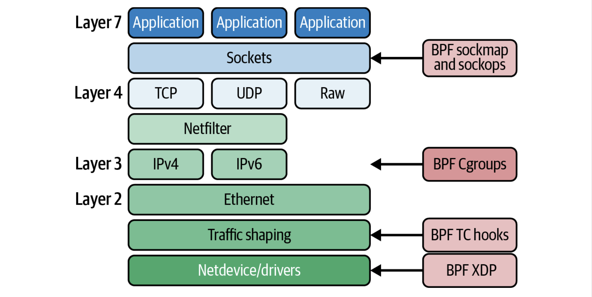

network类型的程序大多实现的功能是通过返回值来告诉内核如何处理数据包，例如正常通过、丢弃、重定向等。也可能是修改网络数据包、socket的配置参数等。


**sockets：**

- `BPF_PROG_TYPE_SOCKET_FILTER`用于过滤socket data的副本并将其发送到类似`tcpdump`的工具。
- `BPF_PROG_TYPE_SOCK_OPS`允许eBPF程序截获socket发生的各种操作，并设置socket的参数。
- `BPF_PROG_TYPE_SK_SKB`与一个特殊的map类型结合使用实现sockmap的操作，即将流量重定向到socket层里的不同目的地。

**traffic control：**

TC听名字就能猜到是负责流量控制，在linux kernel中有一个子系统，非常复杂。可以为入口和出口流量的网络数据包提供自定义的过滤器和分类器。


**XDP：**

`eXpress Data Path`。可以attach到网络接口或者虚拟接口上，实现一系列的功能。


**Flow Dissector：**

用于从数据报的头部提取信息。

**Lightweight Tunnels：**

`BPF_PROG_TYPE_LWT_*`程序类型可以实现网络封装(network encapsulation)。

**Cgroups：**

即control groups，用来限制给定的进程或者进程组可以访问的资源，用来实现容器或者Pod之间的隔离机制，感觉是一一个比较重要的点。

**Infrared Controllers：**

附加到红外控制器的设备的文件描述符上来提供红外协议的解码。


## 0x08 eBPF for Networking

这一章主要介绍了在Networking中eBPF可以实现的各种功能，例如负载均衡、防火墙、安全缓解(security mitigation)和Kubernetes networking。总的来说就是eBPF在network方面可以实现各种各样的功能，除了决定数据包该怎么被处理，例如丢弃，重定向等，还可以直接修改数据报的内容。给我的感觉就是eBPF在网络方面无所不能且可以极大的提高性能，未来可能user space的网络相关应用都会被eBPF程序替代。


XDP和TC的一个区别是XDP只能处理入口流量，而TC即可以处理入口流量，也可以处理出口流量。


我比较关注的一个内容就是eBPF and Kubernetes networking，毕竟我是因为云原生才来学习eBPF的。书里主要介绍了就是传统的k8s network path要经过2个运行在相同kernel上的网络堆栈，经过了两次相同的处理，导致了性能上的下降。


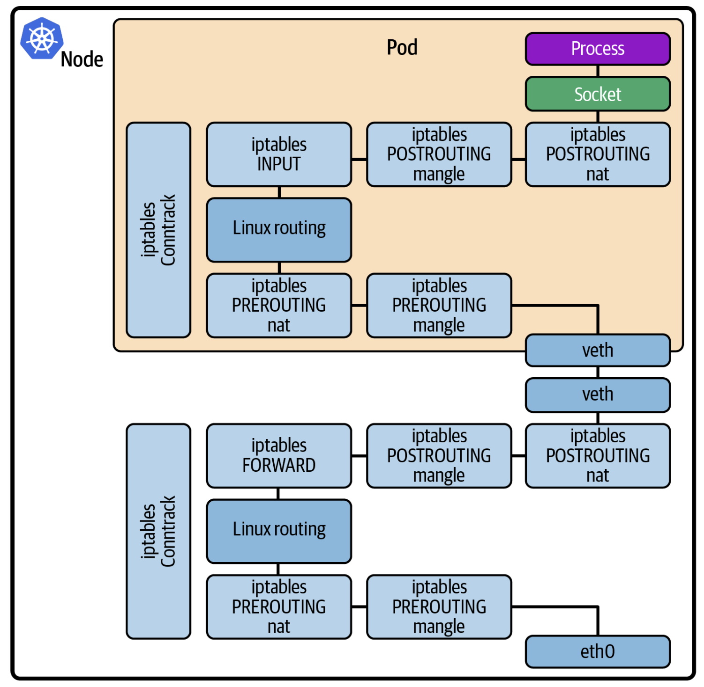

而像基于eBPF的k8s CNI插件 Cilium通过hook进网络堆栈，重写了kernel原生的网络行为，显著提高了性能。


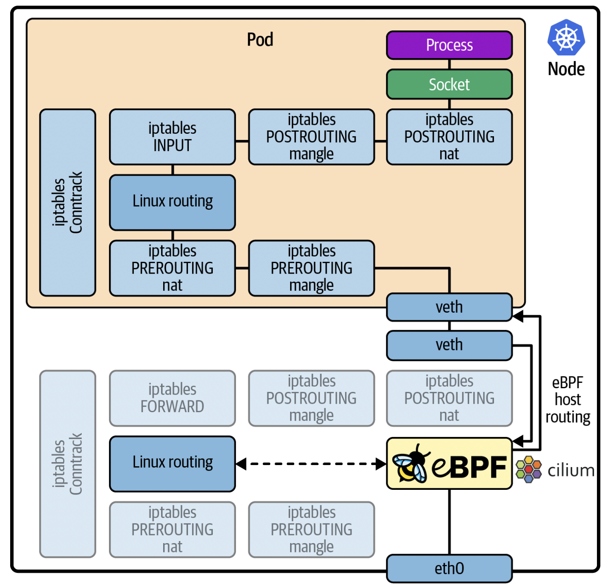

一般使用的iptable因为规则的重写和查找导致了性能低下，而Cilium用eBPF的hash map存储网络规则、连接的跟踪和(connection tracking)和负载均衡的查找表，提供了更好的伸缩性和性能。


Cilium是非常的复杂，由很多协调工作的eBPF程序组成，这些程序attach到内核的不同端点：

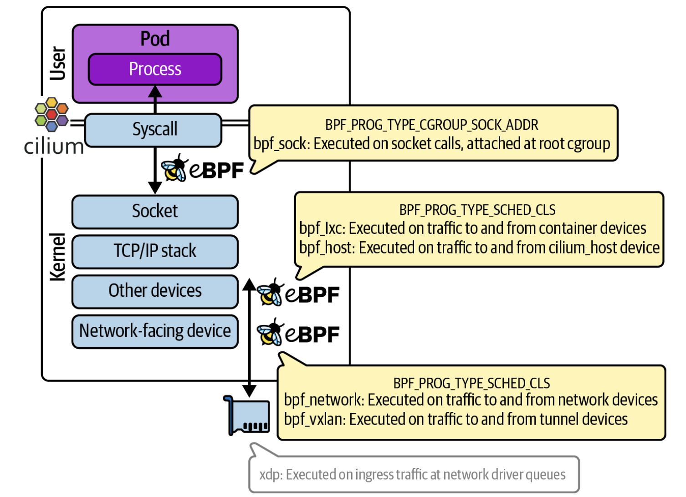


## 0x09 eBPF for Security

下面这张图很好的说明了安全的观测性需要策略和上下文信息：

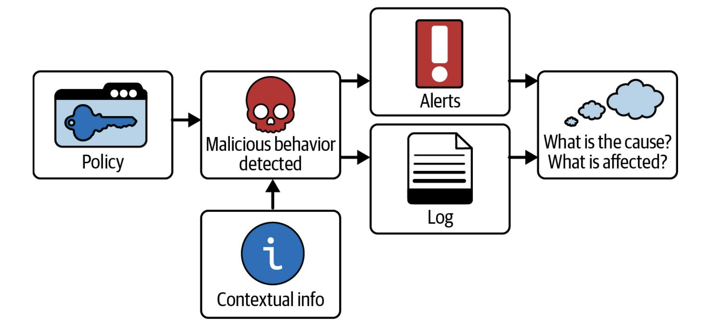

eBPF程序可以用于检测安全事件，这章以递进的关系介绍了几种eBPF程序检测安全事件的方法。

第一种是`Using System Calls for Security Events`。以seccomp(SECure COMPuting)工具作为例子，它的作用是将进程可以使用的系统调用集限制为一个非常小的子集。因为其限制性，出现了seccomp-bpf，使用bpf代码来过滤允许和不允许的系统调用。一组BPF指令会被加载进内核中作为过滤器，每当出现系统调用时，过滤器根据系统调用本身和它的参数来决定是允许执行、返回错误代码给用户态应用程序、杀死进程还是通知用户态应用程序。但是seccomp-bpf还是有很多的限制，比如它只能使用系统调用中的值参数、且必须在启动时应用于进程，在启动后无法修改策略。


第二种就是`Syscall-Tracking Security Tools`，以Falco工具作为例子。它用于提供安全警告，用户可以定义规则来决定哪些事件与安全相关。当发生了与规则中定义的策略不匹配的事件时，就发出警告。它因eBPF程序的动态加载特性，可以在应用程序启动后随时修改策略。但是存在一个`Time Of Check to Time Of Use (TOCTOU)`问题：

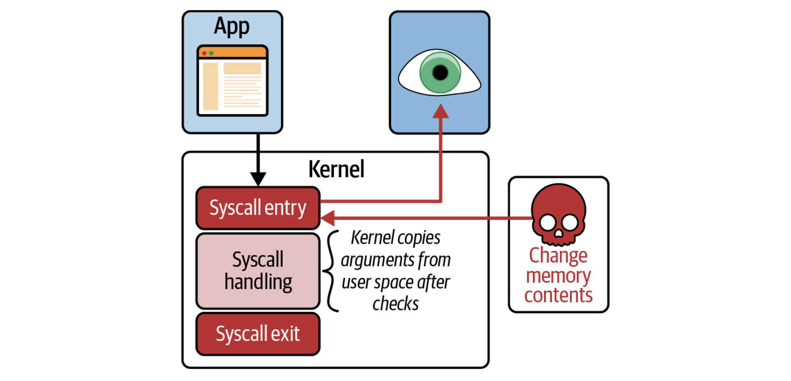

当eBPF程序在系统调用的入口点被触发时，它可以访问用户空间传递给该系统调用的参数，eBPF程序会在这时对参数进行检查。如果这些参数是指针，那么内核在处理该数据之前，需要将指向的数据复制到自己的数据结构中。这就导致了一个时间差，在eBPF程序检查后，在linux kernel复制数据之前，攻击者可以修改这个数据，导致检查的数据和和执行操作的数据不同。


因此为了检查内核中实际处理的信息，eBPF程序应该附加到参数复制到内核内存后发生的事件，这就引出了第三种功能，BPF LSM（kernel version 5.7中添加）

LSM就是之前第7章提到的`Linux Security Module (LSM) API`。LSM API提供了很多的hook，这些hook都发生在内核即将对内核数据结构进行操作之前。hook调用的函数可以决定该操作是否继续执行。

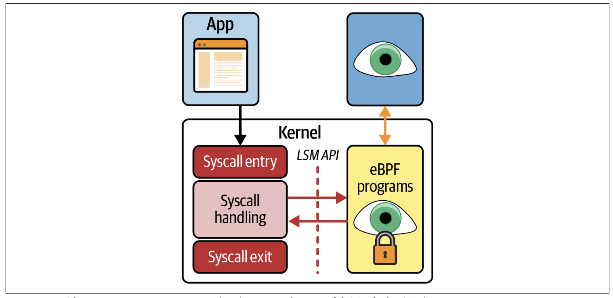

syscal与LSM hook并不是一一映射，一个syscall可能对应多个LSM hook。


第四种以Cilium Tetragon为例子，Tetragon并不是挂载到LSM API的hook上，而是构建了一个框架将eBPF程序挂载到Linux内核的任意函数。它为k8s环境设计，定义了一种名为`TracingPolicy`的k8s资源类型，指定将eBPF程序挂载到哪个函数以及相关条件：

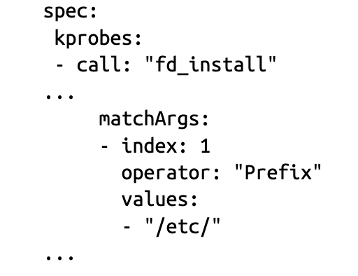

实际上似乎也并不一定任意的函数，而是非官方的稳定函数。指的是内核中虽然不是官方承认的稳定函数，但是很久没有改变，未来不太可能改变。将eBPF附加到这样的稳定函数上来实现安全相关的功能。


本章的最后又介绍了一下Preventative Security(预防性安全)，实际上就是因为下面的图：

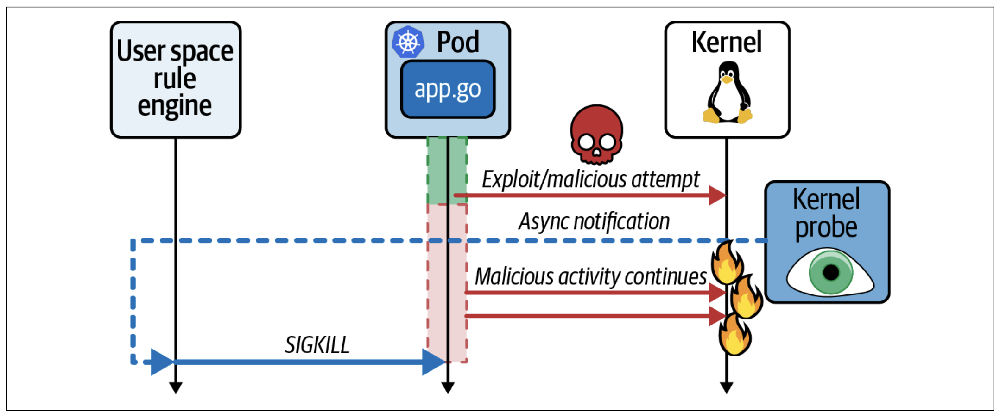

大多数基于eBPF程序的安全工具都是检测恶意事件，然后向用户空间的应用程序发出警告，然后用户空间的应用程序采取行动。这也导致了一个时间差的问题，可能采取行动的时候攻击已经完成了。

因此在kernel version5.3及其更高版本的内核中出现了BPF辅助函数`bpf_send_ signal()`，可以生成signal信号来杀死恶意进程：

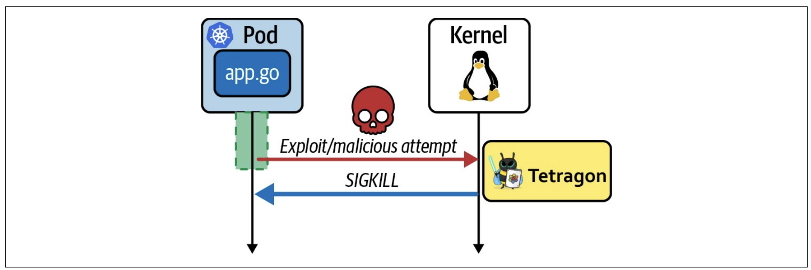

## 0x10 eBPF Programming

这一章主要就是大致介绍了接下来要学习的eBPF编程的一些东西，比如库和语言的选择。作为go的忠实粉，我肯定是选择`cilium/ebpf`和 `libbpfgo`。


## 0x11 The Future Evolution of eBPF

谈论了eBPF未来的发展，其中一个比较有意思的点就是eBPF程序的签名问题，这很复杂，主要就在于用户空间的加载器会动态地调整程序，添加关于map位置的信息，以及为了兼容性重定位（CO-RE）的目的。这些调整从签名的角度来看，很难与**恶意修改**区分开。因为签名是在程序被调整之前生成的，任何后续的修改都可能使签名无效，即使这些修改是出于合法的、必要的调整。

这就导致需要在软件安全性和软件灵活性之间找到一个解决的办法。如果不能实现的话，未来eBPF程序确实也有可能成为供应链安全的一个重大问题。


## Summary

这本书主要还是学习eBPF的相关知识，打下一定的基础，之后就要开始学习eBPF编程了。


## Reference

[如何在 Ubuntu 上配置 eBPF 开发环境](https://yaoyao.io/posts/how-to-setup-ebpf-env-on-ubuntu)

[BPF 可移植性和 CO-RE（一次编译，到处运行）](https://cloud.tencent.com/developer/article/1802154)