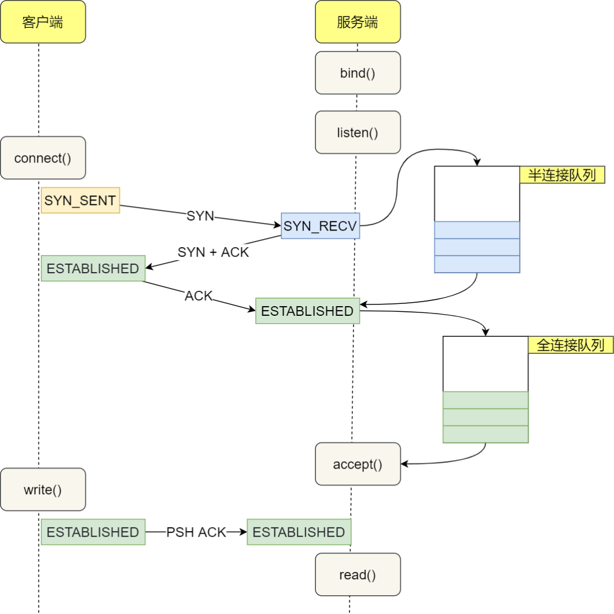

# Learning-eBPF-develop

开始学习eBPF的开发，感觉主要分两部分，一部分是内核的eBPF程序，一部分是用户态的程序，用户态选择使用`cilium/ebpf`进行开发，参考[Getting Started with eBPF in Go](https://ebpf-go.dev/guides/getting-started)学习。内核参考[bpf-developer-tutorial](https://github.com/eunomia-bpf/bpf-developer-tutorial)进行学习，打算的顺序是先简单的搭建好用户态的go开发程序和最简单的例子，然后学习内核的开发，把Kernel的eBPF教程过一遍后再继续把eBPF-go的剩余教程走完。


## cilium-ebpf-learn

### Getting Started

主要是搭建好基本的环境。一些环境在学Learning-eBPF-book的时候已经装好了，这里，基本就是装一下go。装go没啥好说的。

教程里有个坑就是要执行下面的命令，不然找不到`<asm/types.h>`。

```bash
ln -sf /usr/include/asm-generic/ /usr/include/asm
```


开发的话一开始想着goland远程ssh去运行项目，查了一下发现jetbrains有这么个功能：


网上查一下配置一下就可以很简单的弄好了：


非常的舒服，相当于直接linux里运行goland就行写代码和调试，远程配置的所有坑都不用踩。不过要把goland都升级到最新版，老版本的这个功能可能有bug。

这里提一句科技进步带来的生产力飞升。记得两年前刚换mac的时候要跑一个只能在linxu里的程序，当时废了很大的劲才弄了个有bug的远程debug，现在很轻松就可以很舒服的远程编程，

之后就是教程中的那个简单的例子，这里不分析代码了。首先写一个eBPF c程序：

```c

//go:build ignore

#include <linux/bpf.h>
#include <bpf/bpf_helpers.h>

struct {
    __uint(type, BPF_MAP_TYPE_ARRAY); 
    __type(key, __u32);
    __type(value, __u64);
    __uint(max_entries, 1);
} pkt_count SEC(".maps"); 

// count_packets atomically increases a packet counter on every invocation.
SEC("xdp") 
int count_packets() {
    __u32 key    = 0; 
    __u64 *count = bpf_map_lookup_elem(&pkt_count, &key); 
    if (count) { 
        __sync_fetch_and_add(count, 1); 
    }

    return XDP_PASS; 
}

char __license[] SEC("license") = "Dual MIT/GPL"; 

```

执行`go generate`，这一步是让bpf2go将`counter.c` 编译成 `counter_bpf*.o`，bpf2go底层用的其实还是clang和llvm。这一步其实就是生成`BPF skeleton`，类似于Learning-eBPF-book第5章中提到的，只不过那里的用户态是用c编写的，skeleton是通过`bpftool gen skeleton hello-buffer-config.bpf.o > hello-buffer-config.skel.h`这个命令产生的。

```bash
go generate
Compiled /home/parallels/Desktop/gopath/src/ebpf-go-test/counter_bpfeb.o
Stripped /home/parallels/Desktop/gopath/src/ebpf-go-test/counter_bpfeb.o
Wrote /home/parallels/Desktop/gopath/src/ebpf-go-test/counter_bpfeb.go
Compiled /home/parallels/Desktop/gopath/src/ebpf-go-test/counter_bpfel.o
Stripped /home/parallels/Desktop/gopath/src/ebpf-go-test/counter_bpfel.o
Wrote /home/parallels/Desktop/gopath/src/ebpf-go-test/counter_bpfel.go
```

之所以是两个go文件，教程也说了：

- `*_bpfel.o` and `*_bpfel.go` for little-endian architectures like amd64, arm64, riscv64 and loong64（为了小端架构）
- `*_bpfeb.o` and `*_bpfeb.go` for big-endian architectures like s390(x), mips and sparc（大端架构）

然后写`main.go`：

```go
package main

import (
    "log"
    "net"
    "os"
    "os/signal"
    "time"

    "github.com/cilium/ebpf/link"
    "github.com/cilium/ebpf/rlimit"
)

func main() {
    // Remove resource limits for kernels <5.11.
    if err := rlimit.RemoveMemlock(); err != nil { 
        log.Fatal("Removing memlock:", err)
    }

    // Load the compiled eBPF ELF and load it into the kernel.
    var objs counterObjects 
    if err := loadCounterObjects(&objs, nil); err != nil {
        log.Fatal("Loading eBPF objects:", err)
    }
    defer objs.Close() 

    ifname := "lo" // Change this to an interface on your machine.
    iface, err := net.InterfaceByName(ifname)
    if err != nil {
        log.Fatalf("Getting interface %s: %s", ifname, err)
    }

    // Attach count_packets to the network interface.
    link, err := link.AttachXDP(link.XDPOptions{ 
        Program:   objs.CountPackets,
        Interface: iface.Index,
    })
    if err != nil {
        log.Fatal("Attaching XDP:", err)
    }
    defer link.Close() 

    log.Printf("Counting incoming packets on %s..", ifname)

    // Periodically fetch the packet counter from PktCount,
    // exit the program when interrupted.
    tick := time.Tick(time.Second)
    stop := make(chan os.Signal, 5)
    signal.Notify(stop, os.Interrupt)
    for {
        select {
        case <-tick:
            var count uint64
            err := objs.PktCount.Lookup(uint32(0), &count) 
            if err != nil {
                log.Fatal("Map lookup:", err)
            }
            log.Printf("Received %d packets", count)
        case <-stop:
            log.Print("Received signal, exiting..")
            return
        }
    }
}

```

我这边的linux可能是因为虚拟机，用别的网口会报没权限，所以用lo

执行：

```bash
go build && sudo ./ebpf-go-test
2023/12/04 18:12:00 Counting incoming packets on lo..

```

修改了c代码的话需要重走一遍流程，让bpf2go重新编译：

```bash
go generate && go build && sudo ./ebpf-test
```

### Portable eBPF


`//go:embed`主要是编译时将对应的`.o`文件插入到字节切片中，这样编出来的可执行文件就不需要包含`.o`文件。还可以加上`CGO_ENABLED=0`，当开启CGO的时候会将文件中引用libc的库（比如常用的net包），以动态链接的方式生成目标文件，因此设置为0就不会依赖libc，进行静态编译。


```bash
#CGO_ENABLED=1
file ./main
./main: ELF 64-bit LSB executable, ARM aarch64, version 1 (SYSV), dynamically linked, interpreter /lib/ld-linux-aarch64.so.1, Go BuildID=CGJl0VvZM18eVkZDq6-D/xNigdfAoPoOcFTI-QFjd/5iFbmB7fcWS8fdc1BP7h/qHV6eRjQotFE200fvarv, with debug_info, not stripped
#CGO_ENABLED=0
file ./main
./main: ELF 64-bit LSB executable, ARM aarch64, version 1 (SYSV), statically linked, Go BuildID=bPcG_mrpYFDA2rinsWaE/ix3vWY-iYyOorijQap23/uYKcCj5isNvGzjZ3AYUj/tO1xWr1jU76-MFqS_ZuP, with debug_info, not stripped

```


交叉编译的话就直接下面的命令就可以指定架构了：

```bash
CGO_ENABLED=0 GOARCH=arm64 go build
```


### Loading eBPF Programs

这一节主要就是在讲`go generate`产生的eBPF ELF文件是怎么被加载进内核中的。其实就是在讲我们调用的那些库函数到底都做了什么，这些跟着教程然后去跟进库里看一下都可以看到。

`CollectionSpec`代表了从ELF文件中提取的ebpf对象，包括map和program，通过`ebpf.LoadCollectionSpec("bpf_prog.o")`这样的形式获得。

获得了ebpf对象后就可以读取相应的map和program，下一步就是将`CollectionSpec`装载进kernel中，形式如下：

```go
// Instantiate a Collection from a CollectionSpec.
coll, err := ebpf.NewCollection(spec)
if err != nil {
    panic(err)
}
```

其实就是从`CollectionSpec`变成了`Collection`。

可以通过`LoadAndAssign`这么一个封装的函数来代替`NewCollection`，它的优点就是可以选择性的装载map和program，类似于这样的例子：

```go
spec, err := ebpf.LoadCollectionSpec("bpf_prog.o")
if err != nil {
    panic(err)
}

// Insert only the resources specified in 'obj' into the kernel and assign
// them to their respective fields. If any requested resources are not found
// in the ELF, this will fail. Any errors encountered while loading Maps or
// Programs will also be returned here.
var objs myObjs
if err := spec.LoadAndAssign(&objs, nil); err != nil {
    panic(err)
}
defer objs.Close()

// Interact with MyMap through the custom struct.
if err := objs.MyMap.Put(uint32(1), uint64(2)); err != nil {
    panic(err)
}
```

这也是实际会用的，跟进一下例子生成的骨架就知道了：

```go
// See ebpf.CollectionSpec.LoadAndAssign documentation for details.
func loadCounterObjects(obj interface{}, opts *ebpf.CollectionOptions) error {
	spec, err := loadCounter()
	if err != nil {
		return err
	}

	return spec.LoadAndAssign(obj, opts)
}
```


`clang -g`可以将BTF信息包含进eBPF ELF，这些信息可以通过`CollectionSpec.Types`获得，在例子中可以这样：

```go
	spec, err := loadCounter()
	if err != nil {
		log.Fatalf("%s", err)
	}
	fmt.Println(spec.Types.AnyTypeByName("__u64"))
```


### Resource Limits

主要是讲了linux的kernel内存的限制，后面没看太懂是讲什么。

主要是创建eBPF对象需要在内核分配内存，Kernel Version 5.11之前被`RLIMIT_MEMLOCK`限制，5.11之后从rlimits变成了memory cgroup(memcg)。

`rlimit`包就是为了解决5.11之前的限制问题，它有两种行为：

- 引入这个包默认会执行一个副作用的操作，设置当前的`rlimit`为0来使一个map创建失败，然后恢复这个`rlimit`。
- 使用`RemoveMemlock`来移除`RLIMIT_MEMLOCK`的限制，增加`RLIMIT_MEMLOCK`的值到无限大。如果内核支持memcg则不会进行处理。

```go
import "github.com/cilium/ebpf/rlimit"

func main() {
    if err := rlimit.RemoveMemlock(); err != nil {
        panic(err)
    }
}
```

第一个行为还有别的副作用，感觉会很难遇到，遇到了感觉也不知道怎么去debug，我的内核版本大于5.11应该遇不到问题。

### Section Naming

主要介绍了eBPF里的`SEC`宏，具体的一些东西之前也了解了，杂项宏就是`license`这样的：

```bash
char __license[] SEC("license") = "Dual MIT/GPL";
```

除此之外还有map宏和program宏，map宏除了`.maps`还是别的几个没见过的宏，关于全局变量、常量啥的，这些等到具体写代码的时候再学习了。

### Feature Detection

功能检测主要就是检测对应的内核是否支持相应的功能，使用的是`features`包，它有统一的返回值

- `nil`意味着功能支持
- `ErrNotSupported`意味着功能不支持。
- 其他的错误并不一定能说明功能不支持。

例子：

```go
	err := features.HaveProgramType(ebpf.XDP)
	if errors.Is(err, ebpf.ErrNotSupported) {
		fmt.Println("XDP program type is not supported")
		return
	}
	if err != nil {
		// Feature detection was inconclusive.
		//
		// Note: always log and investigate these errors! These can be caused
		// by a lack of permissions, verifier errors, etc. Unless stated
		// otherwise, probes are expected to be conclusive. Please file
		// an issue if this is not the case in your environment.
		panic(err)
	}

	fmt.Println("XDP program type is supported")
```

除此之外还有个`HaveProgramHelper`，不过又说了一些限制，感觉这个包平常也不会用，遇到了再说了。

最后就是`bpftool`也实现了这样的功能检测：

```bash
bpftool feature probe
```

### Object Lifecycle

主要讲eBPF对象的生命周期。对于eBPF对象来说，一般都是一些文件描述符。考虑到这是go语言，因此当go中的对象被垃圾回收器回收的时候，相应的文件描述符也会被关闭。

想要延长eBPF对象的生命周期一种是通过`pin`的方式，其实就类似于这样：

```bash
bpftool prog load hello.bpf.o /sys/fs/bpf/hello
```

实际是一个虚拟的文件系统，要删除就是`rm`，在go里是调用`Unpin()`方法。

另外一种就是attach，将program attach hook也可以增加引用计数器，这里说的link我不是很懂，问了newbing是这样回答的：

> 一个Link对象是一个表示BPF程序和钩子之间绑定关系的抽象，它可以让你在Go应用程序中管理这个绑定。你可以通过调用Link对象的Close()方法来解除绑定，或者通过调用Link对象的Pin()方法来将绑定保存到文件系统中，以便在其他应用程序中使用。

看了一下link对象的`Close()`方法的注释，也是说了如果程序中没有明确的调用`Close()`的话，即使go程序停止了，这个link可能仍会继续存在（go中需要调用`Close()`的资源一般好像也是不用明确`Close()`的，因为程序结束自己就会`Close`，写出来只有一种习惯和起警示作用？）

> Close frees resources.
> The link will be broken unless it has been successfully pinned. A link may continue past the lifetime of the process if Close is not called.


最后又讲了一个很抽象的 概念`ProgramArray`，这是一种特殊的类型的array map，它的值是其他程序的文件描述符的引用，可以实现尾调用和允许`ProgramArray`和程序之间创建循环依赖的关系。且有一个硬性规定：

> **Program Arrays require at least one open file descriptor or bpffs pin**.

下面是一些tips，比较有用的就是如果eBPF代码在go程序结束后运行，那么需要`pin ProgramArray`。


官方的教程非常的短，到这里基本就算结束了，剩下的就是去[eBPF Examples](https://github.com/cilium/ebpf/tree/main/examples)去看各种例子还学习用户态的代码，这部分学习完kernel的代码编写再学习了。

### eBPF Examples

#### kprobe

```c
//go:build ignore

#include "vmlinux.h"
#include <bpf/bpf_helpers.h>
#include <bpf/bpf_tracing.h>

char __license[] SEC("license") = "Dual MIT/GPL";

struct {
    __uint(type, BPF_MAP_TYPE_ARRAY);
    __uint(max_entries, 1);
    __type(key, __u32 );
    __type(value, __u64 );
} kprobe_map SEC(".maps");

SEC("kprobe/sys_execve")
int kprobe_execve() {
    u32 key     = 0;
    u64 initval = 1, *valp;

    valp = bpf_map_lookup_elem(&kprobe_map, &key);
    if (!valp) {
        bpf_map_update_elem(&kprobe_map, &key, &initval, BPF_ANY);
        return 0;
    }
    __sync_fetch_and_add(valp, 1);

    return 0;
}
```

c代码官方的例子用的是下面的，查了一下似乎是一种语法糖，但是我本地一直在疯狂报错怎么跑也跑不通

```c
struct bpf_map_def SEC("maps") kprobe_map = {
	.type        = BPF_MAP_TYPE_ARRAY,
	.key_size    = sizeof(u32),
	.value_size  = sizeof(u64),
	.max_entries = 1,
};

```

查了一下说这个`bpf_map_def`是在`bpf_helpers.h`里的但是我的里面并没有，然后tmd debug了一下午，发现了libbpf的公告：

https://github.com/libbpf/libbpf/wiki/Libbpf:-the-road-to-v1.0#drop-support-for-legacy-bpf-map-declaration-syntax

把这个语法糖删了。。。好似。。。

然后就是用户态的代码：

```go
package main

import (
	"fmt"
	"github.com/cilium/ebpf/link"
	"github.com/cilium/ebpf/rlimit"
	"log"
	"time"
)

const mapKey uint32 = 0

func main() {
	// Remove resource limits for kernels <5.11.
	if err := rlimit.RemoveMemlock(); err != nil {
		log.Fatal("Removing memlock:", err)
	}
	objs := kprobeObjects{}
	//load object
	if err := loadKprobeObjects(&objs, nil); err != nil {
		log.Fatal(err)
	}
	fn := "sys_execve"
	defer objs.Close()
	kp, err := link.Kprobe(fn, objs.KprobeExecve, nil)
	if err != nil {
		log.Fatal(err)
	}
	defer kp.Close()

	ticker := time.NewTicker(time.Second)
	defer ticker.Stop()
	log.Println("Waiting for events..")

	done := make(chan bool)
	go func() {
		time.Sleep(5 * time.Second)
		done <- true
	}()
	for {
		select {
		case <-done:
			fmt.Println("Done!")
			return
		case t := <-ticker.C:
			var value uint64
			if err := objs.KprobeMap.Lookup(mapKey, &value); err != nil {
				log.Fatalf("reading map: %v", err)
			}
			fmt.Print("Current time: ", t, "  ")
			log.Printf("%s called %d times\n", fn, value)
		}

	}

}

```

只是简单的入门例子，还是老流程从ELF中提取eBPF对象然后将其装载进Kernel里。之后就是从MAP中读取。

自此外就是又遇到了一种新的MAP`BPF_MAP_TYPE_ARRAY`，具体各种Map可以参考一下[BPF 进阶笔记（二）：BPF Map 类型详解：使用场景、程序示例](https://arthurchiao.art/blog/bpf-advanced-notes-2-zh/#1-bpf_map_type_array)，感觉写的挺全的。


#### kprobepin

将map pin到虚拟文件系统中，即使用户态程序退出，那个map仍然存在。

```c
struct {
    __uint(type, BPF_MAP_TYPE_ARRAY);
    __type(key, __u32);
    __type(value, __u64);
    __uint(max_entries, 1);
    __uint(pinning, LIBBPF_PIN_BY_NAME);
} kprobe_map SEC(".maps");
```

MAP那边多设置一个pinning参数，MAP pin的时候文件名由MAP的name确定。


```go
	pinPath := path.Join(bpfFSPath, fn)
	err := os.MkdirAll(pinPath, os.ModePerm)
	if err != nil {
		log.Fatalln(err)
	}

	objs := kprobePinObjects{}
	//load object,and pin the map
	if err := loadKprobePinObjects(&objs, &ebpf.CollectionOptions{
		Maps: ebpf.MapOptions{
			PinPath: pinPath,
		},
	}); err != nil {
		log.Fatal(err)
	}
```

通过`bpftool`可以查看map：

```bash
 bpftool map dump pinned /sys/fs/bpf/sys_execve/kprobe_map
[{
        "key": 0,
        "value": 156
    }
]

```

可以用`Unpin()`取消pin：

```go
		select {
		case <-done:
			fmt.Println("Done!")
			err := objs.KprobeMap.Unpin()
			if err != nil {
				log.Fatalln(err)
			}
```


#### kprobe_percpu

这里使用了`BPF_MAP_TYPE_PERCPU_ARRAY`

```c
struct {
    __uint(type, BPF_MAP_TYPE_PERCPU_ARRAY);
    __type(key, __u32);
    __type(value, __u64);
    __uint(max_entries, 1);
} kprobe_map SEC(".maps");
```

`BPF_MAP_TYPE_PERCPU_ARRAY`实际使用和`BPF_MAP_TYPE_ARRAY`差不多，都是Array Map，区别是`BPF_MAP_TYPE_PERCPU_ARRAY`为每个CPU使用不同的内存区域，而`BPF_MAP_TYPE_ARRAY`使用相同的内存区域，对于高性能查找和聚合更有效，被看作是`BPF_MAP_TYPE_ARRAY`的改进版本。

```go
		case t := <-ticker.C:
			var allCpuValue []uint64
			if err := objs.KprobeMap.Lookup(mapKey, &allCpuValue); err != nil {
				log.Fatalf("reading map: %v", err)
			}
			fmt.Println("Current time: ", t, "  ")
			for cpuId, cpuValue := range allCpuValue {
				fmt.Printf("cpuid: %d ,cpuvalue: %d\n", cpuId, cpuValue)
			}
```

#### ringbuffer

主要是用户态程序对ring buffer的处理：

```go
package main

import (
	"bytes"
	"encoding/binary"
	"errors"
	"github.com/cilium/ebpf/link"
	"github.com/cilium/ebpf/ringbuf"
	"github.com/cilium/ebpf/rlimit"
	"golang.org/x/sys/unix"
	"log"
	"os"
	"os/signal"
	"syscall"
)

//go:generate go run github.com/cilium/ebpf/cmd/bpf2go -type event ringbuffer ringbuffer.c

func main() {
	fn := "sys_execve"

	// Subscribe to signals for terminating the program.
	stopper := make(chan os.Signal, 1)
	signal.Notify(stopper, os.Interrupt, syscall.SIGTERM)

	// Remove resource limits for kernels <5.11.
	if err := rlimit.RemoveMemlock(); err != nil {

		log.Fatal("Removing memlock:", err)
	}

	objs := ringbufferObjects{}
	//load object,and pin the map
	if err := loadRingbufferObjects(&objs, nil); err != nil {
		log.Fatal(err)
	}

	defer objs.Close()
	kp, err := link.Kprobe(fn, objs.KprobeExecve, nil)
	if err != nil {
		log.Fatal(err)
	}
	defer kp.Close()

	rd, err := ringbuf.NewReader(objs.Events)
	if err != nil {
		log.Fatal(err)
	}
	defer rd.Close()
	// Close the reader when the process receives a signal, which will exit
	// the read loop.
	go func() {
		<-stopper

		if err := rd.Close(); err != nil {
			log.Fatalf("closing ringbuf reader: %s", err)
		}
	}()

	log.Println("Waiting for events..")

	var event ringbufferEvent
	for {
		record, err := rd.Read()
		if err != nil {
			if errors.Is(err, ringbuf.ErrClosed) {
				log.Println("Received signal, exiting..")
				return
			}
			log.Printf("reading from reader: %s", err)
			continue
		}
		err = binary.Read(bytes.NewBuffer(record.RawSample), binary.LittleEndian, &event)
		if err != nil {
			log.Printf("parsing ringbuf event: %s", err)
			continue
		}
		log.Printf("pid: %d\tcomm: %s\n", event.Pid, unix.ByteSliceToString(event.Comm[:]))
	}
}
```

学习一下程序的终止，非常的优雅，收到`os.Interrupt`和` syscall.SIGTERM`的时候就将rd关闭，另一边`if errors.Is(err, ringbuf.ErrClosed) {`进行判断通过log打印出信息，感觉处理方式非常的优雅。


然后就是从rd中读取出来原始数据并转换成`event`对象。


不过这个例子实际上是帮助解决一些坑的，首先是：

```c
// Force emitting struct event into the ELF.
const struct event *unused __attribute__((unused));
```

将event属性设置为`unused`可以告诉编译器不要警告这个变量未被使用，且可以强制将struct event结构体写入ELF中。

写入ELF还不行，在`go generate`的时候必须指定`-Type`：

```bash
//go:generate go run github.com/cilium/ebpf/cmd/bpf2go -type event ringbuffer ringbuffer.c
```

才可以在生成的`.go`文件中有event对象。

bpf2go的GitHub是这这样写的：

> `bpf2go` generates Go types for all map keys and values by default. You can disable this behaviour using `-no-global-types`. You can add to the set of types by specifying `-type foo` for each type you'd like to generate.

因此猜测bpf2go的生成对象机制是这样的，只会为像Hash和Array这样key和value的type中写明了类型的MAP生成相应的key和value的对象，而ring buffer中没有写明类型，因此默认不会生成对象，需要额外拿`-Type`指定来生成，这也可以适用于C代码写的所有其他的对象，都可以在用户态代码中生成。

另外一点就是什么时候c中的struct会被编译器优化导致ELF文件中没有，这一点考虑到我垃圾的c、二进制和编译原理知识，也不太懂，所以反正遇到了指定`-Type`但是报错的情况，就去加上`const struct event *unused __attribute__((unused));`

顺便来查了一下，发现bpf2go的编译其实也是可以自定义的，因为底层其实还是clang：

```go
go:generate go run github.com/cilium/ebpf/cmd/bpf2go -type event -target arm64 -cflags "-g -O2 -Wall -target bpf -D __TARGET_ARCH_arm64"  ringbuffer ringbuffer.c
```

再复杂可能就是自己指定makefile了。

之所以加上`__TARGET_ARCH_arm64`是因为又看了一下之前书里的CO-RE，里面说如果用到了libbpf提供的某些宏则需要在编译时指定架构，例如`BPF_KPROBE` 和 `BPF_KPROBE_SYSCALL`，但是对于bpf2go来说到底要不要自己指定我也不太清楚， 反正写了也不会出错。


#### uretprobe

主要是用户态的uretprobe怎么写，关键代码还是这些：

```go
const (
	binPath = "/bin/bash"
	symbol  = "readline"
)

	ex, err := link.OpenExecutable(binPath)
	if err != nil {
		log.Fatal("OpenExecutable error", err)
	}
	uretprobe, err := ex.Uretprobe(symbol, objs.BashReadline, nil)
	if err != nil {
		log.Fatal("Uretprobe error,", err)
	}
	defer uretprobe.Close()
```

要hook用户态程序的话，先`OpenExecutable()`，然后在`ex.Uretprobe`中指定`symbol`和ebpf程序的函数即可，而且看了一眼c代码，`SEC`定义似乎乱写都可以成功hook上，所以感觉主要还是得看用户态往哪hook？


但是这个例子没有涉及到`.so`，因为之前看到的似乎可能还要考虑偏移：

```c
u[ret]probe/binary:function[+offset]
```

但实际上目前遇到的好像都不需要，`.so`似乎也是直接用`OpenExecutable`就行了。

所以考虑把之前书里的hook SSL_write实现一下，参考了

[使用eBPF跟踪 SSL/TLS 连接](https://kiosk007.top/post/%E4%BD%BF%E7%94%A8ebpf%E8%B7%9F%E8%B8%AA-ssltls-%E8%BF%9E%E6%8E%A5/)，实现了一个简单版本，一路上遇到了很多bug感觉，最后修好了：

```c
//go:build ignore


#include "vmlinux.h"
#include <bpf/bpf_helpers.h>
#include <bpf/bpf_tracing.h>
#include <bpf/bpf_core_read.h>


#define MAX_ENTRIES 5
char __license[] SEC("license") = "Dual MIT/GPL";

struct event{
    __u8 data[2048];
};

struct sslParam{
    uintptr_t buf;
    int num;
};
struct {
    __uint(type, BPF_MAP_TYPE_HASH);
    __uint(max_entries, MAX_ENTRIES);
    __type(key, __u32);
    __type(value, struct sslParam);
} sslParamMap SEC(".maps");

const struct event *unused1 __attribute__((unused));

struct {
    __uint(type, BPF_MAP_TYPE_RINGBUF);
    __uint(max_entries, 256 * 1024);
} events SEC(".maps");

SEC("uprobe/usr/lib/aarch64-linux-gnu/libssl.so.3/SSL_write")
int BPF_KPROBE(uprobeSslWrite,void *s,const void *buf, int num) {

    struct sslParam param={};
    param.buf = (uintptr_t)buf;
    param.num = num;
    __u64 id=bpf_get_current_pid_tgid();
    pid_t pid = id >> 32;
    bpf_map_update_elem(&sslParamMap, &pid, &param, BPF_ANY);
    return 0;
}


SEC("uretprobe/usr/lib/aarch64-linux-gnu/libssl.so.3/SSL_write")
int BPF_URETPROBE(uretprobeSslWrite){

    struct sslParam *param;
    pid_t pid = bpf_get_current_pid_tgid() >> 32;
    param = bpf_map_lookup_elem(&sslParamMap, &pid);
    if (param==NULL) {
        return 0;
    }
    struct event *out;
    out = bpf_ringbuf_reserve(&events, sizeof(*out), 0);
    if (!out) {
        return 0;
    }
    bpf_probe_read(out->data, sizeof(out->data), (char *)param->buf);
    bpf_ringbuf_submit(out, 0);
    bpf_map_delete_elem(&sslParamMap, &pid);


    return 0;
}

```


```go
package main

import (
	"bytes"
	"encoding/binary"
	"errors"
	"github.com/cilium/ebpf/link"
	"github.com/cilium/ebpf/ringbuf"
	"github.com/cilium/ebpf/rlimit"
	"golang.org/x/sys/unix"
	"log"
	"os"
	"os/signal"
	"syscall"
)

const (
	binPath = "/usr/lib/aarch64-linux-gnu/libssl.so.3"
	symbol  = "SSL_read"
)

func main() {
	// Subscribe to signals for terminating the program.
	stopper := make(chan os.Signal, 1)
	signal.Notify(stopper, os.Interrupt, syscall.SIGTERM)

	// Remove resource limits for kernels <5.11.
	if err := rlimit.RemoveMemlock(); err != nil {

		log.Fatal("Removing memlock:", err)
	}

	objs := uprobeObjects{}
	//load object,and pin the map
	if err := loadUprobeObjects(&objs, nil); err != nil {
		log.Fatal("loadUprobeObjects error,", err)
	}

	defer objs.Close()

	ex, err := link.OpenExecutable(binPath)
	if err != nil {
		log.Fatal("OpenExecutable error", err)
	}
	uprobe, err := ex.Uprobe(symbol, objs.UprobeSslWrite, nil)
	if err != nil {
		log.Fatal("Uprobe error,", err)
	}
	defer uprobe.Close()
	uretprobe, err := ex.Uretprobe(symbol, objs.UretprobeSslWrite, nil)
	if err != nil {
		log.Fatal("Uretprobe error,", err)
	}
	defer uretprobe.Close()

	rd, err := ringbuf.NewReader(objs.Events)
	if err != nil {
		log.Fatal(err)
	}
	defer rd.Close()
	// Close the reader when the process receives a signal, which will exit
	// the read loop.
	go func() {
		<-stopper
		if err := rd.Close(); err != nil {
			log.Fatalf("closing ringbuf reader: %s", err)
		}
	}()

	log.Println("Waiting for events..")

	var event uprobeEvent

	for {
		record, err := rd.Read()
		if err != nil {
			if errors.Is(err, ringbuf.ErrClosed) {
				log.Println("Received signal, exiting..")
				return
			}

			log.Printf("reading from reader: %s", err)
			continue
		}
		err = binary.Read(bytes.NewBuffer(record.RawSample), binary.LittleEndian, &event)
		if err != nil {
			log.Printf("parsing ringbuf event: %s", err)
			continue
		}
		//log.Printf("%s", event.Data)
		//log.Println(len(event.Data))
		log.Printf("%s:%s ,buffer: %s", binPath, symbol, unix.ByteSliceToString(event.Data[:]))
	}
}

```

一个问题就是`uintptr_t`，c对象转go的时候没法转换指针，所以github 的issue上说要改成`uintptr_t`。

#### tracepoint_in_c

就是改成了`link.Tracepoint`

```c
	tracepoint, err := link.Tracepoint("kmem", "mm_page_alloc", objs.MmPageAlloc, nil)
	if err != nil {
		log.Fatal("link tracepoint error")
	}
	defer tracepoint.Close()
```

别的没太多区别。不过输入`link.`的时候能看到还有各种`attach`，`AttachXDP`之前遇到了，别的感觉也都是用于特定情况的。


#### tracepoint_in_go

Program、Map啥的都可以在Go里面声明，但是要手写asm指令太抽象了，然后拿`ebpf.NewProgram`创建程序，感觉基本不可能这样写。

#### cgroup_skb

c的代码其实非常简单，只是给了一个例子：

```c
SEC("cgroup_skb/egress")
int count_egress_packets(struct __sk_buff *skb) {
    u32 key      = 0;
    u64 init_val = 1;

    u64 *count = bpf_map_lookup_elem(&pkt_count, &key);
    if (!count) {
        bpf_map_update_elem(&pkt_count, &key, &init_val, BPF_ANY);
        return 1;
    }
    __sync_fetch_and_add(count, 1);

    return 1;
}
```

`cgroup_skb`是cgroup的套接字缓冲区(skb)上运行，hook点事egress，当数据包离开cgroup时执行此程序。


具体挂载的`go`代码：

```go
	cgroup, err := link.AttachCgroup(link.CgroupOptions{
		Path:    "/sys/fs/cgroup",
		Attach:  ebpf.AttachCGroupInetEgress,
		Program: objs.CountEgressPackets,
	})
```

`Path`它给了个函数但是我这边没有`/proc/mounts`只能自己指定，`Attach`看了一下实际上`Cgroup`还有很多种。

其实感觉对`Cgroup`还是比较迷的，下次补一下。

#### tcp_connect

这里用的是`Fentry`，我是arm得kernel 6以后才支持，装了个6.5.13但是没装好headers，暂时没遇到问题，遇到了再回退linux版本吧。


```c
//go:build ignore

#include "vmlinux.h"
#include <bpf/bpf_helpers.h>
#include <bpf/bpf_tracing.h>
#include <bpf/bpf_core_read.h>
#include <bpf/bpf_endian.h>
#define AF_INET 2
#define TASK_COMM_LEN 16

char __license[] SEC("license") = "Dual MIT/GPL";


struct {
    __uint(type, BPF_MAP_TYPE_RINGBUF);
    __uint(max_entries, 1 << 24);
} events SEC(".maps");


struct event {
    u8 comm[16];
    __u16 sport;
    __be16 dport;
    __be32 saddr;
    __be32 daddr;
};
struct event *unused __attribute__((unused));

SEC("fentry/tcp_connect")
int BPF_PROG(tcp_connect, struct sock *sk) {
    if (sk->__sk_common.skc_family != AF_INET) {
        return 0;
    }

    struct event *tcp_info;
    tcp_info = bpf_ringbuf_reserve(&events, sizeof(struct event), 0);
    if (!tcp_info) {
        return 0;
    }

    tcp_info->saddr = sk->__sk_common.skc_rcv_saddr;
    tcp_info->daddr = sk->__sk_common.skc_daddr;
    tcp_info->dport = sk->__sk_common.skc_dport;
    tcp_info->sport = bpf_htons(sk->__sk_common.skc_num);

    bpf_get_current_comm(&tcp_info->comm, TASK_COMM_LEN);

    bpf_ringbuf_submit(tcp_info, 0);

    return 0;
}
```

用的宏是`BPF_PROG`。


```go
package main

import (
	"bytes"
	"encoding/binary"
	"errors"
	"github.com/cilium/ebpf/link"
	"github.com/cilium/ebpf/ringbuf"
	"github.com/cilium/ebpf/rlimit"
	"log"
	"net"
	"os"
	"os/signal"
	"syscall"
)

const mapKey uint32 = 0

func main() {

	// Subscribe to signals for terminating the program.
	stopper := make(chan os.Signal, 1)
	signal.Notify(stopper, os.Interrupt, syscall.SIGTERM)

	// Remove resource limits for kernels <5.11.
	if err := rlimit.RemoveMemlock(); err != nil {

		log.Fatal("Removing memlock:", err)
	}

	objs := fentryObjects{}
	//load object,and pin the map
	if err := loadFentryObjects(&objs, nil); err != nil {
		log.Fatal("load Object error,", err)
	}

	defer objs.Close()
	tracing, err := link.AttachTracing(link.TracingOptions{
		Program: objs.TcpConnect,
	})
	if err != nil {
		log.Fatal("attach tracing error,", err)
	}
	defer tracing.Close()

	rd, err := ringbuf.NewReader(objs.fentryMaps.Events)
	if err != nil {
		log.Fatal("new reader error", err)
	}
	defer rd.Close()
	go func() {
		<-stopper

		if err := rd.Close(); err != nil {
			log.Fatalf("closing ringbuf reader: %s", err)
		}
	}()

	log.Printf("%-16s %-15s %-6s -> %-15s %-6s",
		"Comm",
		"Src addr",
		"Port",
		"Dest addr",
		"Port",
	)
	// bpfEvent is generated by bpf2go.
	var event fentryEvent
	for {
		record, err := rd.Read()
		if err != nil {
			if errors.Is(err, ringbuf.ErrClosed) {
				log.Println("received signal, exiting..")
				return
			}
			log.Printf("reading from reader: %s", err)
			continue
		}

		// Parse the ringbuf event entry into a bpfEvent structure.
		if err := binary.Read(bytes.NewBuffer(record.RawSample), binary.BigEndian, &event); err != nil {
			log.Printf("parsing ringbuf event: %s", err)
			continue
		}

		log.Printf("%-16s %-15s %-6d -> %-15s %-6d",
			event.Comm,
			intToIP(event.Saddr),
			event.Sport,
			intToIP(event.Daddr),
			event.Dport,
		)
	}

}

// intToIP converts IPv4 number to net.IP
func intToIP(ipNum uint32) net.IP {
	ip := make(net.IP, 4)
	binary.BigEndian.PutUint32(ip, ipNum)
	return ip
}

```

`fentry`用的也还是`link.AttachTracing`，没有专门的函数支持。此外go代码中有很多处理网络的代码，涉及到主机字节顺序和网络字节顺序，网络字节顺序是大端，这点之后写网络编程的时候需要注意。

#### tcp_close

跟上个例子差不多，唯一的区别还是大端小端非常混乱，等自己写网络编程的时候再看看是什么情况了。


#### xdp

xdp程序的例子，虽然started的例子也是xdp，但是并没有对xdp的ctx进行处理。这里的代码也是和书中parse xdp那一节基本差不多：

```c
//go:build ignore

#include "vmlinux.h"
#include <bpf/bpf_helpers.h>
#include <bpf/bpf_tracing.h>
#include <bpf/bpf_core_read.h>
#include <bpf/bpf_endian.h>

char __license[] SEC("license") = "Dual MIT/GPL";

#define MAX_MAP_ENTRIES 16
#define ETH_P_IP 0x0800
/* Define an LRU hash map for storing packet count by source IPv4 address */
struct {
    __uint(type, BPF_MAP_TYPE_LRU_HASH);
    __uint(max_entries, MAX_MAP_ENTRIES);
    __type(key, __u32); // source IPv4 address
    __type(value, __u32); // packet count
} xdp_stats_map SEC(".maps");

/*
Attempt to parse the IPv4 source address from the packet.
Returns 0 if there is no IPv4 header field; otherwise returns non-zero.
*/
static __always_inline int parse_ip_src_addr(struct xdp_md *ctx, __u32 *ip_src_addr) {
    void *data_end = (void *)(long)ctx->data_end;
    void *data     = (void *)(long)ctx->data;

    // First, parse the ethernet header.
    struct ethhdr *eth = data;
    if ((void *)(eth + 1) > data_end) {
        return 0;
    }

    if (eth->h_proto != bpf_htons(ETH_P_IP)) {
        // The protocol is not IPv4, so we can't parse an IPv4 source address.
        return 0;
    }

    // Then parse the IP header.
    struct iphdr *ip = (void *)(eth + 1);
    if ((void *)(ip + 1) > data_end) {
        return 0;
    }

    // Return the source IP address in network byte order.
    *ip_src_addr = (__u32)(ip->saddr);
    return 1;
}

SEC("xdp")
int xdp_prog_func(struct xdp_md *ctx) {
    __u32 ip;
    if (!parse_ip_src_addr(ctx, &ip)) {
        // Not an IPv4 packet, so don't count it.
        goto done;
    }

    __u32 *pkt_count = bpf_map_lookup_elem(&xdp_stats_map, &ip);
    if (!pkt_count) {
        // No entry in the map for this IP address yet, so set the initial value to 1.
        __u32 init_pkt_count = 1;
        bpf_map_update_elem(&xdp_stats_map, &ip, &init_pkt_count, BPF_ANY);
    } else {
        // Entry already exists for this IP address,
        // so increment it atomically using an LLVM built-in.
        __sync_fetch_and_add(pkt_count, 1);
    }

    done:
    // Try changing this to XDP_DROP and see what happens!
    return XDP_PASS;
}
```


内核态的程序就还是基本的流程没啥好说的了。

至此用户态的GO程序的例子都看完了，下面就去尝试自己写些ebpf程序了。overover。

## bpf-developer-tutorial

这部分猜测主要还是在写c，因为对c不熟悉所以非常需要打一个字母出来许多匹配的函数这样的功能，所以肯定不能vim而要用clion了。clion的话配置一下远程：


怎么编译后续就无所谓了，主要是这样改完至少clion会加载远程linux的各种依赖文件，这样敲代码至少不会红，而且也有关键字的提示了。

（**后续不用这样了，按照配置goland的那样配一个Jetbrains Gateway就行**）

### lesson 1-helloworld

一个简单的例子和讲了一个eBPF程序的基本框架和流程：

```c
/* SPDX-License-Identifier: (LGPL-2.1 OR BSD-2-Clause) */
#define BPF_NO_GLOBAL_DATA
#include <linux/bpf.h>
#include <bpf/bpf_helpers.h>
#include <bpf/bpf_tracing.h>

typedef unsigned int u32;
typedef int pid_t;
const pid_t pid_filter = 0;

char LICENSE[] SEC("license") = "Dual BSD/GPL";

SEC("tp/syscalls/sys_enter_write")
int handle_tp(void *ctx)
{
 pid_t pid = bpf_get_current_pid_tgid() >> 32;
 if (pid_filter && pid != pid_filter)
  return 0;
 bpf_printk("BPF triggered sys_enter_write from PID %d.\n", pid);
 return 0;
}
```


使用`eunomia-bpf`编译和运行，一行命令即可，比较方便，不用编写userspace的代码。

```bash
ecc minimal.bpf.c&&ecli run package.json
```


进行eBPF开发也基本都是按照这个流程。

- 定义 eBPF 程序的接口和类型：这包括定义 eBPF 程序的接口函数，定义和实现 eBPF 内核映射（maps）和共享内存（perf events），以及定义和使用 eBPF 内核帮助函数（helpers）。
- 编写 eBPF 程序的代码：这包括编写 eBPF 程序的主要逻辑，实现 eBPF 内核映射的读写操作，以及使用 eBPF 内核帮助函数。
- 编译 eBPF 程序：这包括使用 eBPF 编译器（例如 clang）将 eBPF 程序代码编译为 eBPF 字节码，并生成可执行的 eBPF 内核模块。ecc 本质上也是调用 clang 编译器来编译 eBPF 程序。
- 加载 eBPF 程序到内核：这包括将编译好的 eBPF 内核模块加载到 Linux 内核中，并将 eBPF 程序附加到指定的内核事件上。
- 使用 eBPF 程序：这包括监测 eBPF 程序的运行情况，并使用 eBPF 内核映射和共享内存进行数据交换和共享。
- 在实际开发中，还可能需要进行其他的步骤，例如配置编译和加载参数，管理 eBPF 内核模块和内核映射，以及使用其他高级功能等。


### lesson 2-kprobe-unlink

利用kprobe(内核探针)技术，用户可以自己定义回调函数并在内核几乎的所有函数中**动态**的插入探测点。当内核执行流程执行到指定的探测函数时，会调用该回调函数。

```c
#include "vmlinux.h"
#include <bpf/bpf_helpers.h>
#include <bpf/bpf_tracing.h>
#include <bpf/bpf_core_read.h>

char LICENSE[] SEC("license") = "Dual BSD/GPL";

SEC("kprobe/do_unlinkat")
int BPF_KPROBE(do_unlinkat, int dfd, struct filename *name)
{
    pid_t pid;
    const char *filename;

    pid = bpf_get_current_pid_tgid() >> 32;
    filename = BPF_CORE_READ(name, name);
    bpf_printk("KPROBE ENTRY pid = %d, filename = %s\n", pid, filename);
    return 0;
}

SEC("kretprobe/do_unlinkat")
int BPF_KRETPROBE(do_unlinkat_exit, long ret)
{
    pid_t pid;

    pid = bpf_get_current_pid_tgid() >> 32;
    bpf_printk("KPROBE EXIT: pid = %d, ret = %ld\n", pid, ret);
    return 0;
}
```

分别用`kprobe`和`kretprobe`在`do_unlinkat`函数的入口和出口处进行hook。

`BPF_KPROBE`和`BPF_KRETPROBE`是宏，被用来挂载到kprobe的eBPFF程序使用。相应的还有`BPF_KPROBE_SYSCALL`，它是专门用于kprobe_syscall的。

宏的参数的第一个是这个eBPF程序的name，剩余的args对应挂载的内核函数的函数参数和函数的返回值。例如`do_unlinkat`的函数参数如下，因此宏中就这样写。

```c
int do_unlinkat(int dfd, struct filename *name)
```


`BPF_CORE_READ`是一种宏，这里首先要提到`bpf_probe_read_kernel`这个辅助函数，在一般的eBPF程序中，这个辅助函数用于从内核的某个结构中读取字段的值，而在CO-RE中，使用`bpf_core_read`来读取，因为它记录了目标内核上重定位的字段的信息，它将 `src` 引用的字段读取 `sz` 字节到 `dst` 指向的内存中。

```c
#define bpf_core_read(dst, sz, src)					    \
	bpf_probe_read_kernel(dst, sz, (const void *)__builtin_preserve_access_index(src))
```

而`BPF_CORE_READ`宏是为了解决大量使用`bpf_core_read`的问题，例如要读取`d = a->b->c->d`，下面一行代码就可以，而用`bpf_core_read`则会很复杂。

```c
d = BPF_CORE_READ(a, b, c, d);

struct b_t *b; struct c_t *c;
    bpf_core_read(&b, 8, &a->b);
    bpf_core_read(&c, 8, &b->c);
    bpf_core_read(&d, 8, &c->d);
```

所以感觉一般用`BPF_CORE_READ()`就比较方便了。

更多的需要阅读[BPF CO-RE reference guide](https://nakryiko.com/posts/bpf-core-reference-guide/)。

`bpf_printk()`辅助函数用来打印debug信息，具体信息可以`cat /sys/kernel/debug/tracing/trace_pipe`查看（如果没有用户态程序的话），其实就类似于`printf`，相关的还有一个`bpf_trace_printk()`，这是Kervel5.2以前用的，有很多缺点不方便，5.2以后基本都用`bpf_printk()`。


头文件中的`vmlinux.h`包含了Linux内核源码中所有的类型定义，用于支持CO-RE。`vmlinux.h`头部有下面的代码：

```c
#ifndef BPF_NO_PRESERVE_ACCESS_INDEX
#pragma clang attribute push (__attribute__((preserve_access_index)), apply_to = record)
#endif
```

将`preserve_access_index`属性应用于这个文件中所有的数据结构，这个属性的作用是在编译eBPF程序时，记录每个字段访问的相对位置，然后在加载eBPF程序时，根据当前内核的BTF信息，重定位这些字段访问的绝对位置。这个属性是clang-11版本引入的一个专门针对eBPF后端的特性，从而实现一次编译，到处运行。

### lesson 3-fentry-unlink

fentry（function entry）和 fexit（function exit）是 eBPF（扩展的伯克利包过滤器）中的两种探针类型，用于在 Linux 内核函数的入口和退出处进行跟踪，比kprobe更加先进，在x86的处理器上从Kernel 5.5开始支持，在arm处理器上从Kernel 6.0开始支持（网上查到的是这么说，但实际上我一开始更了个6.0.19还是不行，后来下了6.5.13就支持了）

最大的区别就是fexit 程序可以访问函数的输入参数和返回值，而 kretprobe 只能访问返回值。


```c
#include "vmlinux.h"
#include <bpf/bpf_helpers.h>
#include <bpf/bpf_tracing.h>

char LICENSE[] SEC("license") = "Dual BSD/GPL";

SEC("fentry/do_unlinkat")
int BPF_PROG(do_unlinkat, int dfd, struct filename *name)
{
    pid_t pid;

    pid = bpf_get_current_pid_tgid() >> 32;
    bpf_printk("fentry: pid = %d, filename = %s\n", pid, name->name);
    return 0;
}

SEC("fexit/do_unlinkat")
int BPF_PROG(do_unlinkat_exit, int dfd, struct filename *name, long ret)
{
    pid_t pid;

    pid = bpf_get_current_pid_tgid() >> 32;
    bpf_printk("fexit: pid = %d, filename = %s, ret = %ld\n", pid, name->name, ret);
    return 0;
}
```


使用了`BPF_PROG`宏，是一个用于`tp_btf`、`fentry`和`fexit`的宏，可以帮助我们自动做了解析ctx数组与实际参数类型的转化, 并隐藏了ctx指针。

### lesson 4-opensnoop

这一节主要是一个tracepoint和全局变量的例子：

```c
#include <vmlinux.h>
#include <bpf/bpf_helpers.h>

/// @description "Process ID to trace"
const volatile int pid_target = 0;

SEC("tracepoint/syscalls/sys_enter_openat")
int tracepoint__syscalls__sys_enter_openat(struct trace_event_raw_sys_enter* ctx)
{
    u64 id = bpf_get_current_pid_tgid();
    u32 pid = id >> 32;

    if (pid_target && pid_target != pid)
        return false;
    // Use bpf_printk to print the process information
    bpf_printk("Process ID: %d enter sys openat\n", pid);
    return 0;
}

/// "Trace open family syscalls."
char LICENSE[] SEC("license") = "GPL";
```

`pid_target`是一个全局变量，用于在eBPF程序和用户态程序之间进行数据交互。在以前eBPF必须用map。

> 使用全局变量的原理是，全局变量在 eBPF 程序的数据段（data section）中定义并存储。当 eBPF 程序加载到内核并执行时，这些全局变量会保持在内核中，可以通过 BPF 系统调用进行访问。用户态程序可以使用 BPF 系统调用中的某些特性，如 `bpf_obj_get_info_by_fd` 和 `bpf_obj_get_info`，获取 eBPF 对象的信息，包括全局变量的位置和值。


`struct trace_event_raw_sys_enter* ctx`是BTF支持的tracepoint使用的数据结构，来自`<vmlinux.h>`：

```c

struct trace_event_raw_sys_enter {
	struct trace_entry ent;
	long int id;
	long unsigned int args[6];
	char __data[0];
};
```

`tracepoint`支持的事件可以通过`at`来查看

`tracepoint`挂载点的参数可以通过命令`cat /sys/kernel/tracing/events/syscalls/sys_enter_openat/format`来读取：

```bash
name: sys_enter_openat
ID: 565
format:
        field:unsigned short common_type;       offset:0;       size:2; signed:0;
        field:unsigned char common_flags;       offset:2;       size:1; signed:0;
        field:unsigned char common_preempt_count;       offset:3;       size:1; signed:0;
        field:int common_pid;   offset:4;       size:4; signed:1;

        field:int __syscall_nr; offset:8;       size:4; signed:1;
        field:int dfd;  offset:16;      size:8; signed:0;
        field:const char * filename;    offset:24;      size:8; signed:0;
        field:int flags;        offset:32;      size:8; signed:0;
        field:umode_t mode;     offset:40;      size:8; signed:0;

print fmt: "dfd: 0x%08lx, filename: 0x%08lx, flags: 0x%08lx, mode: 0x%08lx", ((unsigned long)(REC->dfd)), ((unsigned long)(REC->filename)), ((unsigned long)(REC->flags)), ((unsigned long)(REC->mode))

```

`struct trace_entry ent`就是从`common_type`到`common_pid`的部分，id表示tracepoint事件ID，args存储了事件了参数，最多六个。`__data`用于存储额外的数据，如字符串或结构体。例子中没有用`ctx`，我查了下资料学习了一下，比如想获取filename，可以这样：

```c
char *filename = (char *)BPF_CORE_READ(ctx,args[1]);
```


此外，所有的 tracepoints 都定义在 [include/trace/events/](https://xie.infoq.cn/link?target=https%3A%2F%2Fgithub.com%2Ftorvalds%2Flinux%2Ftree%2Fmaster%2Finclude%2Ftrace%2Fevents) 目录下的头文件中。例如进程调度相关的 tracepoints 定义在 [include/trace/events/sched.h](https://xie.infoq.cn/link?target=https%3A%2F%2Fgithub.com%2Ftorvalds%2Flinux%2Fblob%2Fmaster%2Finclude%2Ftrace%2Fevents%2Fsched.h)中，里面都有详细的介绍。这些在本地我的是`/usr/src/linux-headers-6.0.19-060019/include/trace/events/sched.h`。


文章中用`ecli`可以控制全局变量但是我本地并没有那个选项，因此必须代码中设置，这个值一般也是用户态程序设置的。

### lesson 5-uprobe-bashreadline

使用uprobe的例子：

```c
#include <vmlinux.h>
#include <bpf/bpf_helpers.h>
#include <bpf/bpf_tracing.h>

#define TASK_COMM_LEN 16
#define MAX_LINE_SIZE 80

/* Format of u[ret]probe section definition supporting auto-attach:
 * u[ret]probe/binary:function[+offset]
 *
 * binary can be an absolute/relative path or a filename; the latter is resolved to a
 * full binary path via bpf_program__attach_uprobe_opts.
 *
 * Specifying uprobe+ ensures we carry out strict matching; either "uprobe" must be
 * specified (and auto-attach is not possible) or the above format is specified for
 * auto-attach.
 */
SEC("uretprobe//bin/bash:readline")
int BPF_KRETPROBE(printret, const void *ret)
{
 char str[MAX_LINE_SIZE];
 char comm[TASK_COMM_LEN];
 u32 pid;

 if (!ret)
  return 0;

 bpf_get_current_comm(&comm, sizeof(comm));

 pid = bpf_get_current_pid_tgid() >> 32;
 bpf_probe_read_user_str(str, sizeof(str), ret);

 bpf_printk("PID %d (%s) read: %s ", pid, comm, str);

 return 0;
};

char LICENSE[] SEC("license") = "GPL";
```

这个和之前那本书中关于`uprobe`的例子不太一样，这么看来`uprobe`其实并不一定只能hook到`.so`中，还可以hook到二进制文件中的函数，格式为：

```c
//binary
SEC("u[ret]probe/binary:function[+offset]")
//.so
SEC("uprobe/usr/lib/aarch64-linux-gnu/libssl.so.3/SSL_write")
```

另外一个点就是`bpf_probe_read_user_str()`，这涉及到读取str，用户态和内核态的原理都差不多。


对于下面的结构体，`name`指向字符串存储的位置，但 `type` 字段实际上是包含字符串的内存

```c
struct my_kernel_type {
    const char *name;
    char type[32];
};
```

有两种读取方式，`bpf_probe_read_kernel_str()`是读取str的辅助函数。这两种方式最好不要混淆。

```c
struct my_kernel_type *t = ...;
const char *p;
char str[32];

//1.
/*通过重定位的方式拿到指针*/
bpf_core_read(&p, sizeof(p), &t->name);
/*读取字符串的值*/
bpf_probe_read_kernel_str(str, sizeof(str), p);

//2.
bpf_core_read_str(str, sizeof(str), &t->type);

```


因此lesson-4里如果想读取filename的话，需要这样：

```c
    char *filename = (char *)BPF_CORE_READ(ctx,args[1]);
    char str[90];
    bpf_probe_read_user_str(str,sizeof(str),filename);
    //或者用bpf_probe_read_str
    //bpf_probe_read_str(str,sizeof(str),filename);
```

这么一看的话用`bpf_probe_read_str()`确实会方便很多，不需要区分userspace和kernel。但是很容易分不清。


遇到了这么多的函数，终于对CO-RE读取内存有点理清了。

### lesson 6-sigsnoop

```c
#include <vmlinux.h>
#include <bpf/bpf_helpers.h>
#include <bpf/bpf_tracing.h>

#define MAX_ENTRIES 10240
#define TASK_COMM_LEN 16

struct event {
 unsigned int pid;
 unsigned int tpid;
 int sig;
 int ret;
 char comm[TASK_COMM_LEN];
};

struct {
 __uint(type, BPF_MAP_TYPE_HASH);
 __uint(max_entries, MAX_ENTRIES);
 __type(key, __u32);
 __type(value, struct event);
} values SEC(".maps");


static int probe_entry(pid_t tpid, int sig)
{
 struct event event = {};
 __u64 pid_tgid;
 __u32 tid;

 pid_tgid = bpf_get_current_pid_tgid();
 tid = (__u32)pid_tgid;
 event.pid = pid_tgid >> 32;
 event.tpid = tpid;
 event.sig = sig;
 bpf_get_current_comm(event.comm, sizeof(event.comm));
 bpf_map_update_elem(&values, &tid, &event, BPF_ANY);
 return 0;
}

static int probe_exit(void *ctx, int ret)
{
 __u64 pid_tgid = bpf_get_current_pid_tgid();
 __u32 tid = (__u32)pid_tgid;
 struct event *eventp;

 eventp = bpf_map_lookup_elem(&values, &tid);
 if (!eventp)
  return 0;

 eventp->ret = ret;
 bpf_printk("PID %d (%s) sent signal %d ",
           eventp->pid, eventp->comm, eventp->sig);
 bpf_printk("to PID %d, ret = %d",
           eventp->tpid, ret);

cleanup:
 bpf_map_delete_elem(&values, &tid);
 return 0;
}

SEC("tracepoint/syscalls/sys_enter_kill")
int kill_entry(struct trace_event_raw_sys_enter *ctx)
{
 pid_t tpid = (pid_t)ctx->args[0];
 int sig = (int)ctx->args[1];

 return probe_entry(tpid, sig);
}

SEC("tracepoint/syscalls/sys_exit_kill")
int kill_exit(struct trace_event_raw_sys_exit *ctx)
{
 return probe_exit(ctx, ctx->ret);
}

char LICENSE[] SEC("license") = "Dual BSD/GPL";
```

主要是学习定义MAP的语法：

```c
struct {
 __uint(type, BPF_MAP_TYPE_HASH);
 __uint(max_entries, MAX_ENTRIES);
 __type(key, __u32);
 __type(value, struct event);
} values SEC(".maps");
```

除此持外MAP还有别的类型，后面应该会遇到，这里是HASH MAP。

从MAP中通过KEY查找VALUE：

```c
eventp = bpf_map_lookup_elem(&values, &tid);
```

更新元素：

```c
bpf_map_update_elem(&values, &tid, &event, BPF_ANY);
```


以及`bpf_get_current_comm()`的作用是读取当前进程的`commandline`。

### lesson 7-execsnoop

这一节主要介绍环形缓冲区perf的使用。

```c
// SPDX-License-Identifier: (LGPL-2.1 OR BSD-2-Clause)
#include <vmlinux.h>
#include <bpf/bpf_helpers.h>
#include <bpf/bpf_core_read.h>
#include "execsnoop.h"

struct {
    __uint(type, BPF_MAP_TYPE_PERF_EVENT_ARRAY);
    __uint(key_size, sizeof(u32));
    __uint(value_size, sizeof(u32));
} events SEC(".maps");

SEC("tracepoint/syscalls/sys_enter_execve")
int tracepoint__syscalls__sys_enter_execve(struct trace_event_raw_sys_enter* ctx)
{
    u64 id;
    pid_t pid, tgid;
    struct event event={0};
    struct task_struct *task;

    uid_t uid = (u32)bpf_get_current_uid_gid();
    id = bpf_get_current_pid_tgid();
    tgid = id >> 32;

    event.pid = tgid;
    event.uid = uid;
    task = (struct task_struct*)bpf_get_current_task();
    event.ppid = BPF_CORE_READ(task, real_parent, tgid);
    char *cmd_ptr = (char *) BPF_CORE_READ(ctx, args[0]);
    bpf_probe_read_str(&event.comm, sizeof(event.comm), cmd_ptr);
    bpf_perf_event_output(ctx, &events, BPF_F_CURRENT_CPU, &event, sizeof(event));
    return 0;
}

char LICENSE[] SEC("license") = "GPL";
```


定义：

```c
struct {
    __uint(type, BPF_MAP_TYPE_PERF_EVENT_ARRAY);
    __uint(key_size, sizeof(u32));
    __uint(value_size, sizeof(u32));
} events SEC(".maps");
```

使用的是`BPF_MAP_TYPE_PERF_EVENT_ARRAY`，具体原理之前书里也学了。

向perf buff中写就是下面的命令：

```c
bpf_perf_event_output(ctx, &events, BPF_F_CURRENT_CPU, &event, sizeof(event));
```

event数据结构在另外的头文件中构造：

```c
#ifndef __EXECSNOOP_H
#define __EXECSNOOP_H

#define TASK_COMM_LEN 16

struct event {
    int pid;
    int ppid;
    int uid;
    int retval;
    bool is_exit;
    char comm[TASK_COMM_LEN];
};

#endif /* __EXECSNOOP_H */
```

### lesson 8-execsnoop

这一节主要是用ring buffer来捕获进程推出事件并收集相关信息。

```c
#include "vmlinux.h"
#include <bpf/bpf_helpers.h>
#include <bpf/bpf_tracing.h>
#include <bpf/bpf_core_read.h>
#include "exitsnoop.h"

char LICENSE[] SEC("license") = "Dual BSD/GPL";

struct {
    __uint(type, BPF_MAP_TYPE_RINGBUF);
    __uint(max_entries, 256 * 1024 /* 256 KB */);
} rb SEC(".maps");

SEC("tp/sched/sched_process_exit")
int handle_exit(struct trace_event_raw_sched_process_template* ctx)
{
    struct task_struct *task;
    struct event *e;
    pid_t pid, tid;
    u64 id, ts, *start_ts, start_time = 0;

    /* get PID and TID of exiting thread/process */
    id = bpf_get_current_pid_tgid();
    pid = id >> 32;
    tid = (u32)id;

    /* ignore thread exits */
    if (pid != tid)
        return 0;

    /* reserve sample from BPF ringbuf */
    e = bpf_ringbuf_reserve(&rb, sizeof(*e), 0);
    if (!e)
        return 0;

    /* fill out the sample with data */
    task = (struct task_struct *)bpf_get_current_task();
    start_time = BPF_CORE_READ(task, start_time);

    e->duration_ns = bpf_ktime_get_ns() - start_time;
    e->pid = pid;
    e->ppid = BPF_CORE_READ(task, real_parent, tgid);
    e->exit_code = (BPF_CORE_READ(task, exit_code) >> 8) & 0xff;
    bpf_get_current_comm(&e->comm, sizeof(e->comm));

    /* send data to user-space for post-processing */
    bpf_ringbuf_submit(e, 0);
    return 0;
}
```


主要是Ring Buffer的了解和使用，可以参考[[译] BPF ring buffer：使用场景、核心设计及程序示例](https://arthurchiao.art/blog/bpf-ringbuf-zh/)。。BPF环形缓冲区（ringbuf）。它是一个多生产者、单消费者（MPSC）队列，可以同时在多个CPU上安全共享。

反正就是ring buffer全方面的比perf buffer好，既然我的内核版本支持ring buffer，那perf buffer是不可能再用一点了。

这节的例子也是用的ring buffer的最佳方法，用`reserve/commit`来使用ring buffer，减少了数据复制。

```c
    e = bpf_ringbuf_reserve(&rb, sizeof(*e), 0);
    if (!e)
        return 0;

bpf_ringbuf_submit(e, 0);
```


程序中有这么一行判断，因为pid是进程标识符，tid是线程标识符，对于主线程，PID 和 TID 相同；对于子线程，它们是不同的。因为只关心进程（主线程）的退出，因此在 PID 和 TID 不同时返回 0，忽略子线程退出事件。

```c
    /* ignore thread exits */
    if (pid != tid)
        return 0;
```


（后面的Lesson内容怎么开始非常的复杂起来了，先放一下，前8个Lesson学习了内核态的代码的一些知识，现在去把用户态代码学习一下将二者结合起来。）


### lesson 12-profile

主要是学一手内核态代码的编写，用户态代码处理起来有点复杂懒得写数据结构的处理了。而且cilium并没有直接link到`perf_event`的函数，得手写`PerfEventOpen()`这个调用，下面是gpt4给的例子，不保证能运行。

```go
package main

import (
    "golang.org/x/sys/unix"
    "log"
)

func main() {
    // Define the attributes for the perf event
    attrs := unix.PerfEventAttr{
        Type:   unix.PERF_TYPE_HARDWARE,
        Size:   uint32(unsafe.Sizeof(unix.PerfEventAttr{})),
        Config: unix.PERF_COUNT_HW_CPU_CYCLES,
        // Set additional flags and configurations as needed
    }

    // Open the perf event
    fd, err := unix.PerfEventOpen(&attrs, -1, 0, -1, 0)
    if err != nil {
        log.Fatalf("Failed to open perf event: %v", err)
    }
    defer unix.Close(fd)

    // Additional code to work with the perf event
}

```

主要就是认识下面这个辅助函数的用法：

```c

    event->kstack_sz = bpf_get_stack(ctx, event->kstack, sizeof(event->kstack), 0);

    event->ustack_sz = bpf_get_stack(ctx, event->ustack, sizeof(event->ustack), BPF_F_USER_STACK);

```

flag给0是活动内核态的堆栈，flag给`BPF_F_USER_STACK`是获得用户态的堆栈，函数的返回值都是堆栈的size。

### lesson 13-tcpconnlat

这张图可以很好的解释流程：


`connect`是在一开始出发，当TCP状态机处理到SYN-ACK包，即连接建立的时候，会触发hook `tcp_rcv_state_process`。

逻辑也不算复杂，主要就是收集tcp连接的一些基本信息。

```c
#include "vmlinux.h"
#include <bpf/bpf_core_read.h>
#include <bpf/bpf_helpers.h>
#include <bpf/bpf_tracing.h>
#include <bpf/bpf_endian.h>
char __license[] SEC("license") = "Dual MIT/GPL";

#define AF_INET    2
#define AF_INET6   10


struct event {
    union {
        __u32 saddr_v4;
        __u8 saddr_v6[16];
    };
    union {
        __u32 daddr_v4;
        __u8 daddr_v6[16];
    };
    u8 comm[TASK_COMM_LEN];
    __u64 delta_us;
    __u64 ts_us;
    __u32 tgid;
    int af;
    __u16 lport;
    __u16 dport;
};

struct event *unused __attribute__((unused));


struct piddata {
    char comm[TASK_COMM_LEN];
    u64 ts;
    u32 tgid;
};

struct {
    __uint(type, BPF_MAP_TYPE_HASH);
    __uint(max_entries, 4096);
    __type(key, struct sock *);
    __type(value, struct piddata);
} start SEC(".maps");

/*struct {
    __uint(type, BPF_MAP_TYPE_PERF_EVENT_ARRAY);
    __uint(key_size, sizeof(u32));
    __uint(value_size, sizeof(u32));
} events SEC(".maps");*/
struct {
    __uint(type, BPF_MAP_TYPE_RINGBUF);
    __uint(max_entries, 256 * 1024);
} events SEC(".maps");

static int trace_connect(struct sock *sk) {
    u32 tgid = bpf_get_current_pid_tgid() >> 32;
    struct piddata piddatap = {};
/*    if (targ_tgid != 0 && targ_tgid != tgid) {
        return 0;
    }*/
    bpf_get_current_comm(&piddatap.comm, sizeof(piddatap.comm));
    piddatap.ts = bpf_ktime_get_ns();
    piddatap.tgid = tgid;
    bpf_map_update_elem(&start, &sk, &piddatap, 0);
    return 0;
}

static int handle_tcp_rcv_state_process(void *ctx, struct sock *sk) {
    //SYN-ACK
    struct piddata *piddatap;
    s64 delta;
    u64 ts;
    if (BPF_CORE_READ(sk, __sk_common.skc_state) != TCP_SYN_SENT) {
        return 0;
    }
    piddatap = bpf_map_lookup_elem(&start, &sk);
    if (!piddatap)
        return 0;


    struct event *event;
    event = bpf_ringbuf_reserve(&events, sizeof(*event), 0);
    if (!event) {
        goto cleanup;
    }


    //nanoseconds
    ts = bpf_ktime_get_ns();
    delta = ts - piddatap->ts;
    if (delta < 0) {
        bpf_ringbuf_discard(event, 0);
        goto cleanup;
    }

    event->delta_us = delta / 1000U;
    if (event->delta_us < 0) {

        bpf_ringbuf_discard(event, 0);
        goto cleanup;
    }

    __builtin_memcpy(&event->comm, &piddatap->comm, sizeof(piddatap->comm));

    event->ts_us = ts / 1000U;
    event->tgid = piddatap->tgid;
    //bpf_ntohs: network to host short
    event->lport = bpf_ntohs(BPF_CORE_READ(sk, __sk_common.skc_num));
    event->dport = bpf_ntohs(BPF_CORE_READ(sk, __sk_common.skc_dport));
    event->af = BPF_CORE_READ(sk, __sk_common.skc_family);
    if (event->af == AF_INET) {
        //ipv4
        event->saddr_v4 = BPF_CORE_READ(sk, __sk_common.skc_rcv_saddr);
        event->daddr_v4 = BPF_CORE_READ(sk, __sk_common.skc_daddr);
    } else {
        //ipv6
        BPF_CORE_READ_INTO(&event->saddr_v6, sk, __sk_common.skc_v6_rcv_saddr.in6_u.u6_addr32);
        BPF_CORE_READ_INTO(&event->daddr_v6, sk, __sk_common.skc_v6_daddr.in6_u.u6_addr32);
    }

    bpf_ringbuf_submit(event, 0);

    cleanup:
    bpf_map_delete_elem(&start, &sk);
    return 0;

}

SEC("fentry/tcp_v4_connect")
int BPF_PROG(fentry_tcp_v4_connect, struct sock *sk) {
    return trace_connect(sk);
}

SEC("fentry/tcp_v6_connect")
int BPF_PROG(fentry_tcp_v6_connect, struct sock *sk) {
    return trace_connect(sk);
}

SEC("fentry/tcp_rcv_state_process")
int BPF_PROG(fentry_tcp_rcv_state_process, struct sock *sk) {
    return handle_tcp_rcv_state_process(ctx, sk);
}

```

有个知识点就是在ringbuf的`bpf_ringbuf_reserve()`申请内存之后，如果后续发生了问题导致无法`commit`，需要调用`bpf_ringbuf_discard`以告诉缓存区不会提交消息。

```c
bpf_ringbuf_discard(event, 0);
```

此外c语言中关于pid和gid的区别，之前一直有些迷，这篇文章解释的挺好：

[multithreading - If threads share the same PID, how can they be identified? - Stack Overflow](https://stackoverflow.com/questions/9305992/if-threads-share-the-same-pid-how-can-they-be-identified)

go代码就是简单的接受消息和数据大小端的转换，因为我这边发不出ipv6就没有处理ipv6：

```go
package main

import (
	"bufio"
	"bytes"
	"encoding/binary"
	"errors"
	"fmt"
	"github.com/cilium/ebpf/link"
	"github.com/cilium/ebpf/ringbuf"
	"github.com/cilium/ebpf/rlimit"
	"golang.org/x/sys/unix"
	"log"
	"net"
	"os"
	"os/signal"
	"strconv"
	"strings"
	"syscall"
)

//var ipToBlock = flag.String("ip", "1.1.1.1", "ip to block")

func main() {
	// Subscribe to signals for terminating the program.
	stopper := make(chan os.Signal, 1)

	signal.Notify(stopper, os.Interrupt, syscall.SIGTERM)

	// Remove resource limits for kernels <5.11.
	if err := rlimit.RemoveMemlock(); err != nil {

		log.Fatal("Removing memlock:", err)
	}
	spec, err := loadTcpconnlat()
	if err != nil {
		log.Fatal("load profile connect error", err)
	}

	/*	flag.Parse()
		blockme := ipToInt(*ipToBlock)
		err = spec.RewriteConstants(map[string]interface{}{
			"blockme": blockme,
		})
		if err != nil {
			log.Fatal("rewrite constants error,", err)
		}*/

	objs := tcpconnlatObjects{}
	err = spec.LoadAndAssign(&objs, nil)
	if err != nil {
		log.Fatal("LoadAndAssign error,", err)
	}

	defer objs.Close()

	fentryTcpV4Connect, err := link.AttachTracing(link.TracingOptions{
		Program: objs.FentryTcpV4Connect,
	})
	if err != nil {
		log.Fatal("attach tracing error,", err)
	}
	defer fentryTcpV4Connect.Close()

	fentryTcpV6Connect, err := link.AttachTracing(link.TracingOptions{
		Program: objs.FentryTcpV6Connect,
	})
	if err != nil {
		log.Fatal("attach tracing error,", err)
	}
	defer fentryTcpV6Connect.Close()

	fentryTcpRcv, err := link.AttachTracing(link.TracingOptions{
		Program: objs.FentryTcpRcvStateProcess,
	})
	if err != nil {
		log.Fatal("attach tracing error,", err)
	}
	defer fentryTcpRcv.Close()

	go debug()
	//<-stopper
	rd, err := ringbuf.NewReader(objs.Events)
	if err != nil {
		log.Fatal(err)
	}
	defer rd.Close()

	go func() {
		<-stopper

		if err := rd.Close(); err != nil {
			log.Fatalf("closing ringbuf reader: %s", err)
		}
	}()

	log.Println("Waiting for events..")
	//go debug()
	var event tcpconnlatEvent
	for {
		record, err := rd.Read()
		if err != nil {
			if errors.Is(err, ringbuf.ErrClosed) {
				log.Println("Received signal, exiting..")
				return
			}
			log.Printf("reading from reader: %s", err)
			continue
		}
		err = binary.Read(bytes.NewBuffer(record.RawSample), binary.LittleEndian, &event)
		if err != nil {
			log.Printf("parsing ringbuf event: %s", err)
			continue
		}
		/*		var saddrV6 [32]byte
				err = binary.Read(bytes.NewBuffer(record.RawSample[:32]), binary.LittleEndian, &saddrV6)
				if err != nil {
					log.Printf("get the saddrv6 error", err)
					continue
				}
				log.Println("%s", saddrV6)*/
		/*		ptr := unsafe.Pointer(&event.SaddrV4)
				log.Println("%s", (*[32]byte)(ptr)[:])*/
		//log.Printf("pid: %d\tcomm: %s\tsuccess:%t\n", event.Pid, unix.ByteSliceToString(event.Comm[:]), event.Success)
		//log.Printf("pid: %d\tcomm: %s\t", event.Tgid, unix.ByteSliceToString(event.Comm[:]))
		if event.Af == 2 {
			//ipv4
			log.Printf("AF: IPV4\tpid: %d\tcomm: %s\tsaddr:%s\tlport:%d\tdaddr:%s\tdport:%d\tdelta_us:%dms\n", event.Tgid, unix.ByteSliceToString(event.Comm[:]),
				intToIpLittle(event.SaddrV4), event.Lport,
				intToIpLittle(event.DaddrV4), event.Dport,
				event.DeltaUs)

		} else {
			//ipv6

		}

	}

}

func debug() {
	// 打开trace_pipe文件
	file, err := os.Open("/sys/kernel/debug/tracing/trace_pipe")
	if err != nil {
		log.Fatalf("Failed to open trace_pipe: %v", err)
	}
	defer file.Close()

	// 使用bufio.Reader读取文件
	reader := bufio.NewReader(file)

	for {
		line, err := reader.ReadString('\n')
		if err != nil {
			log.Fatalf("Failed to read from trace_pipe: %v", err)
		}

		// 打印从trace_pipe中读取的每一行
		fmt.Print(line)
	}
}

// intToIP converts IPv4 number to net.IP
func intToIpBig(ipNum uint32) net.IP {
	ip := make(net.IP, 4)
	binary.BigEndian.PutUint32(ip, ipNum)
	return ip
}
func intToIpLittle(ipNum uint32) net.IP {
	ip := make(net.IP, 4)
	binary.LittleEndian.PutUint32(ip, ipNum)
	return ip
}

// ipToInt converts an IPv4 address string to a uint32
// 用的是大端顺序
func ipToInt(ipStr string) uint32 {
	ipParts := strings.Split(ipStr, ".")
	if len(ipParts) != 4 {
		log.Fatal("invalid IP format")
	}

	var ipInt uint32

	for i, part := range ipParts {
		part = part[:]
		p, err := strconv.ParseUint(part, 10, 8)
		if err != nil {
			log.Fatal("parseuint error,", err)
		}
		ipInt |= uint32(p) << (8 * i)
	}
	return ipInt
}

```

go中还有一个问题就是go不支持c的union，导致了go中是填充的struct：

```go
type tcpconnlatEvent struct {
	SaddrV4 uint32
	_       [12]byte
	DaddrV4 uint32
	_       [12]byte
	Comm    [32]uint8
	DeltaUs uint64
	TsUs    uint64
	Tgid    uint32
	Af      int32
	Lport   uint16
	Dport   uint16
	_       [4]byte
}
```

因此如果是ipv6，就不能直接访问成员，不知道标准的写法是什么样，这是我个人理解的两种方法：

```go
				var saddrV6 [16]byte
				err = binary.Read(bytes.NewBuffer(record.RawSample[:16]), binary.LittleEndian, &saddrV6)
				if err != nil {
					log.Printf("get the saddrv6 error", err)
					continue
				}
				log.Println("%s", saddrV6)
```

或者：

```go
		ptr := unsafe.Pointer(&event.SaddrV4)
		log.Println("%s", (*[32]byte)(ptr)[:])
```

感觉应该是后者更优雅一点，虽然使用了`unsafe`。

### lesson 14-tcpstates

`tcpstates.bpf.c`用于测量tcp建立各个状态之间的时间差，它hook的是`inet_sk_state_store`函数，用于切换sock的状态。

```c
void inet_sk_state_store(struct sock *sk, int newstate)
{
	trace_inet_sock_set_state(sk, sk->sk_state, newstate);
	smp_store_release(&sk->sk_state, newstate);
}
```


因此就在切换sock状态的时候记录当前的时间来计算时间差即可。

```c
#include "vmlinux.h"
#include <bpf/bpf_core_read.h>
#include <bpf/bpf_helpers.h>
#include <bpf/bpf_tracing.h>
#include <bpf/bpf_endian.h>
char __license[] SEC("license") = "Dual MIT/GPL";

#define AF_INET 2
#define AF_INET6 10
struct event {
    union {
        u32 saddr_v4;
        u8 saddr_v6[16];
    };
    union {
        u32 daddr_v4;
        u8 daddr_v6[16];
    };
    u64 skaddr;

    u64 ts_us;
    u64 delta_us;
    u32 pid;
    s32 oldstate;
    s32 newstate;
    u16 family;
    u16 sport;
    u16 dport;
    u8 task[TASK_COMM_LEN];
};

struct event *unused __attribute__((unused));
struct {
    __uint(type, BPF_MAP_TYPE_RINGBUF);
    __uint(max_entries, 256 * 1024);
} events SEC(".maps");
struct {
    __uint(type, BPF_MAP_TYPE_HASH);
    __uint(max_entries, 8192);
    __type(key, struct sock *);
    __type(value, __u64);
} timestamps SEC(".maps");

SEC("tracepoint/sock/inet_sock_set_state")
int handle_set_state(struct trace_event_raw_inet_sock_set_state *ctx){
    struct sock *sk = (struct sock *)ctx->skaddr;
    u16 protocol = ctx->protocol;

    //TCP
    if (protocol!=IPPROTO_TCP){
        return 0;
    }
    struct event *event;
    event = bpf_ringbuf_reserve(&events, sizeof(*event), 0);
    if (!event){
        return 0;
    }
    event->skaddr = (u64)sk;
    u64 ts_us = bpf_ktime_get_ns()/1000U;
    u64 delta_us;
    u64 *ts_ptr = bpf_map_lookup_elem(&timestamps, &sk);
    if (ts_ptr == 0){
        delta_us = 0;
    } else{
        delta_us = ts_us- *ts_ptr;
    }
    event->ts_us = ts_us;
    event->delta_us = delta_us;
    event->pid = bpf_get_current_pid_tgid()>>32;
    event->oldstate = ctx->oldstate;
    event->newstate = ctx->newstate;
    event->family = ctx->family;
    event->sport = bpf_ntohs(ctx->sport);
    event->dport = bpf_ntohs(ctx->dport);
    bpf_get_current_comm(&event->task, sizeof(event->task));
    if (event->family==AF_INET){
        event->saddr_v4 = BPF_CORE_READ(sk, __sk_common.skc_rcv_saddr);
        event->daddr_v4 = BPF_CORE_READ(sk, __sk_common.skc_daddr);
    } else{
        //ipv6
        BPF_CORE_READ_INTO(&event->saddr_v6, sk, __sk_common.skc_v6_rcv_saddr.in6_u.u6_addr32);
        BPF_CORE_READ_INTO(&event->daddr_v6, sk, __sk_common.skc_v6_daddr.in6_u.u6_addr32);
    }
    bpf_ringbuf_submit(event, 0);
    if (ctx->newstate == TCP_CLOSE)
        bpf_map_delete_elem(&timestamps, &sk);
    else
        bpf_map_update_elem(&timestamps, &sk, &ts_us, BPF_ANY);

    return 0;

}
```

go：

```go
package main

import (
	"bufio"
	"bytes"
	"encoding/binary"
	"errors"
	"fmt"
	"github.com/cilium/ebpf/link"
	"github.com/cilium/ebpf/ringbuf"
	"github.com/cilium/ebpf/rlimit"
	"golang.org/x/sys/unix"
	"log"
	"net"
	"os"
	"os/signal"
	"strconv"
	"strings"
	"syscall"
)

var tcpState map[int32]string = map[int32]string{
	1:  "TCP_ESTABLISHED",
	2:  "TCP_SYN_SENT",
	3:  "TCP_SYN_RECV",
	4:  "TCP_FIN_WAIT1",
	5:  "TCP_FIN_WAIT2",
	6:  "TCP_TIME_WAIT",
	7:  "TCP_CLOSE",
	8:  "TCP_CLOSE_WAIT",
	9:  "TCP_LAST_ACK",
	10: "TCP_LISTEN",
	11: "TCP_CLOSING",
	12: "TCP_NEW_SYN_RECV",
	13: "TCP_MAX_STATES",
}

func main() {
	// Subscribe to signals for terminating the program.
	stopper := make(chan os.Signal, 1)

	signal.Notify(stopper, os.Interrupt, syscall.SIGTERM)

	log.SetFlags(0)
	// Remove resource limits for kernels <5.11.
	if err := rlimit.RemoveMemlock(); err != nil {

		log.Fatal("Removing memlock:", err)
	}
	spec, err := loadTcpstates()
	if err != nil {
		log.Fatal("load profile connect error", err)
	}
	objs := tcpstatesObjects{}
	err = spec.LoadAndAssign(&objs, nil)
	if err != nil {
		log.Fatal("LoadAndAssign error,", err)
	}

	defer objs.Close()
	//tracepoint, err := link.Tracepoint("kmem", "mm_page_alloc", objs.MmPageAlloc, nil)
	tp, err := link.Tracepoint("sock", "inet_sock_set_state", objs.HandleSetState, nil)
	if err != nil {
		log.Fatal("attach tracepoint error,", err)
	}
	defer tp.Close()
	go debug()
	//<-stopper
	rd, err := ringbuf.NewReader(objs.Events)
	if err != nil {
		log.Fatal(err)
	}
	defer rd.Close()

	go func() {
		<-stopper

		if err := rd.Close(); err != nil {
			log.Fatalf("closing ringbuf reader: %s", err)
		}
	}()

	log.Println("Waiting for events..")
	//go debug()
	var event tcpstatesEvent
	for {
		record, err := rd.Read()
		if err != nil {
			if errors.Is(err, ringbuf.ErrClosed) {
				log.Println("Received signal, exiting..")
				return
			}
			log.Printf("reading from reader: %s", err)
			continue
		}
		err = binary.Read(bytes.NewBuffer(record.RawSample), binary.LittleEndian, &event)
		if err != nil {
			log.Printf("parsing ringbuf event: %s", err)
			continue
		}
		if event.Family == 2 {
			//ipv4

			log.Printf("IPV4  pid: %-7d comm: %-16s saddr:%-15s sport:%-5d  daddr:%-15s dport:%-5d  %-35s delta_us:%4dms\n", event.Pid, unix.ByteSliceToString(event.Task[:]),
				intToIpLittle(event.SaddrV4), event.Sport,
				intToIpLittle(event.DaddrV4), event.Dport,
				tcpState[event.Oldstate]+"-->"+tcpState[event.Newstate],
				event.DeltaUs/1000)

		} else {
			//ipv6

		}

	}

}

func debug() {
	// 打开trace_pipe文件
	file, err := os.Open("/sys/kernel/debug/tracing/trace_pipe")
	if err != nil {
		log.Fatalf("Failed to open trace_pipe: %v", err)
	}
	defer file.Close()

	// 使用bufio.Reader读取文件
	reader := bufio.NewReader(file)

	for {
		line, err := reader.ReadString('\n')
		if err != nil {
			log.Fatalf("Failed to read from trace_pipe: %v", err)
		}

		// 打印从trace_pipe中读取的每一行
		fmt.Print(line)
	}
}

// intToIP converts IPv4 number to net.IP
func intToIpBig(ipNum uint32) net.IP {
	ip := make(net.IP, 4)
	binary.BigEndian.PutUint32(ip, ipNum)
	return ip
}
func intToIpLittle(ipNum uint32) net.IP {
	ip := make(net.IP, 4)
	binary.LittleEndian.PutUint32(ip, ipNum)
	return ip
}

// ipToInt converts an IPv4 address string to a uint32
// 用的是大端顺序
func ipToInt(ipStr string) uint32 {
	ipParts := strings.Split(ipStr, ".")
	if len(ipParts) != 4 {
		log.Fatal("invalid IP format")
	}

	var ipInt uint32

	for i, part := range ipParts {
		part = part[:]
		p, err := strconv.ParseUint(part, 10, 8)
		if err != nil {
			log.Fatal("parseuint error,", err)
		}
		ipInt |= uint32(p) << (8 * i)
	}
	return ipInt
}

```

### lesson 15-javagc

了解一下概念，感觉这个USDT适用范围现在还是比较小的，而且需要编译时带`--enable-dtrace`。

相关概念可以看一下[Exploring USDT Probes on Linux | ZH's Pocket](https://leezhenghui.github.io/linux/2019/03/05/exploring-usdt-on-linux.html)


本来想写个简单的程序的，但是内科态有些麻烦，`Cilium/ebpf`并没有很好的支持这个USDT，找到了一个库实现了这个功能，看了一下有些复杂：

[mmat11/usdt: go package for linking ebpf.Program to USDTs](https://github.com/mmat11/usdt/tree/main)

和之前的uprobe相比，需要去ELF中找offset等相关信息。

这是样例代码：
[mmat11/usdt-examples](https://github.com/mmat11/usdt-examples)


### lesson 19-lsm-connect

主要是LSM-ebpf的使用。用户可以编写ebpf程序挂载到LSM提供的hook点，去实现全系统的强制访问控制和审计策略。

> These BPF programs allow runtime instrumentation of the LSM hooks by privileged users to implement system-wide MAC (Mandatory Access Control) and Audit policies using eBPF.

具体的hook点需要去查看`lsm_hooks.h`，我的文件是在`/usr/src/linux-headers-6.0.19-060019/include/linux/lsm_hooks.h`。hook点的参数我是参考`/usr/src/linux-headers-6.0.19-060019/include/linux/security.h`，里面有`security_xxx`这样的函数原型，列出了要用的参数的类型。在`/usr/src/linux-headers-6.0.19-060019/include/linux/security.c`，有具体的实现，例如：

```c
int security_path_link(struct dentry *old_dentry, const struct path *new_dir,
		       struct dentry *new_dentry)
{
	if (unlikely(IS_PRIVATE(d_backing_inode(old_dentry))))
		return 0;
	return call_int_hook(path_link, 0, old_dentry, new_dir, new_dentry);
}
```

通过`call_int_hook`调用对应的hook。通过`call_int_hook`调用对应的hook。然后去Linux内核中查找哪里调用了这个实现的函数就可以知道具体在哪里hook了。

例如里面对接下来要用到的hook点就有下面的描述：

```c
  @socket_connect:
 	Check permission before socket protocol layer connect operation
 	attempts to connect socket @sock to a remote address, @address.
 	@sock contains the socket structure.
 	@address contains the address of remote endpoint.
 	@addrlen contains the length of address.
 	Return 0 if permission is granted.
```

其中`@`描述的都是会用到的变量。

关于LSM，这篇文章介绍的挺好：[Introduction to Linux Security Modules (LSMs) · kubearmor/KubeArmor Wiki](https://github.com/kubearmor/KubeArmor/wiki/Introduction-to-Linux-Security-Modules-(LSMs))


代码如下：

```c
// lsm-connect.bpf.c
#include "vmlinux.h"
#include <bpf/bpf_core_read.h>
#include <bpf/bpf_helpers.h>
#include <bpf/bpf_tracing.h>

char LICENSE[] SEC("license") = "Dual BSD/GPL";

#define EPERM 1
#define AF_INET 2

const volatile u32 blockme = 0; // 1.1.1.1 -> int
SEC("lsm/socket_connect")
int BPF_PROG(restrict_connect, struct socket *sock, struct sockaddr *address, int addrlen, int ret)
{
    // Satisfying "cannot override a denial" rule
    if (ret != 0)
    {
        return ret;
    }

    // Only IPv4 in this example
    if (address->sa_family != AF_INET)
    {
        return 0;
    }

    // Cast the address to an IPv4 socket address
    struct sockaddr_in *addr = (struct sockaddr_in *)address;

    // Where do you want to go?
    __u32 dest = addr->sin_addr.s_addr;
    bpf_printk("lsm: found connect to %u", dest);

    if (dest == blockme)
    {
        bpf_printk("lsm: blocking %d", dest);
        return -EPERM;
    }
    return 0;
}

```

其实只做了很简单的逻辑，判断是否是要阻止访问的ip，如果是就返回`-EPERM`。

用户态代码拿`go`实现：

```go
package main

import (
	"bufio"
	"encoding/binary"
	"flag"
	"fmt"
	"github.com/cilium/ebpf/link"
	"github.com/cilium/ebpf/rlimit"
	"log"
	"net"
	"os"
	"os/signal"
	"strconv"
	"strings"
	"syscall"
)
//go:generate go run github.com/cilium/ebpf/cmd/bpf2go -cc clang -target arm64 -cflags "-g -O2 -Wall -target bpf -D __TARGET_ARCH_arm64"  lsmConnect ./kernel-code/lsm-connect.bpf.c

var ipToBlock = flag.String("ip", "1.1.1.1", "ip to block")

func main() {

	// Subscribe to signals for terminating the program.
	stopper := make(chan os.Signal, 1)
	signal.Notify(stopper, os.Interrupt, syscall.SIGTERM)

	// Remove resource limits for kernels <5.11.
	if err := rlimit.RemoveMemlock(); err != nil {

		log.Fatal("Removing memlock:", err)
	}
	spec, err := loadLsmConnect()
	if err != nil {
		log.Fatal("load lsm connect error", err)
	}
	flag.Parse()
	blockme := ipToInt(*ipToBlock)
	err = spec.RewriteConstants(map[string]interface{}{
		"blockme": blockme,
	})
	if err != nil {
		log.Fatal("rewrite constants error,", err)
	}

	objs := lsmConnectObjects{}
	err = spec.LoadAndAssign(&objs, nil)
	if err != nil {
		log.Fatal("LoadAndAssign error,", err)
	}

	defer objs.Close()
	lsm, err := link.AttachLSM(link.LSMOptions{
		Program: objs.RestrictConnect,
	})
	if err != nil {
		log.Fatal("attach lsm error,", err)
	}
	defer lsm.Close()

	go debug()
	<-stopper

}

func debug() {
	// 打开trace_pipe文件
	file, err := os.Open("/sys/kernel/debug/tracing/trace_pipe")
	if err != nil {
		log.Fatalf("Failed to open trace_pipe: %v", err)
	}
	defer file.Close()

	// 使用bufio.Reader读取文件
	reader := bufio.NewReader(file)

	for {
		line, err := reader.ReadString('\n')
		if err != nil {
			log.Fatalf("Failed to read from trace_pipe: %v", err)
		}

		// 打印从trace_pipe中读取的每一行
		fmt.Print(line)
	}
}

// intToIP converts IPv4 number to net.IP
func intToIP(ipNum uint32) net.IP {
	ip := make(net.IP, 4)
	binary.BigEndian.PutUint32(ip, ipNum)
	return ip
}

// ipToInt converts an IPv4 address string to a uint32
// 用的是大端顺序
func ipToInt(ipStr string) uint32 {
	ipParts := strings.Split(ipStr, ".")
	if len(ipParts) != 4 {
		log.Fatal("invalid IP format")
	}

	var ipInt uint32

	for i, part := range ipParts {
		part = part[:]
		p, err := strconv.ParseUint(part, 10, 8)
		if err != nil {
			log.Fatal("parseuint error,", err)
		}
		ipInt |= uint32(p) << (8 * i)
	}
	return ipInt
}

```


## Other-Examples

记录下其他的例子。

### Process-in-cgroup

```c
struct {
    __uint(type, BPF_MAP_TYPE_CGROUP_ARRAY);
    __type(key, u32);
    __type(value, u32);
    __uint(max_entries, 1);

} cgroup_map SEC(".maps");


SEC("tracepoint/syscalls/sys_enter_execve")
int tracepoint__syscalls__sys_enter_execve(struct trace_event_raw_sys_enter* ctx){
    if (bpf_current_task_under_cgroup(&cgroup_map, 0) == 1) {
        char comm[TASK_COMM_LEN];
        bpf_get_current_comm(&comm,sizeof(comm));
        bpf_printk("Command %s\n", comm);
    } else{
        //bpf_printk("no");
    }
    return 0;
}
```

`bpf_current_task_under_cgroup`辅助函数可以判断当前的进程是否在给定的cgroup中，这个`BPF_MAP_TYPE_CGROUP_ARRAY`存储的是文件句柄：

```go
	// 打开 cgroup 目录
	cgroupFd, err := os.Open("/sys/fs/cgroup/user.slice/user-0.slice/session-8.scope/")
	if err != nil {
		log.Fatalf("打开 cgroup 失败: %v", err)
	}
	//defer cgroupFd.Close()

	// 获取 cgroup 文件描述符
	fd := cgroupFd.Fd()
	//log.Printf("fd:%d\n", fd)
	err = objs.CgroupMap.Put(uint32(0), uint32(fd))
	if err != nil {
		log.Fatal("put error,", err)
	}
```


## eBPF-Kernel-Code-Tips

这部分主要是记录eBPF程序内核代码编写记得笔记的整理。

`bpftrace`可以列出所有的kprobe和tracepoint。

```bash
sudo bpftrace -l
bpftrace -l 'kprobe:*unlink*'
```


`bpf_printk()`辅助函数用来打印debug信息，具体信息可以`cat /sys/kernel/debug/tracing/trace_pipe`查看


`tracepoint`支持的事件可以通过`cat /sys/kernel/debug/tracing/available_events`来查看

`tracepoint`挂载点的参数可以通过命令`cat /sys/kernel/tracing/events/syscalls/sys_enter_openat/format`来读取。


TODO

TODO

## References

[bpf-developer-tutorial](https://github.com/eunomia-bpf/bpf-developer-tutorial)

[Getting Started with eBPF in Go](https://ebpf-go.dev/guides/getting-started)

[What is vmlinux.h?](https://www.grant.pizza/blog/vmlinux-header/)

[BPF CO-RE reference guide](https://nakryiko.com/posts/bpf-core-reference-guide/)，译文参考[[译] BPF CO-RE 参考指南](https://zhuanlan.zhihu.com/p/494293133)

[BPF ring buffer](https://nakryiko.com/posts/bpf-ringbuf/)，译文参考[[译] BPF ring buffer：使用场景、核心设计及程序示例](https://arthurchiao.art/blog/bpf-ringbuf-zh/)

[BPF 进阶笔记（二）：BPF Map 类型详解：使用场景、程序示例](https://arthurchiao.art/blog/bpf-advanced-notes-2-zh/#1-bpf_map_type_array)

[使用eBPF跟踪 SSL/TLS 连接](https://kiosk007.top/post/%E4%BD%BF%E7%94%A8ebpf%E8%B7%9F%E8%B8%AA-ssltls-%E8%BF%9E%E6%8E%A5/)

[Exploring USDT Probes on Linux | ZH's Pocket](https://leezhenghui.github.io/linux/2019/03/05/exploring-usdt-on-linux.html#heading-usdt)

[Introduction to Linux Security Modules (LSMs) · kubearmor/KubeArmor Wiki](https://github.com/kubearmor/KubeArmor/wiki/Introduction-to-Linux-Security-Modules-(LSMs))

[Unraveling BPF LSM Superpowers :shield: - HackMD](https://hackmd.io/@kubearmor/H1XFyMXiq)

[multithreading - If threads share the same PID, how can they be identified? - Stack Overflow](https://stackoverflow.com/questions/9305992/if-threads-share-the-same-pid-how-can-they-be-identified)

[Exploring USDT Probes on Linux | ZH's Pocket](https://leezhenghui.github.io/linux/2019/03/05/exploring-usdt-on-linux.html)

