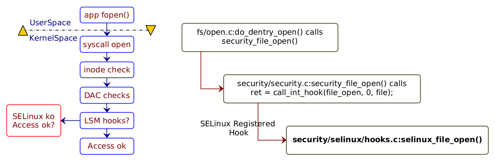
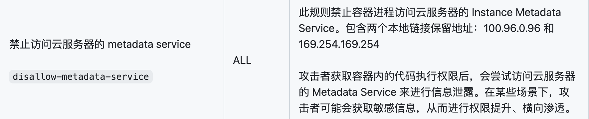
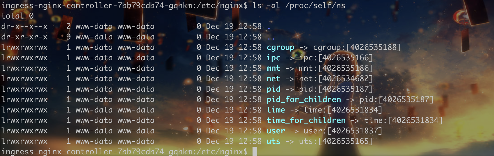
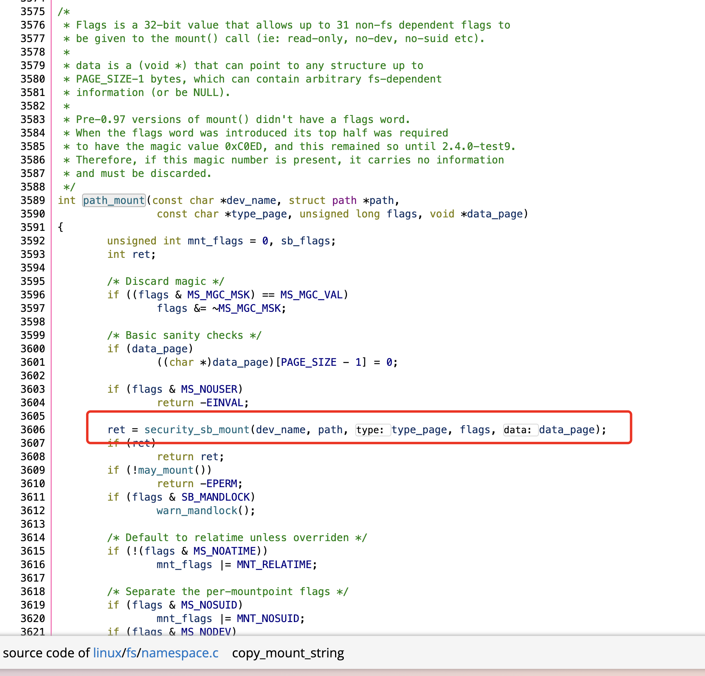

# vArmor

> **vArmor** 是一个云原生容器沙箱系统，它借助 Linux 的 LSM 技术（AppArmor & BPF）实现强制访问控制器（即 enforcer），从而对容器进行安全加固。它可以用于增强容器隔离性、减少内核攻击面、增加容器逃逸或横行移动攻击的难度与成本。**vArmor** 遵循 Kubernetes Operator 设计模式，用户可通过操作 CRD API 对特定的 Workload 进行加固。从而以更贴近业务的视角，实现对容器化微服务的沙箱加固。此外 **vArmor** 还包含多种内置加固规则，具备开箱即用的特性。

接下来主要是分析vArmor中的ebpf程序来了解它是如何利用LSM-eBPF实现防御的。


## behavior

这个模式不做任何的阻止操作，单纯的只是收集简单的信息：

```c
// SPDX-License-Identifier: GPL-2.0
// Copyright 2023 vArmor-ebpf Authors

#include "vmlinux.h"
#include <bpf/bpf_helpers.h>
#include <bpf/bpf_tracing.h>
#include <bpf/bpf_core_read.h>

#define MAX_FILENAME_LEN 64
#define MAX_ENV_LEN 256
#define MAX_ENV_EXTRACT_LOOP_COUNT 400
#define TASK_COMM_LEN 16

char __license[] SEC("license") = "GPL";

struct {
    __uint(type, BPF_MAP_TYPE_PERF_EVENT_ARRAY);
} events SEC(".maps");

struct event {
    u32 type;
    u32 parent_pid;
    u32 parent_tgid;
    u32 child_pid;
    u32 child_tgid;
    unsigned char parent_task[TASK_COMM_LEN];
    unsigned char child_task[TASK_COMM_LEN];
    unsigned char filename[MAX_FILENAME_LEN];
    unsigned char env[MAX_ENV_LEN];
    u32 num;
};

const struct event *unused __attribute__((unused));

// https://elixir.bootlin.com/linux/v5.4.196/source/kernel/fork.c#L2388
// https://elixir.bootlin.com/linux/v5.4.196/source/include/trace/events/sched.h#L287
SEC("raw_tracepoint/sched_process_fork")
int tracepoint__sched__sched_process_fork(struct bpf_raw_tracepoint_args *ctx)
{
    // TP_PROTO(struct task_struct *parent, struct task_struct *child)
    struct task_struct *parent = (struct task_struct *)ctx->args[0];
    struct task_struct *child = (struct task_struct *)ctx->args[1];

    struct event event = {};

    event.type = 1;

    BPF_CORE_READ_INTO(&event.parent_pid, parent, pid);
    BPF_CORE_READ_INTO(&event.parent_tgid, parent, tgid);
    BPF_CORE_READ_STR_INTO(&event.parent_task, parent, comm);
    BPF_CORE_READ_INTO(&event.child_pid, child, pid);
    BPF_CORE_READ_INTO(&event.child_tgid, child, tgid);
    BPF_CORE_READ_STR_INTO(&event.child_task, child, comm);

    u64 env_start = 0;
    u64 env_end = 0;
    int i = 0;
    int len = 0;

    BPF_CORE_READ_INTO(&env_start, parent, mm, env_start);
    BPF_CORE_READ_INTO(&env_end, parent, mm, env_end);

    while(i < MAX_ENV_EXTRACT_LOOP_COUNT && env_start < env_end ) {
        len = bpf_probe_read_kernel_str(&event.env, sizeof(event.env), (void *)env_start);
        if ( len <= 0 ) {
            break;
        } else if ( event.env[0] == 'V' &&
                    event.env[1] == 'A' &&
                    event.env[2] == 'R' &&
                    event.env[3] == 'M' &&
                    event.env[4] == 'O' &&
                    event.env[5] == 'R' &&
                    event.env[6] == '=' ) {
            break;
        } else {
            env_start = env_start + len;
            event.env[0] = 0;
            i++;
        }
    }

    event.num = i;
    bpf_perf_event_output(ctx, &events, BPF_F_CURRENT_CPU, &event, sizeof(event));

    return 0;
}

// https://elixir.bootlin.com/linux/v5.4.196/source/fs/exec.c#L1722
SEC("raw_tracepoint/sched_process_exec")
int tracepoint__sched__sched_process_exec(struct bpf_raw_tracepoint_args *ctx)
{
    // TP_PROTO(struct task_struct *p, pid_t old_pid, struct linux_binprm *bprm)
    struct task_struct *current = (struct task_struct *)ctx->args[0];
    struct linux_binprm *bprm = (struct linux_binprm *)ctx->args[2];

    struct task_struct *parent = BPF_CORE_READ(current, parent);

    struct event event = {};

    event.type = 2;
    BPF_CORE_READ_INTO(&event.parent_pid, parent, pid);
    BPF_CORE_READ_INTO(&event.parent_tgid, parent, tgid);
    BPF_CORE_READ_STR_INTO(&event.parent_task, parent, comm);
    BPF_CORE_READ_INTO(&event.child_pid, current, pid);
    BPF_CORE_READ_INTO(&event.child_tgid, current, tgid);
    BPF_CORE_READ_STR_INTO(&event.child_task, current, comm);
    bpf_probe_read_kernel_str(&event.filename, sizeof(event.filename), BPF_CORE_READ(bprm, filename));

    u64 env_start = 0;
    u64 env_end = 0;
    int i = 0;
    int len = 0;

    BPF_CORE_READ_INTO(&env_start, current, mm, env_start);
    BPF_CORE_READ_INTO(&env_end, current, mm, env_end);

    while(i < MAX_ENV_EXTRACT_LOOP_COUNT && env_start < env_end ) {
        len = bpf_probe_read_user_str(&event.env, sizeof(event.env), (void *)env_start);

        if ( len <= 0 ) {
            break;
        } else if ( event.env[0] == 'V' &&
                    event.env[1] == 'A' &&
                    event.env[2] == 'R' &&
                    event.env[3] == 'M' &&
                    event.env[4] == 'O' &&
                    event.env[5] == 'R' &&
                    event.env[6] == '=' ) {
            break;
        } else {
            env_start = env_start + len;
            event.env[0] = 0;
            i++;
        }
    }

    event.num = i;
    bpf_perf_event_output(ctx, &events, BPF_F_CURRENT_CPU, &event, sizeof(event));
    return 0;
}

```

用`raw_tracepoint`分别hook了`sched_process_fork`和`sched_process_exec`。关于`fork`和`exec`可以阅读[原来进程是这样创建的 - 知乎](https://zhuanlan.zhihu.com/p/626794881)。

所以其实就是在Linux上所有进程被创建的过程中收集一些简单的信息。


## bpfenforcer

vArmor在**EnhanceProtect**模式下可支持使用内置规则和自定义接口来定义防护策略。内置规则：[vArmor/docs/built_in_rules.zh_CN.md at main · bytedance/vArmor ](https://github.com/bytedance/vArmor/blob/main/docs/built_in_rules.zh_CN.md#%E5%86%85%E7%BD%AE%E8%A7%84%E5%88%99)。接下来就是阅读内置规则中与eBPF有关的，阅读其源码来学习。

所有的代码都是从`/pkg/bpfenforcer/bpf/enforcer.c`中的`ebpf`程序作为入口，其他的`.h`文件中是详细的处理函数。


具体的hook点需要去查看`lsm_hooks.h`，我的文件是在`/usr/src/linux-headers-6.0.19-060019/include/linux/lsm_hooks.h`。hook点的参数我是参考`/usr/src/linux-headers-6.0.19-060019/include/linux/security.h`，里面有`security_xxx`这样的函数原型，列出了要用的参数的类型。在`/usr/src/linux-headers-6.0.19-060019/include/linux/security.c`，有具体的实现，例如：

```c
int security_path_link(struct dentry *old_dentry, const struct path *new_dir,
		       struct dentry *new_dentry)
{
	if (unlikely(IS_PRIVATE(d_backing_inode(old_dentry))))
		return 0;
	return call_int_hook(path_link, 0, old_dentry, new_dir, new_dentry);
}
```

通过`call_int_hook`调用对应的hook。然后去Linux内核中查找哪里调用了这个实现的函数就可以知道具体在哪里hook了。


关于LSM，这篇文章介绍的挺好：[Introduction to Linux Security Modules (LSMs) · kubearmor/KubeArmor Wiki](https://github.com/kubearmor/KubeArmor/wiki/Introduction-to-Linux-Security-Modules-(LSMs))

关键的还是理解这张图：



### socket_connect



理解下来就是在`socket_connect`中对这些ip进行阻止。

```c
SEC("lsm/socket_connect")
int BPF_PROG(varmor_socket_connect, struct socket *sock, struct sockaddr *address, int addrlen) {
```


代码逻辑比较简单，首先判断是不是ipv4和ipv6，然后：

```c
  // Whether the current task has network access control rules
  u32 mnt_ns = get_task_mnt_ns_id(current);
  u32 *vnet_inner = get_net_inner_map(mnt_ns);
  if (vnet_inner == NULL)
    return 0;
static u32 get_task_mnt_ns_id(struct task_struct *task) {
  return BPF_CORE_READ(task, nsproxy, mnt_ns, ns).inum;
}

static u32 *get_net_inner_map(u32 mnt_ns) {

  return bpf_map_lookup_elem(&v_net_outer, &mnt_ns);
}
```

`nsproxy`是一个包含指向了所有命名空间的指针的结构体，`mnt_ns`是`mnt_namespace`，ns是`ns_common`，里面写了这个命令空间的一些基本信息。`inum`则是一个唯一标识符，用于区分不同的命名空间实例。因此每一个进程有自己所属的namespace。



`v_net_outer`是一个MAP，以`mnt_ns`这个唯一标识符作为索引来获取这个namespace的存储了network rule的`vnet_inner`。`vnet_inner`也是一个Map，里面存储了相关的network rule。

重要的处理就是在`iterate_net_inner_map()`函数中，遍历`vnet_inner`，以此从中取出`net_rule`，分ipv4和ipv6两种情况，分别判断是不是要block的ip，如果是就`return -EPERM;`来禁止访问这个ip。

### capable

逻辑比较简单，可能是因为eBPF的程序只用来实现禁用所有 capabilities，禁用任意 capability和禁用特权 capability的功能可能是由AppArmor实现的。

```c
SEC("lsm/capable")
int BPF_PROG(varmor_capable, const struct cred *cred, struct user_namespace *ns, int cap, unsigned int opts, int ret) {
  // Retrieve the current task
  struct task_struct *current = (struct task_struct *)bpf_get_current_task();

  // Whether the current task has file access control rules
  u32 mnt_ns = get_task_mnt_ns_id(current);
  u64 *deny_caps = get_capability_rules(mnt_ns);
  if (deny_caps == 0)
    return ret;
  DEBUG_PRINT("================ lsm/capable ================");
  // Permission check
  u64 request_cap_mask = CAP_TO_MASK(cap);
  if (*deny_caps & request_cap_mask) {
    struct user_namespace *current_ns = get_task_user_ns(current);
    kernel_cap_t current_cap_effective = get_task_cap_effective(current);
    // We utilize casts to ensure compatibility with kernel 6.3+
    u64 current_effective_mask = *(u64 *)&current_cap_effective;
    DEBUG_PRINT("task(mnt ns: %u) current_effective_mask: 0x%lx, request_cap_mask: 0x%lx", 
            mnt_ns, current_effective_mask, request_cap_mask);
    // Compatible with overlayfs when writing /tmp directory
    if (current_ns == ns && current_effective_mask == 0x1fffeffffff) {
      return ret;
    }
    // Compatible with containerd on cgroup v2 environment
    if (current_ns == ns && current_effective_mask == 0x1ffffffffff) {
      return ret;
    }
    DEBUG_PRINT("task(mnt ns: %u) is not allowed to use capability: 0x%x", mnt_ns, cap);
    return -EPERM;
  }
  return ret;
}
```

通过`BPF_CORE_READ(task, cred, user_ns);`获取当前进程的user space，如果等于`ns`且不是这两种情况就进行拦截。

从逻辑上也可以理解对capability拦截的实现逻辑，因为每一个cap代表着一位，例如：

```bash
cat /proc/1/status |grep "Cap"
CapInh:	0000000000000000
CapPrm:	00000000a80425fb
CapEff:	00000000a80425fb
CapBnd:	00000000a80425fb
CapAmb:	0000000000000000
```

通过将cap进行`CAP_TO_MASK`，可以知道它指的是哪一位。

```c
#define CAP_TO_MASK(x) (1ULL << x)
```

如果要在eBPF程序中实现禁用指定的capability也是很容易实现的，直接将不允许的capability与`CAP_TO_MASK`处理后的cap的那一位进行对比是不是都为1即可。


关于namespace和cgroup，这个文章介绍的挺好：[What Are Namespaces and cgroups, and How Do They Work? - NGINX](https://www.nginx.com/blog/what-are-namespaces-cgroups-how-do-they-work/)


### file_open

在打开文件的时候进行权限检查，这部分代码如果第一次接触可能会有一些绕，多打`DEBUG_PRINT`看信息就能看懂。

首先是`task_in_execve()`函数检查当前进程是否来自`execve()`：

```c
static int task_in_execve(struct task_struct *task) {
    unsigned long long val = 0;
    unsigned int offset = __builtin_preserve_field_info(task->in_execve, BPF_FIELD_BYTE_OFFSET);


    unsigned int size = __builtin_preserve_field_info(task->in_execve, BPF_FIELD_BYTE_SIZE);

    bpf_probe_read(&val, size, (void *) task + offset);
    val <<= __builtin_preserve_field_info(task->in_execve, BPF_FIELD_LSHIFT_U64);
    val >>= __builtin_preserve_field_info(task->in_execve, BPF_FIELD_RSHIFT_U64);
    return (int) val;
}
```


这个`__builtin_preserver`函数可以参考[BPF Built-in Functions (Using the GNU Compiler Collection (GCC))](https://gcc.gnu.org/onlinedocs/gcc/BPF-Built-in-Functions.html)，通过传入不同的kind可以返回不同的值，主要在处理bit filed的时候很有效：

```c
	unsigned int in_execve: 1;
```

因为`in_execve`是一个bit field,因此不能直接读取，需要按照这样的方式先度offset和size，读完后再左移和右移，把其他位都置0来得到`in_execve`。

另外比较难理解的是`prepend_path_to_first_block()`函数的处理，这里首先是判断是否是`mount`的路径，如果是则继续往前探索。

```c
        mnt_root = BPF_CORE_READ(mnt, mnt).mnt_root;
        if (mnt_root == dentry) {
            mnt_parent = BPF_CORE_READ(mnt, mnt_parent);
            if (mnt_parent != mnt) {
                dentry = BPF_CORE_READ(mnt, mnt_mountpoint);
                mnt = mnt_parent;
            }
        }
```

然后挨个读取`dentry`获得相关的信息并存储，用于后续的处理。

`map_file_to_perms()`函数主要是获取当前打开的文件所需的权限：

```c
static __noinline u32 map_file_to_perms(struct file *file) {
  u32 perms = 0;
  unsigned int flags = BPF_CORE_READ(file, f_flags);
  fmode_t mode = BPF_CORE_READ(file, f_mode);

  if (mode & FMODE_WRITE)
    perms |= MAY_WRITE;
  if (mode & FMODE_READ)
    perms |= MAY_READ;
  
  if ((flags & O_APPEND) && (perms & MAY_WRITE))
    perms = (perms & ~MAY_WRITE) | MAY_APPEND;
  /* trunc implies write permission */
  if (flags & O_TRUNC)
    perms |= MAY_WRITE;
  if (flags & O_CREAT)
    perms |= AA_MAY_CREATE;

  return perms;
}
```

最后就是权限的检测，如果有匹配的`perm`且路径也匹配，就不允许open文件。

```c
    // Permission check
    if (rule->permissions & requested_perms) {
      if (old_path_check(&rule->pattern, buf, offset)) {
        DEBUG_PRINT("");
        DEBUG_PRINT("access denied");
        return -EPERM;
      }
    }
  }
```

### path_symlink

和`file_open`整体流程差不多，唯一的区别就是处理的是创建符号连接(symbolic link)。

### path_link

处理的流程还是差不多，不过处理的是硬链接。

关于硬链接和Linux的inode，这篇文章讲的很好，看完就可以理解：[理解inode - 阮一峰的网络日志](https://www.ruanyifeng.com/blog/2011/12/inode.html)

### path_rename

流程基本相同。

### bprm_check_security

bprm是`binary program`的缩写，简单跟一下就知道是在`search_binary_handler`中调用的`security_bprm_check(bprm)`，可以了解`execve()`的流程中了解到，这篇文章写的很好：[How the Linux kernel runs a program · Linux Inside](https://0xax.gitbooks.io/linux-insides/content/SysCall/linux-syscall-4.html)

但是这个hook点还是对执行的二进制文件进行检查，看是否有匹配的规则，有就`return -EPERM`。虽然处理逻辑和之前差不多，但是也是学习到了`execve()`的流程。

### ptrace_access_check

首先关于`ptrace`，可以参考下面的文章：[Looking into Process Tracing and Control in Linux with strace and ptrace | by Razika Bengana | Medium](https://medium.com/@razika28/looking-into-process-tracing-and-control-in-linux-with-strace-and-ptrace-f335330d1500)

这是手册：[ptrace(2) - Linux manual page](https://man7.org/linux/man-pages/man2/ptrace.2.html)


但实际上vArmor的这个hook点并不是单纯的为了`ptrace`的权限检测，而是为了实现这个功能：

|      |      | 禁止访问进程文件系统的根目录  `disallow-access-procfs-root` | ALL  | 本策略禁止容器内进程访问进程文件系统的根目录（即 /proc/[PID]/root），防止攻击者利用共享 pid ns 的进程进行攻击。  攻击者可能会在共享了宿主机 pid ns、与其他容器共享 pid ns 的容器环境中，通过读写 /proc/*/root 来访问容器外的进程文件系统，实现信息泄露、权限提升、横向移动等攻击。 | 禁用 PTRACE_MODE_READ 权限 | AppArmor BPF |
| ---- | ---- | ----------------------------------------------------------- | ---- | ------------------------------------------------------------ | -------------------------- | ------------ |

这涉及到了一个容器的逃逸方式：[一个未公开的容器逃逸方式-安全客 - 安全资讯平台](https://www.anquanke.com/post/id/290540)


关键的处理代码：

```c
/* Returns 0 on success, -errno on denial. */
static int __ptrace_may_access(struct task_struct *task, unsigned int mode)
{
	const struct cred *cred = current_cred(), *tcred;
	struct mm_struct *mm;
	kuid_t caller_uid;
	kgid_t caller_gid;
	if (!(mode & PTRACE_MODE_FSCREDS) == !(mode & PTRACE_MODE_REALCREDS)) {
		WARN(1, "denying ptrace access check without PTRACE_MODE_*CREDS\n");
		return -EPERM;
	}
	/* May we inspect the given task?
	 * This check is used both for attaching with ptrace
	 * and for allowing access to sensitive information in /proc.
	 *
	 * ptrace_attach denies several cases that /proc allows
	 * because setting up the necessary parent/child relationship
	 * or halting the specified task is impossible.
	 */
	/* Don't let security modules deny introspection */
	if (same_thread_group(task, current))
		return 0;
	rcu_read_lock();
	if (mode & PTRACE_MODE_FSCREDS) {
		caller_uid = cred->fsuid;
		caller_gid = cred->fsgid;
	} else {
		/*
		 * Using the euid would make more sense here, but something
		 * in userland might rely on the old behavior, and this
		 * shouldn't be a security problem since
		 * PTRACE_MODE_REALCREDS implies that the caller explicitly
		 * used a syscall that requests access to another process
		 * (and not a filesystem syscall to procfs).
		 */
		caller_uid = cred->uid;
		caller_gid = cred->gid;
	}
	tcred = __task_cred(task);
	if (uid_eq(caller_uid, tcred->euid) &&
	    uid_eq(caller_uid, tcred->suid) &&
	    uid_eq(caller_uid, tcred->uid)  &&
	    gid_eq(caller_gid, tcred->egid) &&
	    gid_eq(caller_gid, tcred->sgid) &&
	    gid_eq(caller_gid, tcred->gid))
		goto ok;
	if (ptrace_has_cap(tcred->user_ns, mode))
		goto ok;
	rcu_read_unlock();
	return -EPERM;
ok:
	rcu_read_unlock();
	/*
	 * If a task drops privileges and becomes nondumpable (through a syscall
	 * like setresuid()) while we are trying to access it, we must ensure
	 * that the dumpability is read after the credentials; otherwise,
	 * we may be able to attach to a task that we shouldn't be able to
	 * attach to (as if the task had dropped privileges without becoming
	 * nondumpable).
	 * Pairs with a write barrier in commit_creds().
	 */
	smp_rmb();
	mm = task->mm;
	if (mm &&
	    ((get_dumpable(mm) != SUID_DUMP_USER) &&
	     !ptrace_has_cap(mm->user_ns, mode)))
	    return -EPERM;
	return security_ptrace_access_check(task, mode);
}
```


>    PTRACE_MODE_READ
>           For "read" operations or other operations that are less
>           dangerous, such as: get_robust_list(2); kcmp(2); reading
>           /proc/pid/auxv, /proc/pid/environ, or /proc/pid/stat; or
>           readlink(2) of a /proc/pid/ns/* file.

因此，vArmor主要就是为了禁用 PTRACE_MODE_READ 权限，并设定一定的规则。

```c
static __always_inline bool ptrace_permission_check(u32 current_mnt_ns, u32 child_mnt_ns, u64 rule, u32 request_permission) {
  DEBUG_PRINT("current task(mnt ns: %u) request the vArmor ptrace permission(0x%x) of child task(mnt ns: %u)", 
          current_mnt_ns, request_permission, child_mnt_ns);

  u32 permissions = rule >> 32;
  u32 flags = (u32)(rule & 0xffffffff);

  if (permissions & request_permission) {
    // deny all tasks
    if (flags & GREEDY_MATCH) {
      DEBUG_PRINT("access denied");
      return false;
    }

    // only deny tasks outside the container
    if (flags & PRECISE_MATCH && current_mnt_ns != child_mnt_ns) {
      DEBUG_PRINT("access denied");
      return false;
    }
  }

  DEBUG_PRINT("access allowed");
  return true;
}
```

所以其实vArmor都是基于规则 来进行处理，代码都比较简单，所以了解背后的原理更为重要。


### sb_mount

`sb_mount`的全称应该是`super block mount`，在mount操作执行前进行安全性插件。

[mount(2) - Linux manual page](https://man7.org/linux/man-pages/man2/mount.2.html)



插件主要是针对flags、fstype和path前缀后缀匹配的检查：

```c
struct mount_rule {
  u32 mount_flags;
  u32 reverse_mount_flags;
  unsigned char fstype[FILE_SYSTEM_TYPE_MAX];
  struct path_pattern pattern;
};
```

具体的处理代码和之前差不多。

vArmor有很多关于mount的规则，主要还是用于防止挂载cgroupfs、procfs等导致的逃逸。

### move_mount

关于`move_mount`这个系统调用可以参考：[Six (or seven) new system calls for filesystem mounting [LWN.net]](https://lwn.net/Articles/759499/)

在Linux Kernel新版本中重写了`mount`，在`mount`的时候会执行新的一系列处理。

但是代码中提到：

> We only care about the relocation use case of move_mount() for now, and reuse the rules for mount().

说明仍然只是关注relocation的使用。这个功能实际上我并没有实际的理解，因为我这边的内核实际上还没有使用`move_mount`，在`mount -o move`的时候触发的仍然是`sb_mount`而不是`move_mount`，所以不知道单独写个`move_mount`作用在哪，猜测使用`move_mount`的内核，在处理`mount -o move`的时候就会触发`move_mount`？

### sb_umount

`sb_umount`的处理和之前差不多， 就是flag设成`AA_MAY_UMOUNT`。


## Summary

至此vArmor的ebpf代码就看完了，其实逻辑上非常的简单，在阅读代码上并没有花费太久，主要的时间都用在了查阅那些hook和阅读相关的Linux源码上，从而学到了很多的东西。

## References

[原来进程是这样创建的 - 知乎](https://zhuanlan.zhihu.com/p/626794881)

[字节vArmor代码解读 | Spoock](https://blog.spoock.com/2023/08/23/eBPF-vArmor/)

[eBPF-vArmor ①](https://mp.weixin.qq.com/s/_EFhYftQukWCZkYrIDd70w)

[What Are Namespaces and cgroups, and How Do They Work? - NGINX](https://www.nginx.com/blog/what-are-namespaces-cgroups-how-do-they-work/)

[BPF Built-in Functions (Using the GNU Compiler Collection (GCC))](https://gcc.gnu.org/onlinedocs/gcc/BPF-Built-in-Functions.html)

[Introduction to Linux Security Modules (LSMs) · kubearmor/KubeArmor Wiki](https://github.com/kubearmor/KubeArmor/wiki/Introduction-to-Linux-Security-Modules-(LSMs))

[理解inode - 阮一峰的网络日志](https://www.ruanyifeng.com/blog/2011/12/inode.html)

[How the Linux kernel runs a program · Linux Inside](https://0xax.gitbooks.io/linux-insides/content/SysCall/linux-syscall-4.html)

[Looking into Process Tracing and Control in Linux with strace and ptrace | by Razika Bengana | Medium](https://medium.com/@razika28/looking-into-process-tracing-and-control-in-linux-with-strace-and-ptrace-f335330d1500)

[一个未公开的容器逃逸方式-安全客 - 安全资讯平台](https://www.anquanke.com/post/id/290540)

[ptrace(2) - Linux manual page](https://man7.org/linux/man-pages/man2/ptrace.2.html)

[Six (or seven) new system calls for filesystem mounting [LWN.net]](https://lwn.net/Articles/759499/)